## Initialize Graphics

在初始化的时候就设置好一些通用的Desc，包括SamplerDesc，DescriptorHandle，RasterizerDesc，BlendDesc，DepthStencilDesc。

<p align="center">
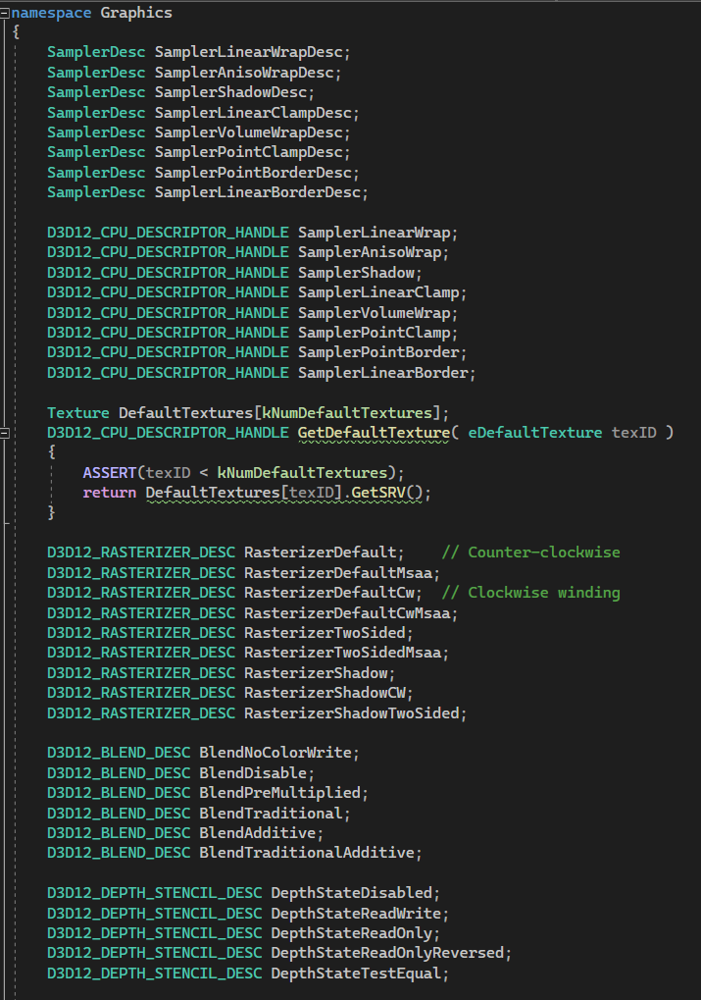
</p>

## Resource

所有Resource都是通过`ID3D12Device::CreateCommittedResource`创建的。调用这个方法会同时创建一个*ID3D12Resource*和一个堆，这种堆称为*隐式堆（implicit heap）*，因为这种堆无法被App访问。在释放最后一个Resource的引用时，必须保证GPU不再读写这个资源。本质上都是Buffer，在Desc中需要指定这个Resource的类型：
<p align="center">
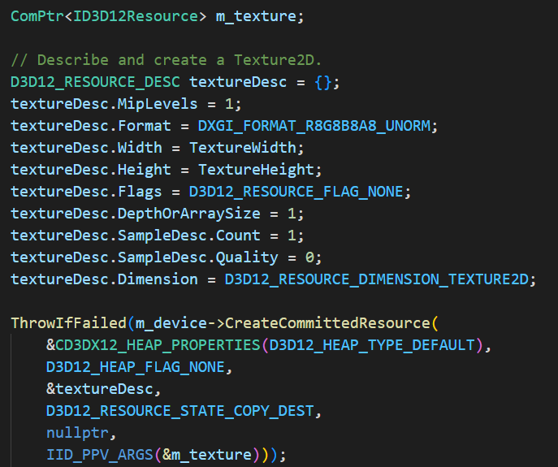
</p>

<p align="center">
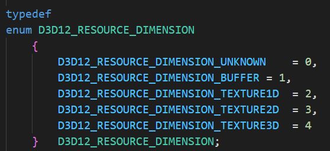
</p>

不同类型的Resource有不同的feature：

* Texture通常支持mipmap，filter，有一维，二维，三维的。
* 而Buffer就简单了，是一维的，且不支持mipmap，filter。用作顶点数据，ConstantBuffer。

创建的这些资源都是GPU资源，所以要指定Resource存放的堆的类型，不同类型的堆，CPU、GPU的访问权限不同。通常有[三种类型的堆](https://learn.microsoft.com/en-us/windows/win32/api/d3d12/ne-d3d12-d3d12_heap_type#constants)：

- `D3D12_HEAP_TYPE_DEFAULT` 
  - 大部分资源都位于默认堆，仅能被GPU访问。
  - 用于Texture，VertexData 等通常不会改变的数据。
- `D3D12_HEAP_TYPE_UPLOAD`
  - 上传堆，通常用于CPU写一次，GPU读一次。
  - 上传`ConstantBuffer`中的动态数据，会被每一个像素和顶点反复读取。
  - 上传资源到GPU，然后复制到Defaultheap.
  - Texture不能放这儿
* `D3D12_HEAP_TYPE_READBACK`
  * 用于CPU从GPU读回数据
  * 资源的初始状态必须是`D3D12_RESOURCE_STATE_COPY_DEST`

因为DefaultHeap中的资源只能被GPU访问，所以CPU还不能直接把数据传给它。而且Texture不能直接放到`_UPLOAD`堆中，这就需要先把Texture数据先以Buffer类型上传到_UPLOAD堆，然后再从_UPLOAD堆复制到_DEFAULT堆。
因此，不论是Texture资源还是顶点数据，都要先写到一个_UPLOAD堆的Resource中：
<p align="center">
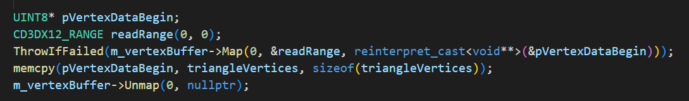
</p>

用`ID3D12Resource::Map`会开辟一块这个Resource的CPU虚拟地址范围，Umap会deallocate这块范围，且是线程安全的，可以多层嵌套调用。在用`Map`获得了CPU虚拟地址后，就可以用正常的*memcpy*向其中写入数据了。之后我们就可以进一步使用这个Resource了。

而纹理数据的创建则更复杂一些：
1. 以`D3D12_RESOURCE_STATE_COPY_DEST`为初始状态创建一个在_DEFAULT堆的Texture Resource.
   - 这个将作为最终创建好的GPU纹理资源
2. 创建一个_UPLOAD堆的中间商BufferResource。
   - 大小和要复制的TextureResource一样，可以用`GetRequiredIntermediateSize()`直接获得。
3. 随后可以直接调用`UpdateSubresources`把数据先从CPU传给中间Resource，再在GPU上复制到真正的纹理Resource。
4. 最后还要把TextureResource的状态转换为`D3D12_RESOURCE_STATE_COPY_DEST`。
5. 还需要保证GPU执行完这些命令之前对中间Resource有引用，这里需要同步一次。
6. 完了就得到了一个可用的纹理Resource。

这里上传资源的实现需要支持各种类型的Resouce，还有Mipmap之类的，所以比较麻烦，可以直接用`UpdateSubresources`，当然也可以自己实现。

### [Resource view](https://learn.microsoft.com/en-us/windows/win32/direct3d12/resource-binding-flow-of-control#resource-types-and-views)

* Constant buffer view (CBV)
* Unordered access view (UAV)
* Shader resource view (SRV)
* Samplers
* Render Target View (RTV)
* Depth Stencil View (DSV)
* Index Buffer View (IBV)
* Vertex Buffer View (VBV)
* Stream Output View (SOV)

前四个是shader  visible，

在创建一个纹理`ID3D12Resource`的同时，通常也要创建其对应的SRV，通过一个`D3D12_CPU_DESCRIPTOR_HANDLE`持有对应的SRV。

## Resource bind   

创建好各种`ID3DResource`后，就可以在需要时，把这些资源绑定到Shader上。`ID3DResource`不直接绑定到shader，而是用一个额外的小对象描述`ID3DResource`的结构，称为`Descriptor`，将一个`ID3DResource`绑定到Shader的时候，只需要使用这个`Descriptor`即可。

### flow of control
* 创建一个或多个*root signature object*，每个都对应不同的绑定配置
* 用*RSO*创建*pipeline state object*
* 创建*descriptor heaps*，用于保存SRV，UAV和CBV descriptors。
* 初始化*descriptor heaps*中一些每帧可以复用的descriptor。
* For each frame：
  * For each command list：
    * Set root signature
    * 更新*root signature*的常量和*view*的*descriptor*
    * For each item to draw 
      * 定义渲染这个对象需要的descriptor。
      * 用descriptor heaps中的指定区域更新*root signature*。例如，一个`descriptor table`可能指向不会改变的`descriptor`，另一些`descriptor table`可能指向一些动态的`descriptor`。
      * 更新每个item都不同的的root signature的常量或descriptor。
      * 设置pipeline state，要与当前绑定的*root signature*兼容。
      * Draw
    * 重复下一个Item。
  * 重复下一个command list。
  * 严格来讲，GPU不再使用的内存就可以被释放。对descriptor不需要释放，后续的渲染可以重用这些descriptor heap。
* 重复下一帧。

其它类型的*descriptor（RTV，DSV，IDV，VBV，SOV）*，这些view通常可以直接通过Resource拿到，执行Comamndlist的API直接绑定，和root signature的绑定方式一样。

这和Shader visible的descriptor完全不同，它要手动管理descriptor heap，以在不同的draw可以引用不同的descriptor。shader visible的heap交给了App管理，使得App可以重用那些不会改变的descritpor，或者使用一些大型静态descriptor heap中的descriptor（Texture），还可以使用shader indexing（material ID）选择要使用的descriptor， 组合不同的descriptor sets。


### Descriptor

是一块相对比较小的数据，用于充分描述一个GPU对象。

Descriptor的Size和硬件有关，可以调用`ID3D12Device::GetDescriptorHandleIncrementSize.`获取对应Descriptor的size。

Driver不会持有Descriptor的引用，由App保证Descriptor的类型和信息是正确的。

Descriptor[不需要被释放](https://learn.microsoft.com/en-us/windows/win32/direct3d12/descriptors-overview#descriptor-data)。

#### Descriptor Handle

*Descriptor handle*是Descriptor的地址。

* CPU handle is Immediate use。使用之后可以立即销毁（Heap）或重用。
* GPU handle不是Immediate use， 它只是标识了一个位置，在GPU执行的时候才会真正使用。

可以获得Heap开始位置的Handle:

> ID3D12DescriptorHeap::GetCPUDescriptorHandleForHeapStart()

> ID3D12DescriptorHeap::GetGPUDescriptorHandleForHeapStart()

一个Descriptor的Size可以从Device获得：

> ID3D12Device::GetDescriptorHandleIncrementSize

然后可以从起始Handle偏移IncrementSize的整数倍获得后续的Handle。
<p align="center">

</p>
同样，有一个DescriptorHandle时，如果知道它是哪个Head的，也可以算出它在Heap中的位置。

#### Null Descriptor

在创建Descriptor时，可以给Resource参数传一个nullptr，这样会定义一个null descritpor。这可以告诉Shader这个Resource没有绑定任何东西。之所以要这么做，是因为除了Resource的地址，其它的信息仍然很重要，例如*CreateShaderResourceView*，Descriptor中还需要保存resource类型，mipmap的数量，等。所以，除了pResource参数可以传null，其它参数必须和正常情况下一样。

#### Default Descriptor

调用*CreateShaderResourceView*这类方法时，pResource不为空，pDesc为空，则会创建一个默认Descriptor。

#### Create Descriptor

[创建各种Descriptor](https://learn.microsoft.com/en-us/windows/win32/direct3d12/creating-descriptors)

#### Copy Descriptor

通常一些资源会事先创建好，Handle放在一个全局的大Heap里，需要使用时把Handle从这里Copy到要使用的Heap中。

Copy方法有：
```c++
ID3D12Device::CopyDescriptors() 
ID3D12Device::CopyDescriptorsSimple()
```
Copying操作是在*CPU Timeline*上立即完成的。复制操作的Source和Descriptor都是一组`Descriptor Range`，复制操作并不关心这些Descriptor是不是在同一个Heap上，这不影响。但是Heap的类型必须是相同的。


### Descriptor headps
理想情况下包含*descriptor tables*中的所有descriptor。所有这些descriptor都保存在*user mode heaps*。

[管理DescriptorHeap](https://learn.microsoft.com/en-us/windows/win32/direct3d12/descriptor-heaps-overview#management)

### Descriptor tables
*descriptor tables*存储在*descriptor heap*中，

https://learn.microsoft.com/en-us/windows/win32/direct3d12/descriptor-tables-overview

## Suballocation
Direct3D 12中，可以一次性申请一大块内存，随后App可以创建Descriptor指向这些内存。

## Texture manage

`MiniEngine`中，所有Texture在加载时会预先在一个全局的DescriptorAllocator申请一个Descriptor，并创建Texutre，参考[TextureManager](MiniEngine.TextureMananger.md)。

## Material
在创建材质时，Renderer中有一个巨大DescriptorHeap，包含4096个Descriptor，直接用。每个材质从中申请固定数量的Texture，视着色模型而定。将需要的Texture的DescriptorHandle都Copy过去，不支持的Texture用合适的默认Texture代替。Copy可以混合用不同的Heap拷贝。
<p align="center">
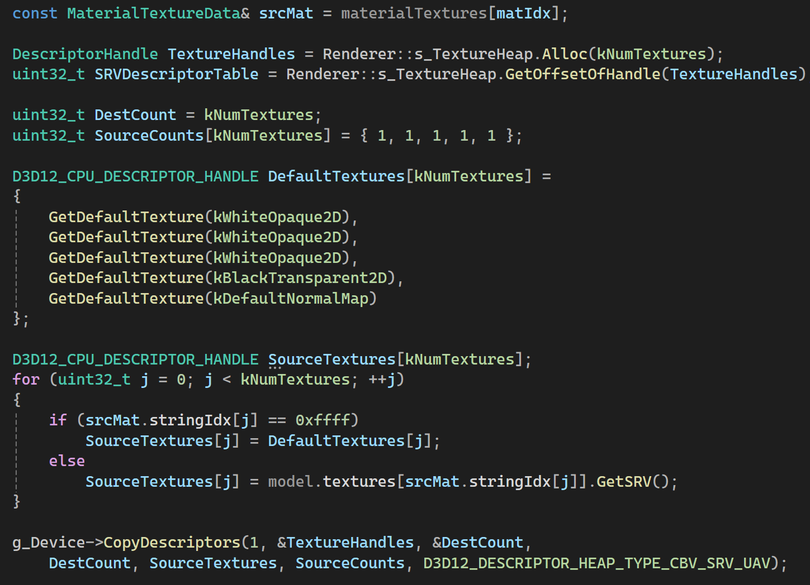
</p>

随后还要创建每个Texture对应的Sampler。这里最好是能够给所有Sampler的设置计算一个Hash，用采样的选项的不同`D3D12_TEXTURE_ADDRESS_MODE`，以达到复用SamplerDescriptorHead的目的。创建的时候也是从一个巨大的Render的SamplerDescriptorHeap中获取连续的Descriptor。

创建Sampler和Texture差不多，有个SamplerManager，也是先有一个全局的DescriptorAllocator，可以无限增长，用它创建真正的Sampler。然后Copy到渲染器使用的巨大SamplerDescriptorHeap。如果向SamplerManager请求一个已经创建过的同样配置的Sampler（通过Hash判断），会直接返回已有的，复用。
<p align="center">
  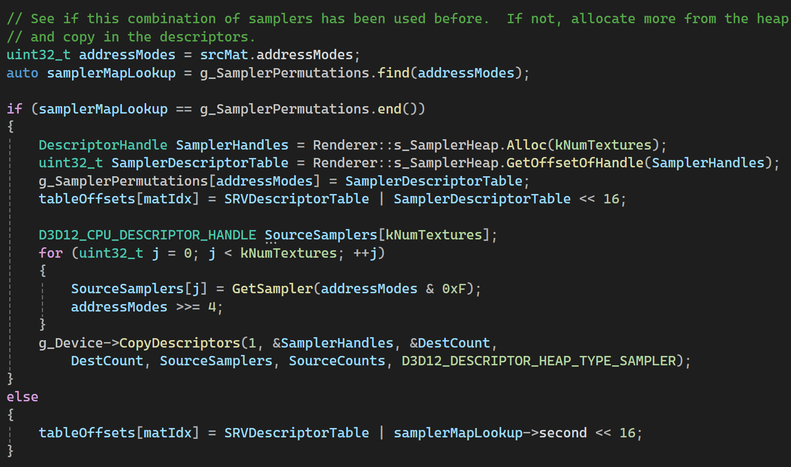
</p>

对于Renderer来说，所有材质的Texture和Sampler都是存在它指定的两个巨大Descriptor中，Mesh在渲染的时候只要知道不同材质的Texture和Sampler在这两个Heap中的偏移即可，这里直接记在了Mesh上：
<p align="center">
  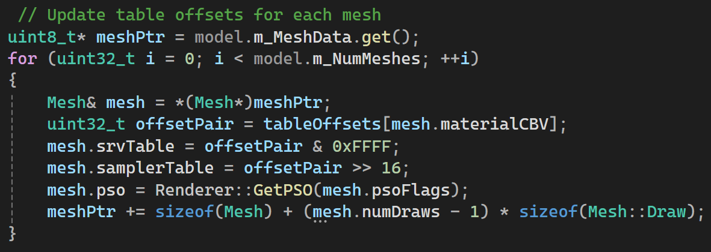
</p>

## Model Buffer and Material Constant

都是当作`D3D12_RESOURCE_DIMENSION_BUFFER`上传到DefaultHeap。先传到UploadHeap的Buffer，再Copy过去。

MaterialConstant就是模型文件里保存的结构。

## RootSignature
* [Document](https://learn.microsoft.com/en-us/windows/win32/direct3d12/root-signatures)

* [关于RootSignature更详细的记录](rootSignature.md)。

`RootSignature`本质上定义了一次绘制中VS，PS的全局输入。`Model`在构建Mesh的渲染流程时，只定义了一个RootSignature。对于所有的Mesh而言，场景整体的渲染效果确定后，需要传给VS，PS的数据应该也是确定了，需要用的的CBV，SRV，Sampler等也就确定了。这里的关键在于组织好RootParameter的结构，而且是一种通用的结构。

`Model`中设定了以下几种RootParameter的绑定：

<p align="center">
  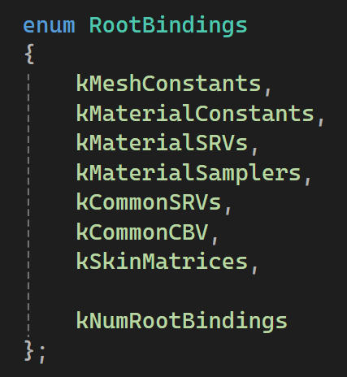
</p>

* `kMeshConstants` 特定于Mesh的CBV，通常仅VS可见。例如，ObjectToWorld的变换矩阵。
* `KMaterialConstants` 特定于材质的CBV，仅材质可见，类似于emissiveFactor，metallicRoughnessFactor这样的材质参数。
* `kMaterialSRVs` 特定于材质用的SRV，各种纹理。
* `kMaterialSamplers` 特定于材质用的Sampler，通常和上面的纹理一一对应。
* `kCommonSRVs` Shader中的全局效果用到的SRV，每个材质都一样。例如：ShadowTexture，SSAO，RadianceIBLTexture，IrradianceIBLTexture。
  * 这里用到的Sampler也是全局一样的，所以可以设定对应的Sampler为StaticSampler。
* `kCommonCBV` Shader中全局效果相关的参数，VS、PS均可见，ViewProjMatrix，SunShadowMatrix等。
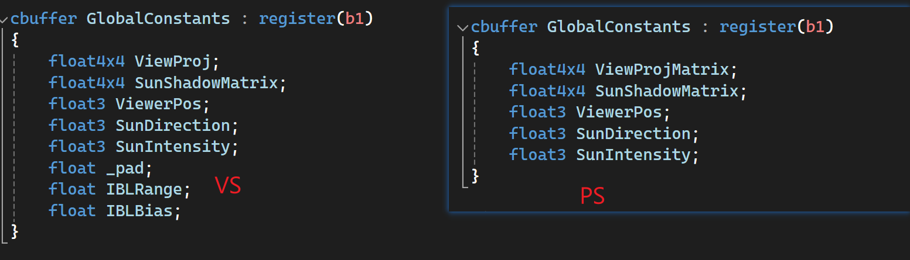
* `kSkinMatrices` 蒙皮矩阵，通过一个宏控制有没有。

<p align="center">
  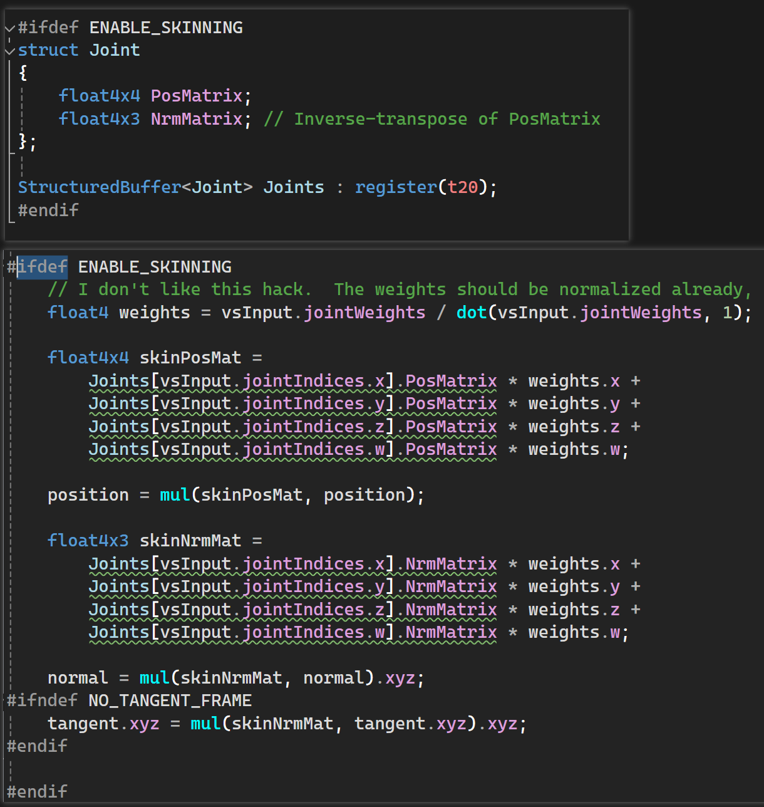
</p>

这里对RootSignature也做了缓存，在计算Hash时，不能只算外层的`D3D12_ROOT_SIGNATURE_DESC`，里面嵌套的所有指针指向的数据内容都要单独计算，不同的指针也可能它的数据内容是相同的。

## PSO
在`Core`层面，有一个全局静态数据保存所有PSO：
```c++
static map< size_t, ComPtr<ID3D12PipelineState> > s_GraphicsPSOHashMap;
static map< size_t, ComPtr<ID3D12PipelineState> > s_ComputePSOHashMap;
```
其中，key是对应的`D3D12_GRAPHICS_PIPELINE_STATE_DESC`的内存值的Hash，以及其中的`D3D12_INPUT_LAYOUT_DESC`数组中的值组合起来的Hash。这里因为`D3D12_INPUT_LAYOUT_DESC`中是一个c风格数组，所以要单独处理它的Hash:

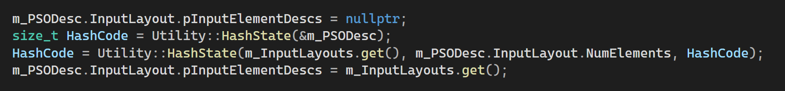

因为这一层只是缓存了ID3D12PipelineState，在Renderer层面有一个全局GraphicsPSO数组，保存所有Renderer在用的PSO，`Mesh`上只是存一个PSO索引就是指向这里。
```c++
std::vector<GraphicsPSO> sm_PSOs; 
```
GraphicsPSO这一层方便以统一的方式组织PSO，用PSOFlag构建出`D3D12_GRAPHICS_PIPELINE_STATE_DESC`，才能计算出Hash，查找真正缓存的PSO对象。

* 构建vertexLayout 在PSOFlag中记录了有那些顶点数据，根据有无的顶点数据，确定`vertexLayout`，确定对应的Shader，PSOFlag上还有BlendState，TwoSide等设置。
* 确定用什么Shader 根据psoFlags中的顶点数据信息决定，例如，有SkinWeight才用对应的Shader。

对于创建PSO来说，只要确定了InputLayout和RootSignature就行，确定这两个，就能确定Shader。因为前面提到了，材质上所用的纹理和Constant参数都是一模一样的，没有的就用默认纹理占位，这就确定了RootSignature也是一样的。

## 执行渲染

执行渲染时，从`Model`创建`ModelInstance`，这里要处理`MeshConstants`，为每个Mesh都要创建一个，且MeshContants每帧都可能改变的，需要同时持有UploadBuffer和DefaultBffer，方便每帧更新。

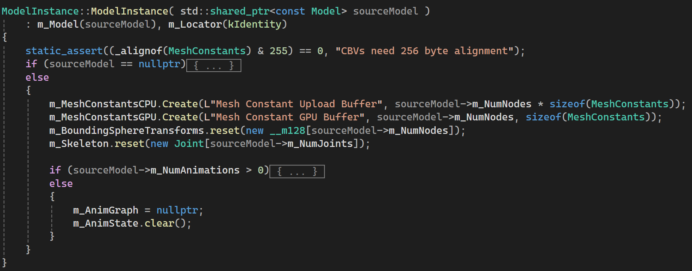

### Update阶段

遍历GraphNode，更新所有`MeshConstants`。遍历SceneGraph时，直接将Transform数据更新到UploadBuffer，然后执行Copy：
```c++
  MeshConstants* cb = (MeshConstants*)m_MeshConstantsCPU.Map();

  {
    // 遍历SceneGraph，更新MeshConstant
  }

  m_MeshConstantsCPU.Unmap();

  gfxContext.TransitionResource(m_MeshConstantsGPU, D3D12_RESOURCE_STATE_COPY_DEST, true);
  gfxContext.GetCommandList()->CopyBufferRegion(m_MeshConstantsGPU.GetResource(), 0, m_MeshConstantsCPU.GetResource(), 0, m_MeshConstantsCPU.GetBufferSize());
  gfxContext.TransitionResource(m_MeshConstantsGPU, D3D12_RESOURCE_STATE_GENERIC_READ);
```