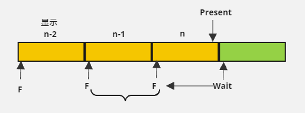

IDXGISwapChain::Present

* 将BackBuffer和FrontBuffer进行交换，自动选择合适的
  * IDXGISwapChain3::GetCurrentBackBufferIndex得到应该渲染到的BackBuffer
* 如果开了VSync，则会等待垂直同步信号，确保渲染的帧在显示器刷新周期的开始时被呈现。
* 禁用VSync：当调用Present(0, 0)时，Present函数会尽可能立即交换缓冲区，并把绘制的帧提交到显示器上。
* 调用Present之前，只需确保所有渲染命令都已经提交并开始执行，但并不一定要求它们全部完成。
* Present会确保之前的渲染命令都执行完才呈现结果。会启动图形管线中的一些同步机制。

三缓冲区渲染循环：

1. 同步
   * Wait同步sm_Fence
   * 插入同步sm_Fence
2. 记录渲染命令
   * CommandList提交执行即可，不必同步
3. Present 
   * 向g_CurrentBuffer渲染本帧最终的结果
   * s_SwapChain1->Present(PresentInterval, 0) // 等待显示器刷新次数
   * 更新g_CurrentBuffer = (g_CurrentBuffer + 1) % SWAP_CHAIN_BUFFER_COUNT

* 在录制第n帧时，显示器正显示着第n-2帧。
* 在录制第n帧时，GPU在计算第n-1帧的渲染命令。
* 录制完第n帧所有渲染命令后，调用Present，将显示第n-1帧的内容。
* 然后等待【录制完第n-1帧】时插入的Fence，确保第n-1帧的所有命令执行完毕。
* 插入新的第n帧渲染命令的同步Fence。
* 最后开始下一帧(n+1)的命令录制。