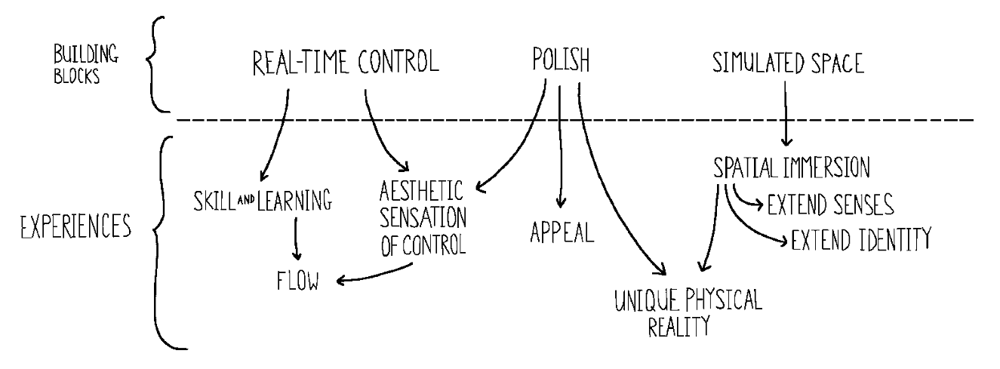
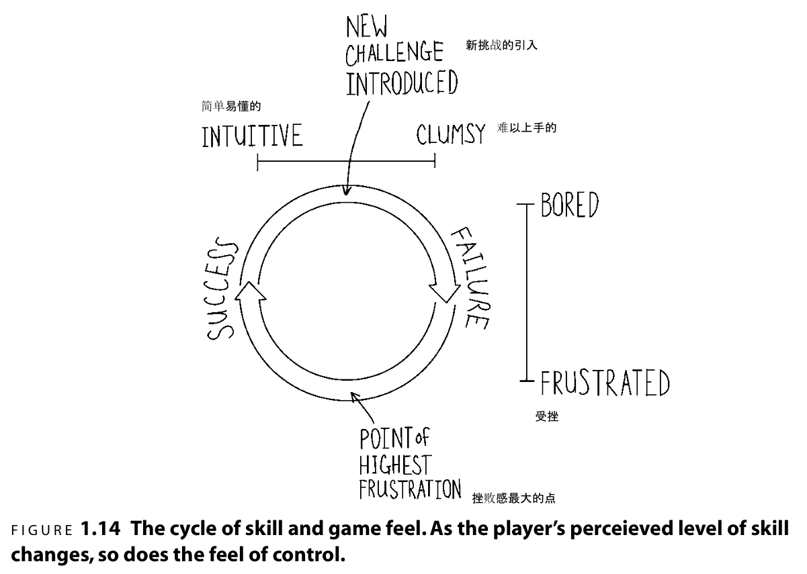

# 什么是游戏感？

经验总结:
* 符合直觉的操控，易于上手，难于精通，玩家技巧和游戏挑战之间的完美平衡。
* 玩家和游戏虚拟物体的物理交互。
* 让玩家身临其境，沉浸感。
* 游戏的表现力。

定义：
> 在模拟空间中对虚拟物体的实时操控，并通过润色增强交互感。

三个要素:
* 实时操控（real-time control）
* 模拟空间（simulated space）
* 润色（polish）

其中，`实时操控`是指通过从玩家到游戏不间断的命令流，对运动的角色进行精确、持续的操作。

`模拟空间`是指在虚拟空间中可以被玩家`主动`感知的模拟的物理交互。
* 实时操控的角色和物体之间的每一次碰撞检测和响应。
* 关卡设计。
* 和角色运动速度有关的物体的结构和空间。

这些交互`通过`提供能进行围绕、穿梭、碰撞或是作为速度参考的物体，来赋予角色的运动以意义。

>主动感知：通过实时操控在模拟空间中探索就是主动感知。

>被动感知：在电视或电影中看到的物体的交互是被动感知。

`润色`是指在不改变游戏内在模拟方式的情况下，人为地提升交互效果。

* 游戏角色运动时脚底生成的尘土粒子。
* 两车相撞时发出的碰撞声音。

去掉润色，游戏的本质功能没有变化，只是体验会差很多。

这里我们只讨论同时具有三大要素的游戏。

《星际争霸》不是，它的实时操控不是连贯的，玩家只是下指令，指令下完，命令就结束了，你可以设定一个目的地，但无法控制单位的路线规划。它的模拟空间中，控制物体移动，瞄准并选择攻击的时机是由计算机掌控的，这是被玩家间接感知到的。

# 游戏感给人的体验
1. 操控的美感

与操控木偶一样的愉悦感，沉浸在操控中，看到屏幕上有东西能够移动并根据我按按钮的动作做出反应，感觉非常好。当玩家的技术还不足以让他投入到游戏的挑战中时，这种感受到的操控纯粹的、美学上的美也会让玩家体验很好。

2. 学习、练习、掌握技能的快感。

掌握不同的游戏内的技巧所带来的强烈的回报感。

3. 感官的延伸。

沉浸到操控的游戏角色上，感觉自己就是游戏内的角色，是自己身体的延伸。

4. 身份认知的延伸。

感觉和第三点一样。

5. 与游戏里的独特物理现实进行的交互。

操控角色探索游戏世界时，感受到的游戏世界中的物理感。

# 创造游戏感

## 1. 游戏感中操控的美感

操控物体可以带来无意识的愉悦。

如果输入和响应之间的关系是正确的，那么在一款游戏中操控一些东西可以获得一种令人舒服的美感。这里的`正确`并没有公式，需要设计师针对输入和响应之间的复杂关系进行数百次的微小调整。这里的感受是基于美学的判断的，而最终的感受是基于设计师情感的表达的。

`哇！真棒！我能完成这些华丽流畅的动作。`

但是，如果缺少某种专注点，即使感受最好的操控，也会很快变得重复、乏味。解决方案是加入一些挑战。一旦有了目标，操控的行为就被赋予了新的意义。玩家可以把意图和结果进行对比，他们可能输也可能赢。这样一来操控的美感就变成了一项技能。

## 2. 把游戏感当作一项技能

调整角色的运动方式和设置挑战都会改变游戏感。
* 修改中立、摩擦力和角色的运动速度这样的全局数值能定义操控给人的基本感受。
* 添加规则和挑战，通过定义一系列可供训练和掌握的`技能`来改变这个基本感受。

怎么让有技巧地操控变成一种不同的体验？
* 游戏中的挑战通过让玩家侧重于不同运动的可能性空间来改变操控给人的感觉，鼓励玩家去探索这个可能性空间。
* 游戏感会根据玩家技术的变化而变化。
* 当玩家可以毫不困惑地将意图转化为结果时，他们会发现操控非常符合直觉。

### 2.1 挑战会改变操控给人的感觉

如果没有挑战，基本的操控带来的愉悦感很快就会变得重复、乏味、让人昏昏欲睡。

添加挑战后，玩家会变得专注、有目的去完成挑战，刺激玩家去寻找可能的操作空间中的新区域，让他们接触到本来可能会错过的操控感（游戏体验）。

挑战由两部分组成：目标和限制。
* `目标`能够给玩家一个衡量自己表现的方式来影响其感受。有了目标，才有可能失败或成功。

> 玩家应该做的事情和游戏允许他们执行的操作操作一样重要。

* `限制`通过明确地约束运动，达到影响游戏感的效果。限制并不强调某个运动，而是选择性地从可能性空间中移除一些运动。

设计师可以通过目标强调好的方面，利用限制规避坏的方面，使玩家感受到的游戏感变成自己所期望的那样。

### 2.2 游戏感会因玩家技能的改变而改变

如果玩家没有达到一定的技巧水平就不能欣赏到游戏的游戏感。

但有时候即使玩家熟练掌握了一款游戏的技巧，依然认为这个游戏非常难操作。这意味着两种不同游戏感给人的体验，与学习、练习以及掌握一个技巧的感觉之间存在联系。？？

纯粹操控的美感可以用在这里，作为安慰缓解挫败感。

当玩家熟练掌握了一个技巧后，就不再感觉到令人压抑的笨拙感，操控的美感便走到台前，它和克服挑战的满足感结合在一起，提供了到达这一技巧水平的奖励。随后下一个挑战被引入，这一循环再次开始。

好的设计：为有着不同水平技巧的玩家设计不同的感受。通过分析总结玩家当前的技巧状态，了解玩家正在思考、正在集中注意力就的地方，调整游戏感。在玩家操控的可能性空间中撒下`面包屑`引导玩家，在强调最好的操控感的同时保持技术与挑战之间的平衡。

为了让这个循环能够进行下去，必须想办法让玩家不会因为无聊或者受到挫折就放弃一款游戏。

心流状态：当你正在面对的挑战的难度很接近你的能力水平的时候，你就会进入心流状态。这是一个失去自我意识、失去对时间的感知，并获得大量的愉悦感的时刻。

而电子游戏在创造和维持心流上有着许多优势，比如提供清晰的目标、有限的刺激范围，以及直接、即时的反馈。

### 2.3 符合直觉的操控

符合直觉的操控：是指这样一种操控，游戏可以近乎完美地把玩家的意图在游戏世界中实现。

一些不是有意设置的操控上的模糊会让玩家觉得这个游戏无法准确地响应他们的输入，从而破坏玩家的操控感。

挑战和干扰的区别：
* `挑战`在技巧的维度上让游戏变得更难的元素。一个行为的结果是可以预测的、目标是清晰的、反馈是及时的。
* `干扰`指的是那些任意扰乱玩家意图的元素。

寻找难以掌握但值得练习，易于入门难以精通的技能。

## 3.游戏是感官的延伸

定义玩家如何在游戏里看、听和感受，如何通过虚拟的感官覆盖真实的感官，以更好地体验游戏虚拟世界。就像现实生活中我们用视觉、听觉、触觉感受这个世界一样。

从设计师的角度：
* 将输入信号映射到运动上。
* 创造一个空间和一些物体以给这些运动提供参考系。
* 定义摄像机的行为。
  * 它要被放到哪里
  * 它相对于角色是如何运动的

不要让摄像机过度运动，运动的时候尽量平滑。当你无法通过变成获得良好的效果的时候，就把控制权交给玩家。
## 4.游戏感和本体感受
本体感受（proprioception），帮助玩家确定角色身体位置、重量，或者肌肉、肌腱和关节的运动，描述一个人在潜意识中对他的身体在空间中的位置的感知程度。

例如，玩赛车游戏时，转弯时身体不由自主地跟着倾斜，好像自己真的坐在赛车里一样。

## 5.玩家身体的延伸带来的游戏感
当游戏中的角色时你自己的身体和感官的延伸时，身份认知会通过同样的方式扩展出去。
`我的角色`变成了`我自己`。

有趣的是，这种身份认知的转变是反复无常的。游戏中发生积极的事情时，会认为我即是角色，当做出了抽象操作时，又会把自己和角色划分界限。这种身份认知的反复，可以缓解游戏中的挑战给玩家带来的挫败感，对角色的咒骂总比玩家一直无聊和受挫折后放弃游戏要更好。

身份认知的延伸不是可以直接设计的东西。更灵敏的操控能够很容易让玩家接受身份认知的转移。
## 6.游戏感是一种独特的物理现实

我们感受虚拟空间时，会快速解析出它的物理特性，形成一个自洽的心理模型。当游戏世界中的所有内容都符合一致的物理模型时，我们构建的虚拟空间中的物理规则就符合逻辑了。如果游戏内的一个小反馈与其他内容发生矛盾时，就会导致玩家基于虚拟空间建立的心理模型出现不合逻辑的情况，给玩家带来糟糕体验。

