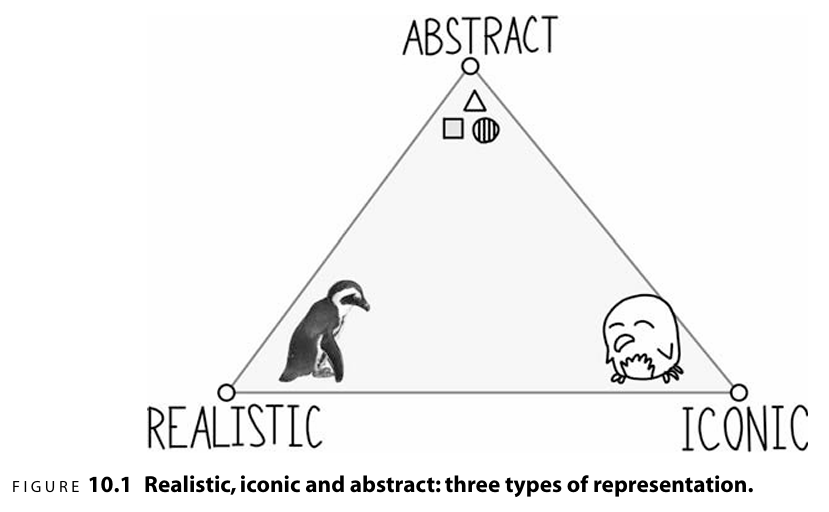
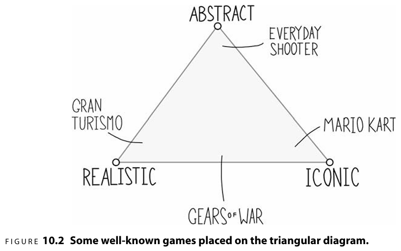

# 隐喻的度量方法
表现形式(Representation)：指游戏场景的视觉艺术和声音的表现形式。表现形式传达了关于物体是什么的想法。

处理手法(treatment)：由视觉效果、声音效果、触觉效果共同组成，如何呈现、处理这种表现形式。表明了物体的复杂程度。

通过两种方式衡量隐喻对游戏感的影响：

* 隐喻是什么？这个东西看起来是什么？在概念层面上每个物体向玩家表现了什么？
* 接下来，玩家对这个事物的行为会有怎样的期待？换句话说，基于隐喻的表现形式，玩家会期望什么样的行为、特效、动画、运动、交互和声音？

`隐喻对游戏感的主要作用`是引导玩家对特定事物应该如何行动确立先入为主的预期。

响应、情境、润色与所呈现的隐喻越匹配，游戏就会具有更好的统一性、自洽性和更出色的游戏感。但这并不是核心，也不是我们所追求的。

我们所追求的是：隐喻可以完美地对应响应、润色和情境的时候，表现形式和处理手法才处于最佳状态。

## 写实、形象化、抽象
三种视觉表现形式：

一些游戏的分类：

总结：隐喻设定了玩家对各种事物的外观、运动、声音、行为和交互方式的期望，当游戏中响应、润色和情境能与这个期望协调，此时就处于最佳状态。

# 规则的度量方法

[记录在这里](./GameFeel5.md#规则)
