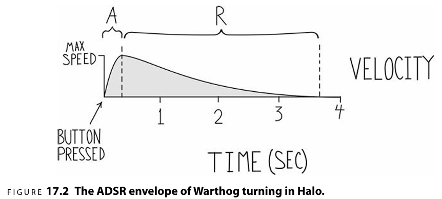

# 打造游戏感的准则

## 1. 结果可以被预测
> 当玩家采取行动时，他们得到的响应应该符合他们的预期。
> 玩家的意图和结果之间不应该存在干扰、歧义，造成玩家的困惑。

这并不是说游戏或者操作要简单，即使操作有点麻烦，但当结果可以被玩家预测，或者是玩家预期想要这个结果时，玩家会很乐意学习并精通这一操作。

这里的难点是“什么才是玩家所预期的”？不同玩家按下按钮和感知结果的方式存在差别，不同玩家有着不同的经验背景、游戏经验，对同一情况可能会有不同的预期，造成玩家实际的预期与我们设计的预期不符，从而使玩家产生缺乏响应或充满挫败感的结果。

所以，我们必须通过输入映射、隐喻和艺术手法，间接地塑造出玩家的预期，尽可能地让绝大多数玩家的预期与我们设计的一致。

以下有三种会让玩家认为结果过于随机，而产生无法预测的陷阱：

1. `操作模糊` 在映射输入和响应的时候，可能会设计出有歧义的操作。例如，`空格`会触发跳跃，紧接着按下`Ctrl`会触发重击落地，如果先按下`Ctrl`再按下`空格`，则会触发后空翻。同时按下时，取决于玩家按下的先后顺序，毫秒级的时间差，玩家很难把控，结果就会给玩家一种感觉，会随机触发重击落地或后空翻。这种歧义，是完全应该从设计上避免的。
2. `状态混乱`通常，设计师会根据游戏角色处于不同的状态设计不同的输入映射。例如，角色处于空中或地面时，左右输入的效果会有所不同。但这样的设计并不会让玩家感到困惑，因为角色处于空中或地面的不同玩家可以很容易感知到。但是，如果设计了太多的状态，每个状态都有不同的输入映射，同时还存在大量的按钮同时按下的效果，就会让玩家感到困惑，玩家难以区分和记住各种微小差别的状态和对应的输入映射，同样的输入会产生太多的结果了。
3. `舞台化`原本是动画种的一个概念：“动作只有在舞台上才可以被理解。为了清晰地展示一个动作，关总的眼睛必须在合适的时间被引导至合适的地点。而在同一时刻只让观众专注于一个动作是非常关键的。”即我们需要强调玩家输入的结果，让玩家能够及时、清晰地感知到输入产生的结果。可以用一些特效、镜头上的反馈。
## 2. 即时响应
即时响应，玩家会感觉到很舒畅。但这并不是说响应一定是快速且短暂的。例如，对车转向的操控，可以被设计成，玩家准心的方向离车当前的朝向越远时，转向的速度就越快，结果就是，玩家在改变输入后，响应会很明显，即便释放的过程漫长又平缓，但玩家感受到的响应是即时的。这里一定要让玩家感知到他们操作结果的时间差不超过100ms，不然就会感到反馈不及时。

这种效果类似于动画种的淡入淡出。淡入淡出的效果会柔滑动作，让动作显得更有生机。

## 3. 易于上手，难于精通(Easy but Deep)

怎么做到易于上手？
* `利用自然映射`，输入和游戏种被控物体间的关系是明显且符合直觉的。例如，鼠标指针控制转向，WSAD控制移动等。
* `新手教程和辅助功能`，如“自动瞄准”，“动态难度调整规则”等。

怎么做到难于精通(即Deep深度)？

这个就比较困难了。
* 设计师难以预测哪些元素的组合能让人们花费无数个小时去执着地练习。

我们需要设计各种挑战，用这些挑战定义技巧和基础行为。

可能的解决办法：
1. 更改输入和响应感知之间的关系(change the relationship between 
input and response sensitivity,原翻译多少有点病)，增加额外的对输入控制的感知，以把交互刻画地细致和巧妙。通过规则(goals and challenges)和情境（spatial layout）带来新的、更加富有表现力的交互，可以刻画出多种层次的游戏感，也使得游戏更加有深度。
例如，玩家在游戏种有一种行为是从A点跑到B点，我们可以增加跟踪完成这个行为的时间，然后设计一些简单的操作让玩家获得更好的成绩，之后在这个基础上让这个操作（技能）的提升变得更加困难。最终，玩家会自发地改变策略提升自己的成绩。
2. `允许玩家之间进行对抗`。

## 4. 新颖
尽管输入的结果需要是是可以预测的，但是在响应上也不能千篇一律，还是要有足够的差别，以便让操作令人感觉新鲜、有趣。例如，一个游戏种，角色的就只有一种攻击动作，这个动作设计再怎么精美绝伦，当执行了10000次后，玩家也会感觉到无聊。

解决方案：
1. 用海量的附加内容，即增加游戏内容。
2. 加入更多的游戏机制，并利用这些机制增强感受。添加更多的武器、武器可以装更多的配件等等。
3. 提升全局物理模拟的复杂度。例如跑酷类的游戏，如果跳跃、多段跳跃，可以做得更加物理模拟的话，有细微的输入时机差别都会产生不同的结果。

## 5. 响应有吸引力
怎么做到更有吸引力？
1. 附加效果和表层动画可以带来吸引力。
2. 确保无论何时玩家进行输入，响应的结果都是吸引人的。可以做一些很夸张的效果，即使角色死亡，也可以加一些有趣的、整活的交互，比如夸张的死亡效果、布娃娃模拟。

## 6. 自然运动
追求流畅和自然的运动。

角色的运动、动画种，曲线运动、弧线运动是更有吸引力的。

## 7. 和谐
游戏世界带给玩家的感知，有任何一个细微的不合理之处都会被放大得格外明显。

必须让一切变得协调。

在图像、声音、运动、拟真度和规则方面要有同样的抽象程度。

## 8. 征服感(Ownership，拥有感？)
什么东西能提升征服感?

1. 好的虚拟体验(Best virtual sensations)能极大增强玩家的归属感。这种情况发生在玩家完全学会游戏机制，并且掌握了大多数游戏挑战的时候，也就是大多数玩家玩完了，会离开这个游戏的时候。这也被称为重复可玩性（replayability）。如果玩家感到非常的投入，此时玩家也会继续玩下去，然后就会向别人安利这款游戏（精神股东）。玩家一旦掌握了这种具备足够表现力的虚拟感受，即掌握了能够给自己带来足够爽感的游戏机制，就能进行即兴创作(自主探索、利用游戏机制创造更加有趣的体验)，而这往往会产生独特的自我表达方式。也就是说，玩家通过游戏机制表达自我。例如，通过组合游戏中不同随机词条的装备，构建出更牛逼的Build，并向别人安利。
2. 通过大量的状态设定以及精心设计的、分布有序的故事情节，营造出了强烈的归属感，而且这种设定在众多不同的场景中都具有很高的实用价值。
3. 通过调节输入和响应间的灵敏度。丰富的交互规则，更容易整活。例如，滑雪板与地面的角度稍有差异，就会导致完全不同的着陆效果。
4. 多人游戏，让玩家得到强大的社交体验。