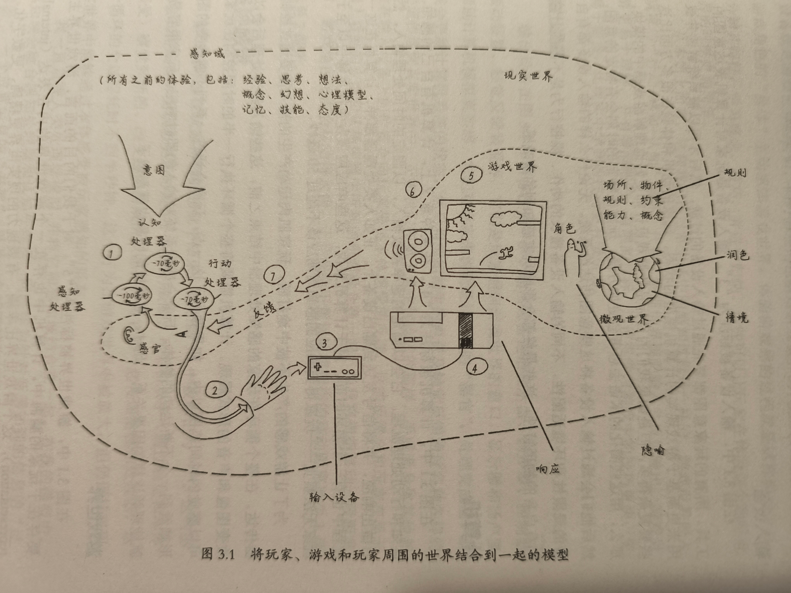

游戏感模型

没啥新的东西，就是描述玩家感知、操作输入、计算机处理、计算机输出这样的一个完整的游戏循环。

此外还要加上`玩家的意图`。

意图来自何处？是什么驱动了玩家去做出一些行为？

现实世界：马斯洛提出的人类需求金字塔模型。

游戏世界：设计师应该制定目标（不论是阴性的还是显性的），刺激玩家在游戏世界中行动。通过一个看起来随机的、可搜集的抽象变量来制造有意义且引人注目的玩家意图。

游戏世界中的逻辑应该是简单易懂的，同时给玩家清晰的动机，对玩家投入的努力给予响应的奖励和反馈。

很多时候这些奖励是很平凡的或容易被忽略的。这种情况是好是坏，这是一个问题。但这至少使得大多数游戏世界实际上先天存在目的性。

例如，原神中，每个地图有探索度、神瞳搜集这类目标，这些都不是强制性的，有的人特别地想完成它，有的人却会忽略它。忽略它的人也不会有什么损失，不会影响对其它游戏部分的体验。当你体验完游戏的主线内容，进入长草期后，一部分事先忽略这些的人，可能会选择完成这些小目标。这些看上去可有可无，甚至有些无聊的小目标，至少拓展了游戏中可体验的内容。