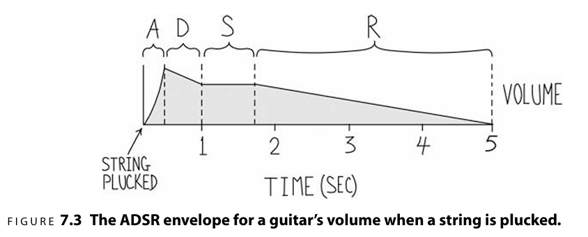
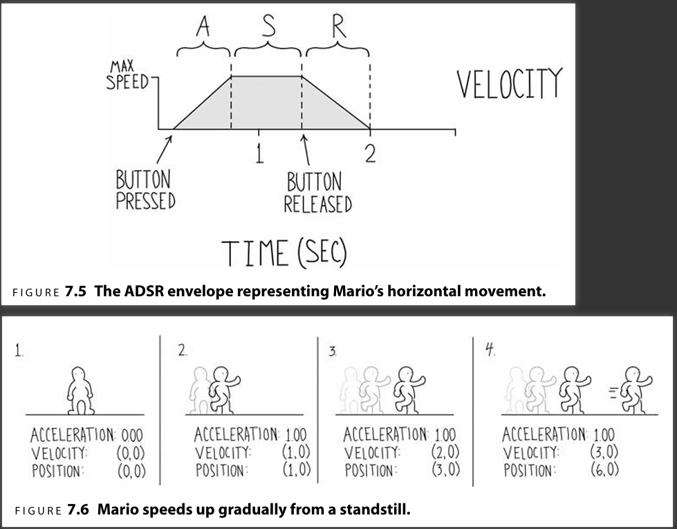
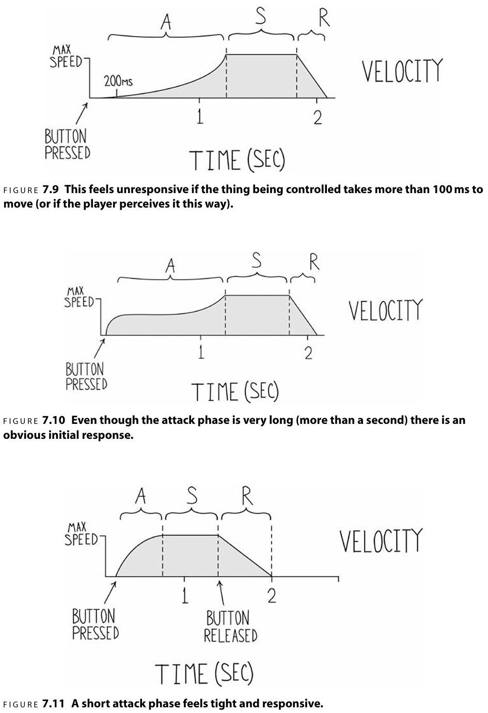
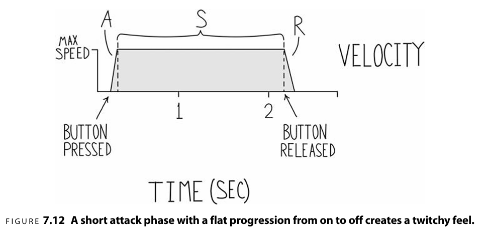
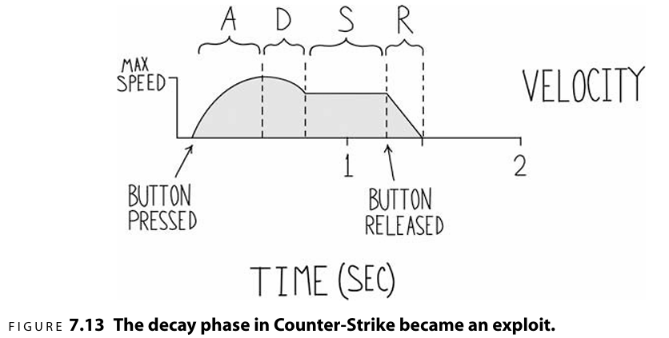
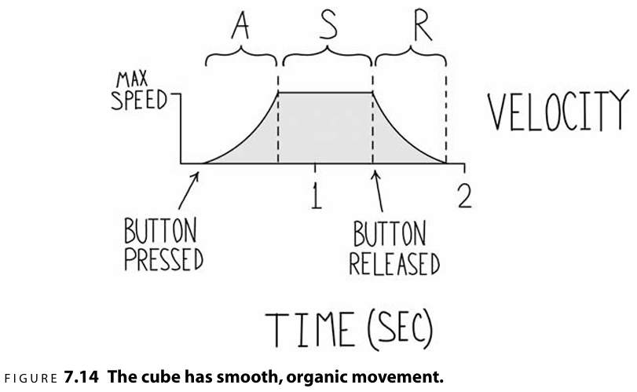

# 响应的测量方法

主要是游戏响应玩家输入的方式，带给玩家的体验。即常说的"手感"。

# 1. 玩家输入到游戏内行为的映射。
* 一种输入可以映射到一种行为，例如移动，跳跃。
* 一种输入随当前角色状态的不同可以映射到不同的行为，例如，在空中，地上，水中，WSAD的移动输入是相同的，当游戏内的响应确是不同的。
* 多个输入组合成一种新的信号，游戏中产生新的响应。
* 动作游戏中的搓招，连招输入，游戏能产生丰富多彩的不同响应，给玩家全新的体验。

# 2. 响应的测量方式：冲击、衰减、保持和释放

模仿描绘乐器发出声音的方式，利用ADSR(Attack,Decay,Sustain,Release)包络图描绘游戏内参数是如何响应玩家输入的。

分为四个阶段，
* Attack冲击阶段，响应输入的初始阶段，往往对输入有较为敏感的响应。
* Decay衰减阶段，冲击阶段后，响应处于最大值，会进入一个短暂的衰减阶段。
* Sustain保持阶段，衰减阶段后，进入保持阶段，响应量保持稳定不变。
* Release释放阶段，输入停止，响应慢慢恢复原状。

对应于游戏中，常见的角色运动速度对输入的响应：

* 按下按钮，立即获得一个加速的，速度随时间线性增长，知道达到最大速度，这就是冲击阶段。
* 只要按钮不松开，就保持最大速度移动，这是保持阶段。
* 按钮松开，随时间线性减速，知道速度归零，这是释放阶段。

这里最关键的是响应变量随时间的变化方式，是线性的、指数级的、还是其它的不规则曲线形式的变化，这是影响玩家输入手感的关键。

## 2.1 冲击阶段

我们可以总结一下不同的包络曲线会体验到怎样的操作感：

图7.9，一个较长的冲击阶段会让玩家感觉到"飘"或"迟钝"，通常情况下这会让玩家觉得响应不够及时，这是设计师应该避免的，我们应该让玩家感受到迅速、灵敏的响应。但在特定情境下，例如巨型飞船的控制，其质量很大，加速的过程就是这么漫长。

图7.10，就是一个迅速灵敏的响应。

图7.11，也是迅速灵敏，张弛有度的，冲击阶段的初始部分是非常急速的，后面还有很长一段冲击过程。

冲击的初始阶段通常是非线性曲线，这样才能保持一种流畅的活力，加强玩家对即时响应的感知。

如果冲击阶段是线性、较短的直线，如图7.12，会给玩家一种抽搐的感觉，一种不自然的僵硬感。因为响应太灵敏了，但这并非完全是坏事，这取决于你想要的游戏效果。在游戏需要灵敏地控制角色做精准的位移时，这种感受也是很好的。

## 2.2 释放阶段
这是冲击的镜像阶段，这里需要强调的是"软释放"，就从冲击阶段的逐渐响应输入到最大值的过程，这样会营造一种松弛感，突然停下，戛然而止会给玩家一种突兀的感觉。如果你的游戏需要灵敏也不是不行。

## 2.3 衰减阶段
游戏中，衰减阶段通常是一种意外情况，或者是有意为之。为什么不希望这样？因为这种操作会让玩家把键盘按坏的。

但也有游戏把它设计成一种机制，例如三角洲行动中的小碎步，快速点按Shift+W，即冲刺+前进，就是为了保持快速的、无声的移动。因为在衰减阶段之后的保持阶段，速度比冲击的最高点还低，三角洲中还有个特殊机制，冲击阶段还没有脚步声。

# 3. 模拟机制
如何构造这些包络图？通常是要设定一些游戏参数，通过输入影响其中的某些参数，达到我们想要的效果。这类似于对游戏内的机制进行数学建模，设定一个模型，玩家的输入会影响这个模型的输出。

例如对移动的建模，有速度，加速度，阻力，最大速度，最大加速度。玩家的输入就是增加加速度：

模拟机制（模型）的构建，是很重要的，它决定了可能衍生出来的操作感。

另一个例子，如果没有加速度，阻力，玩家输入直接影响位置，有输入时直接给玩家位置加上某个值，那就是前面图7.12那种灵敏的响应。

# 4. 过滤

为了更好的调整游戏手感，通常会用一层代码把接收到的原始输入型号进行过滤后变成一个数值范围。例如现在大多数游戏中给玩家调整的鼠标灵敏度。

一些游戏中，对开车的手感，如果刚一按下转向键就转了个大弯，给人的感觉就很突兀，但是如果能够，根据玩家按下转向键的时长，逐渐增大转向速率，给人的感觉会好很多。