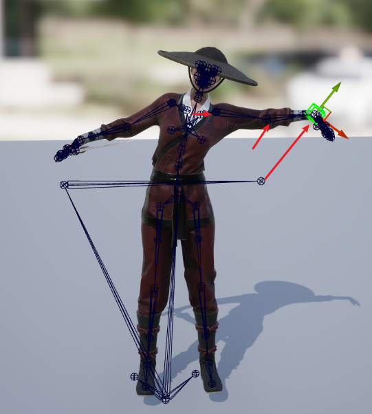
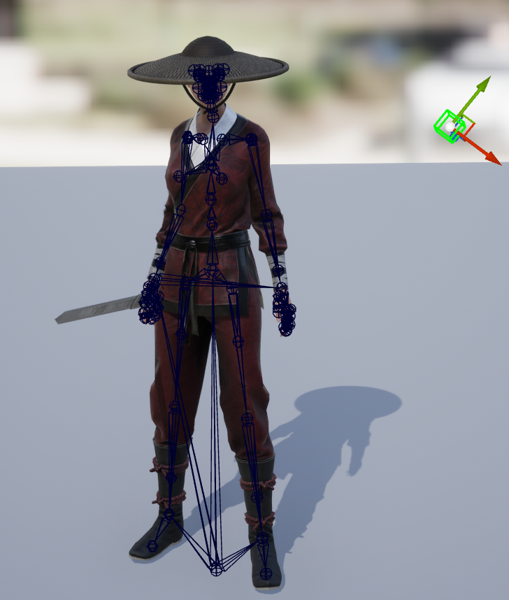
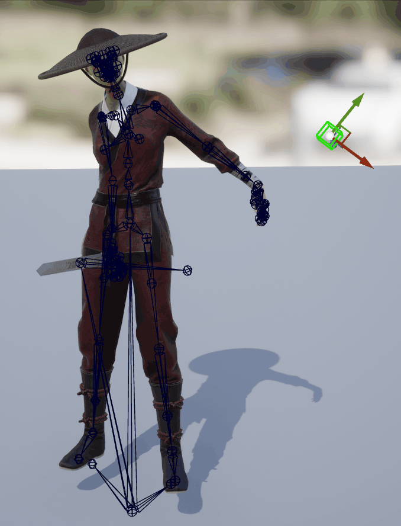
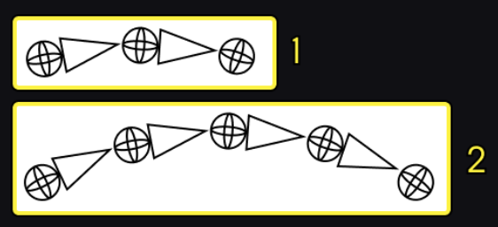

# Introduction
* 

# IK(Inverse Kinematics)

# IK Rig

[IK Rig documentation](https://dev.epicgames.com/documentation/zh-cn/unreal-engine/ik-rig-in-unreal-engine)

`UIKRigDefinition`

可以定义一些IK Goal，并指定IK解算算法，例如这里给手加个Ik Goal，然后把手向右上移动，这里用Full Body IK Solver，可以得到`为了让IK Goal到达指定位置`，所有其它Bone应该有的Transform，Rotation，相当于以程序化的方式生成了一个Pose，或者说一帧动画。

然后就可以把这一帧动画，叠加到输入Pose上：

叠加IK Rig后：

这里也可以创建Retarget chain。

# IK Retargeter

`UIKRetargeter`

# reference 

* [UE5 IK](https://dev.epicgames.com/documentation/en-us/unreal-engine/unreal-engine-ik-rig)
* [IK Rig重定向](https://dev.epicgames.com/documentation/zh-cn/unreal-engine/ik-rig-animation-retargeting-in-unreal-engine)
* [使用IK Rig重定向两足角色](https://dev.epicgames.com/documentation/zh-cn/unreal-engine/retargeting-bipeds-with-ik-rig-in-unreal-engine)