## Base

### AnimGraphNode Function
AnimGraph中的所有函数都多了三个委托函数，可以绑定到别的函数：
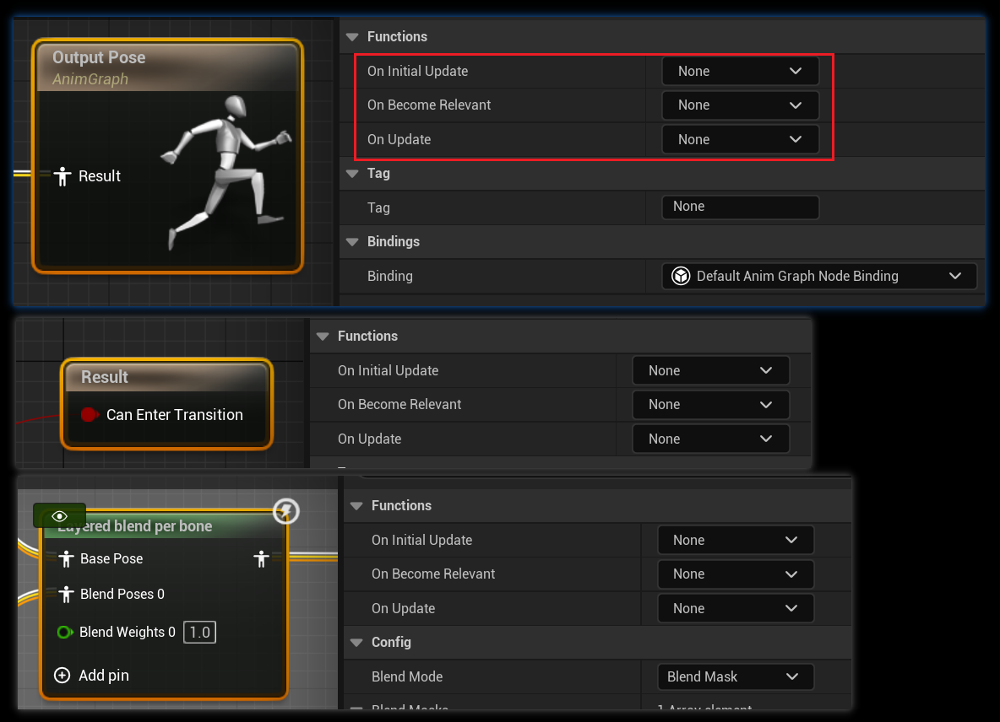

* OnInitialUpdate：在当前节点第一次调用Update之前，只执行一次。
* OnBecomeRelevant：当前节点权重从0变成任何其它权重时，`FNodeFunctionCaller::BecomeRelevant()`。
* OnUpdate：当前节点Update时都会调用这个。

### `IsStateBlendingIn()`和`IsStateBlendingOut()`
* Both functions answer: for this specific state (the FAnimNode_StateResult you pass), is it currently blending in or blending out within its owning state machine during an update tick?

`UAnimationStateMachineLibrary`中的蓝图函数，输入`FAnimUpdateContext`和`FAnimationStateResultReference`，可以判断当前动画状态是正在BlendingIn还是BlendingOut。假设当前Node输出的动画状态是B，状态机的当前状态是A。

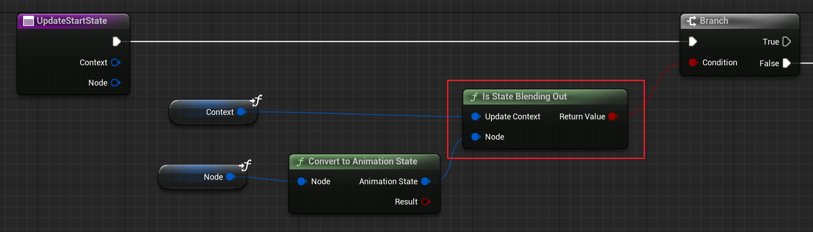

* **BlendingIn**: 如果A==B，且B.Weight<1.f，说明当前正状态正在BlendingIn。
* **BlendingOut**: 如果A!=B，且B.Weight>0.f，说明当前状态正在BlendingOut。

## LeftHandPose_OverrideState
状态机计算出基本的Pose之后，第一个处理的是`LeftHandPose_OverrideState`。是用来覆写左手的Pose的。

在`ABP_ItemAnimLayersBase`中，它实现为：

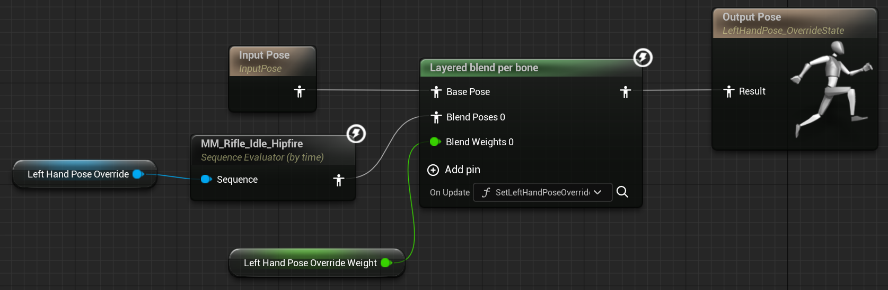

输入Pose与另一个Pose进行混合，`LeftHandPoseOverride`被设置为`ExplicitTime`，即每次这个节点初始化的时候都会读取`ExplicitTime`指定的时间点的`Pose`，即第0帧的Pose。

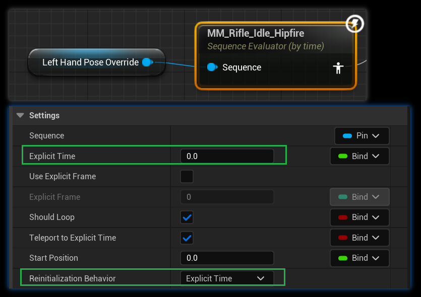

`LayeredBlendPerBone`指定的[BlendMasks](https://dev.epicgames.com/documentation/en-us/unreal-engine/blend-masks-and-blend-profiles-in-unreal-engine)为`LeftFingersMask`，即指混合左手手指。同时混合之前会调用`SetLeftHandPoseOverride`更新混合权重，里面有个bool开关，决定要不要混合。

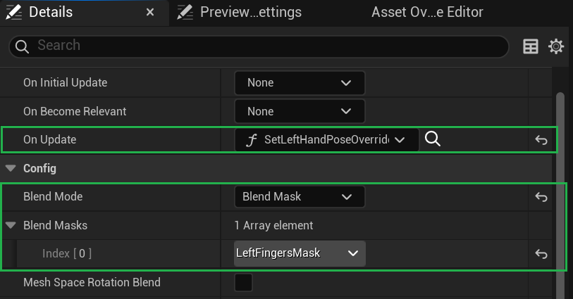

大部分子动画蓝图的这个配置都是关了的，只有`ABP_ShotgunAnimLayers`是开的，他的父类是`ABP_RifleAnimLayers`，这两把枪的动作可以说是一模一样，除了左手握持的姿势有一点点区别，所以`ABP_ShotgunAnimLayers`就用这个功能，做一帧左手握持正确的动画，在这里混合进来，仅微调一下左手的姿势。

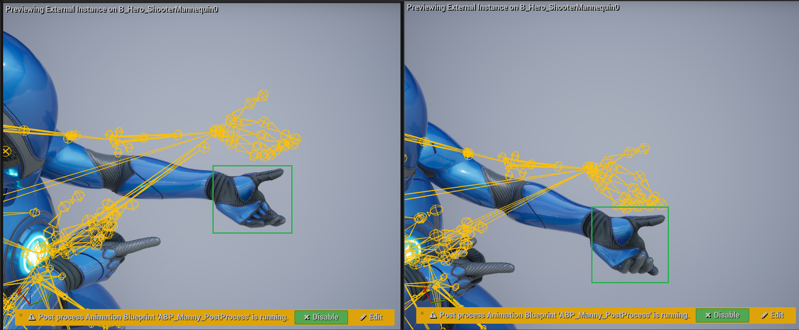

## Upperbody/lowerbody split
有了基本的Localmotion基础Pose，这部分的功能是提供一些Montage播放的Slot，进行上下半身的姿势调整，

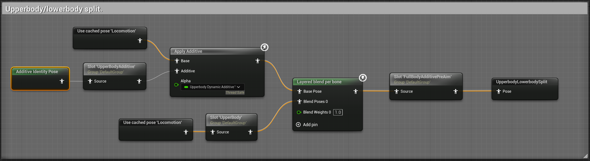

1. `UpperBodyAdditive` Slot 播放的Montage，实现的是动态按权重`UpperbodyDynamicAdditiveWeight`叠加到Locomotion输出上。权重的更新`UpdateBlendWeightData()`实现的逻辑是：
* 玩家在地上，并且有montage在播的时候直接以1全量叠加。
* 如果不满足上面条件时，1渐渐插值到0，平滑地结束叠加，比如突然跳起来时。

    这里Slot的名字虽然叫`UpperBodyAdditive`，但它仍然是全身叠加的。这个Slot播放的动画必须是叠加动画，期望的是只有上半身的叠加动作，不然估计效果会不对。

2. `UpperBody` Slot 是不论这个Slot播的啥，最终都只会叠加上半身。因为后面的`Layered lend per bone`用的是`UpperBodyLowerBodySplitMask`，这个mask下半身都是0。虽然这里Blend Weight是写死的0，但是仍然会按Blend Mask里面对每个骨骼设置的Mask权重进行混合。

4. `FullBodyAdditivePreAim` 就是一个普通的Slot了，爱播啥就播啥，按Montage的逻辑处理。例如射击动作：`AM_MM_Pistol_Fire`。

5. 装弹动作的处理，装弹动作在`UpperBody`和`UpperBodyAdditive`都在播放，分别播放装弹动作的非叠加版本和叠加版本。这样做估计是想让换弹动作在叠加到Locomotion后，再和基础的换弹动作blend一下，使即使叠加了幅度很大的Locomotion，也让换弹动作看起来更平滑。

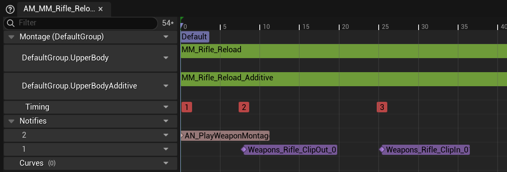

## FullBody_Aiming

瞄准通常是基于idle状态的，Lyra中有四种Idle状态：没有武器的Idle、Idle Hipfire(腰射)、Idle ADS(Aim down sight开镜瞄准)、Crouch Idle，均要考虑瞄准。

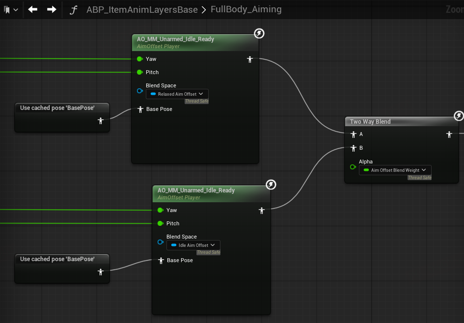

动画蓝图中，AimOffset只分了两种，RelaxedAimOffset和IdleAimOffset，RelaxedAimOffset在所有AimLinkedLayer的实现都是`AO_MM_Unarmed_Idle_Ready`，即没有武器的AO，只有头上下左右看。持有不同的武器，对应不同的AimLinkedLayer实现，有不同AO，`AO_MF_Pistol_Idle_ADS`，`AO_MM_Rifle_Idle_ADS`。在做AO中每个方向的动画时，[要满足这里提到的条件](Animation.MontageAndSlot.md#animation-additive-or-nonadditive)，BaseAnimation需要是对应的Idle状态。

这里为啥还要和没有武器的Idle瞄准Blend呢？而且AimOffsetBlendWeight的计算还挺复杂，HipFireUpperBodyOverrideWeight又是什么。

## AnimLinkedLayer - FullBodyAdditives

这是给AimLinkedLayer实现FullBodyAdditives接口，Layer中是按武器分不同的AimLinkedLayer的，这里是特定武器相关的动作叠加。

Layer给的一个实现例子是跳起来后的着陆动画:

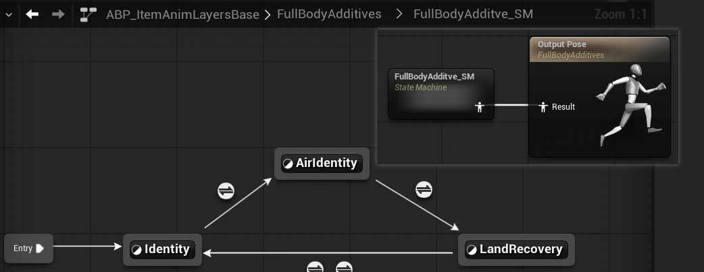

在这个后面还有一个`FullBody Slot`，可以用来播放全身Override的Montage，比如闪现，不用被瞄准等动作覆盖。

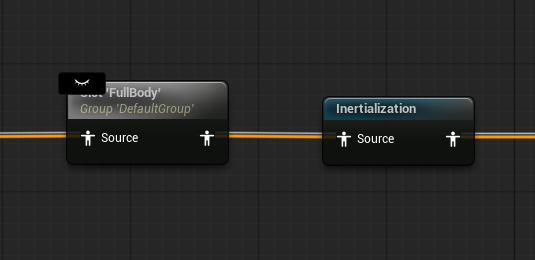

而`Inertialization`，惯性混合，一些Blend节点、状态机的过渡条件可以配置过渡类型为`Inertialization`。传统混合在过渡期间会计算源姿势和目标姿势，然后合成混合姿势。

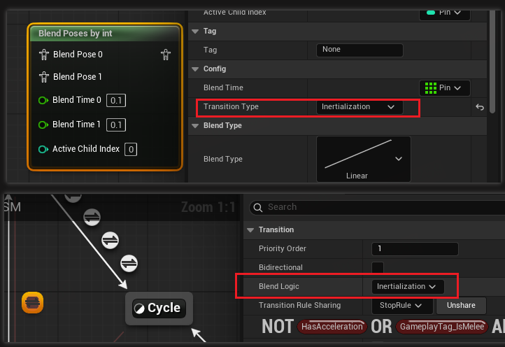

而惯性混合不会再计算Source姿势，？

1. 记录切换瞬间的状态：当动画状态切换时（例如从“奔跑”切换到“行走”），系统会记录当前动画的骨骼位置、旋转及其变化速率（速度）。所以不会再计算SourcePose。
2. 应用惯性衰减：在新动画播放初期，系统会将记录的“速度”作为惯性力施加到新动画上，并随时间指数衰减（类似弹簧阻尼系统），使新旧动画的过渡更连续。
3. 通过数学公式（如阻尼振荡）计算过渡曲线，避免线性混合的突兀感。

## TurnInPlace
原地转身，用于在角色处于各种Idle状态时，转动View不会立即将整个角色马上转到当前View，而是上半身先跟随View转动，下半身脚不动。在上半身转过大于一定角度时，再通过动画慢慢将整个身体（包括下半身）转动到与当前View一致。

在玩家转动视角时，角色会先整个MeshComponent旋转到当前View，此时是滑步转过去的。

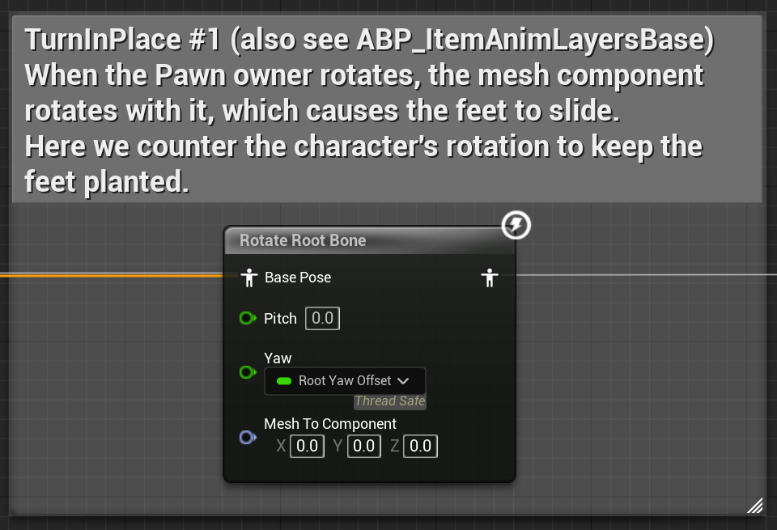

这里先用`RotateRootBone`把角色转回去RootYawOffset，使全身都回到角色旋转前的状态。然后，用`AimOffset`，将`AimYaw`设为`-RootYawOffset`，使角色**上半身姿势**恢复到当前View方向。实现下半身不动，上半身转。

当RootYawOffset大于一定值时，再启动真的原地转身动画，慢慢把脚也转过去。

### 具体细节
BlueprintThreadSafeUpdateAnimation:

**UpdateRotationData()**

用当前获得的`OwnerActor.GetActorRotation`与前一帧记下的`WorldRotation`求差值，得到这一帧`Rotation.Yaw`的变化量`YawDataSinceLastUpdate`。

**UpdateRootYawOffset()**
根据`RootYawOffsetMode`决定如何调用`SetRootYawOffset()`，这里面会同时更新`RootYawOffset`和`AimYaw`,保证这两者互为相反数，角色最终的方向始终是当前View的方向。

* **RootYawOffsetMode==Accumulate** 要求叠加YawOffset，这通常是在角色处于Idle状态时，站着或蹲着都一样，直接尝试更新为：`RootYawOffset-=YawDeltaSinceLastUpdate`，逆角色转动的Delta值转回原来的方向。
* **RootYawOffsetMode==BlendOut** 要求BlendOut YawOffset，通常是在角色移动的时候，就不需要原地转身的动画了。平滑地将RootYawOffset插值到0。
* 末尾都会把`RootYawOffsetMode`重置为BlendOut，前面的状态机逻辑每帧都需要确定是希望Accumulate还是BlendOut，因为大多数状态都是希望BlendOutYawOffset，基本上只有Idle状态会希望Accumulate。
 
UpdateAnimationGraph：

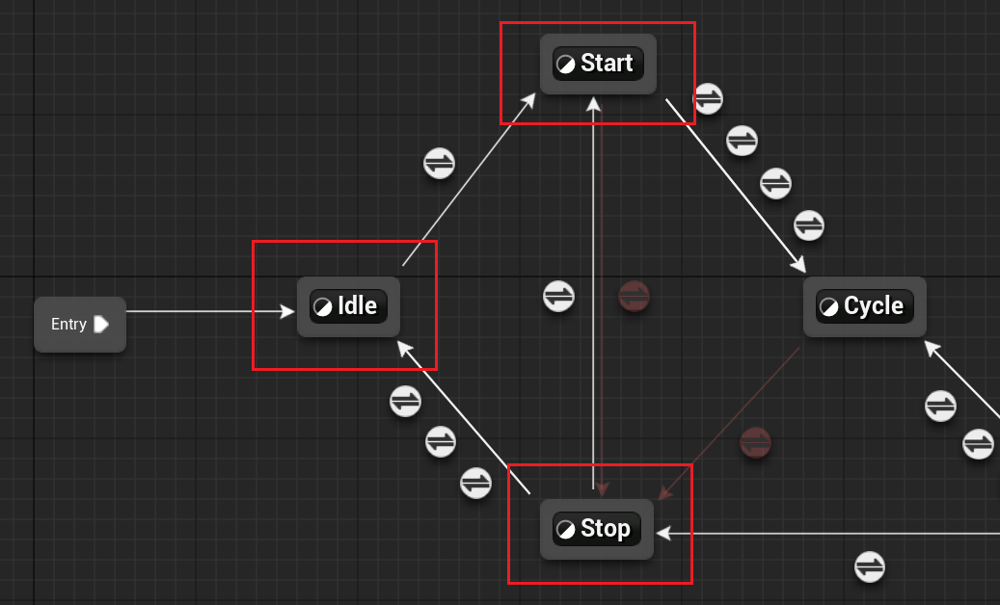

当这三个状态发生变化时，会更新`RootYawOffsetMode`。

* **UpdateIdleState** 处于Idle状态时，只要不是BlendingOut，`RootYawOffsetMode`就一直设为Accumulate，可以正常累计YawOffset。随后调用`ProcessTurnYawCurve`。
* **UpdateStartState** 处于Start状态时，这个状态是角色开始往各个方向移动了，包括Jog，ADS，Crouch。这时就不应该有YawOffset了，所以`RootYawOffsetMode`会被设为`Hold`，RootYawOffset将不会再发生变化。
* **UpdateStopState** 当处于Stop状态时，说明要进入Idle了，要开启原地转身了，所以这里也会把`RootYawOffsetMode`设为Accumulate。

在`UpdateIdleState`中，如果决定累加YawOffset，还会调用`ProcessTurnYawCurve`立即处理全身旋转向动画已经转了的角度，要从RootYawOffset减掉这一部分。如果有转身动画，这里需要知道上一帧它转了多少度，这个信息约定好在转向动画的动画曲线中获得：

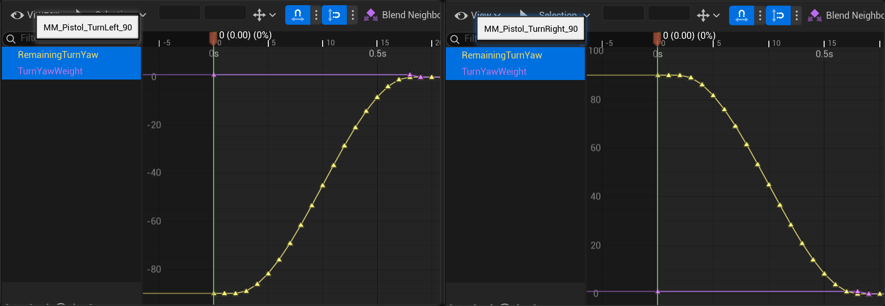

`RemainingTurnYaw`记录的是当前动画还剩多少度没有转完。`TurnYawWeight`记录的是当前是否还需要处理旋转角度，这里为啥不直接用`RemainingTurnYaw`为零判断？因为当前帧处理的是上一帧转的角度，所以这里`TurnYawWeight`在`RemainingTurnYaw`为0后，还需要多一帧为1。处理逻辑：

在`ProcessTurnYawCurve`中：
* `TurnYawCurveValue`记录了上一帧的剩余旋转度数，令`PreviousTurnYawCurveValue`=`TurnYawCurveValue`。
* 如果`TurnYawWeight`为0，说明上一帧没有旋转了，不处理。
* 然后，`TurnYawCurveValue`=`RemainingTurnYaw`/`TurnYawWeight`，这里通常都是1，可以设为别的值缩放旋转度数。
  * `PreviousTurnYawCurveValue`!=0时：
    * 用`RootYawOffset-(TurnYawCurveValue-PreviousTurnYawCurveValue)`调用SetRootYawOffset()。

以上，如果`AnimLayer-FullBody_IdleState`没有实现原地转身动画的播放，将一直保持下半身不转上半身转的状态，如果RootYawOffset过大，在`SetRootYawOffset`会被Clamp，避免转得太离谱。

然后调用AnimLayer - FullBody_IdleState,`ABP_ItemAnimLayersBase`有实现原地转身动画状态：

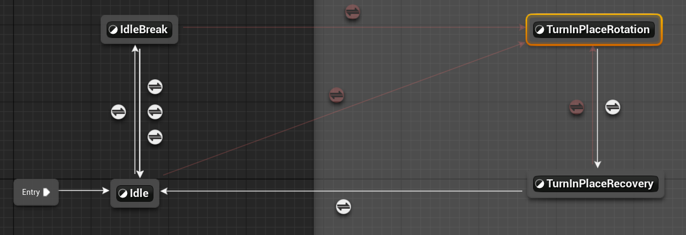

当`RootYawOffset`大于50，就会进入`TurnInPlaceRotation`状态，这里是逆着RootYawOffset的方向选择动画播就行。在读到`TurnYawWeight`的值为0的时候就退出`TurnInPlaceRotation`状态，进入`TurnInPlaceRecovery`，注意，此时转身动画通常还剩一点稳定动作没播完，所以这个状态如果判断到`RootYawOffset`仍然大于50时，即玩家在快速连续转向，可以立即过度回`TurnInPlaceRotation`，实现了大于转身动画本身的旋转角度时的连续无缝转向。

* 如果进入`TurnInPlaceRecovery`状态后，`RootYawOffset`没有大于50，不需要转回`TurnInPlaceRotation`，就会继续之前的进度把剩下的转向进度播完。然后回到Idle状态。因为剩下来的动画中，`RemainingTurnYaw`和`TurnYawWeight`都为0，`RootYawOffset`不会受到影响。

### 没转满90度，RootYawOffset就为0了怎么办？
无论如何`TurnInPlaceRotation`都会把转身动画播到`TurnYawWeight`都为0才转换到下一个状态的，所以一定会播完90度转身，但同时`ProcessTurnYawCurve`中也会一直减掉转身的角度，无非是最终从-50度到+40度，最终姿势肯定是对的。打印出转身过程`RootYawOffset`的变化：

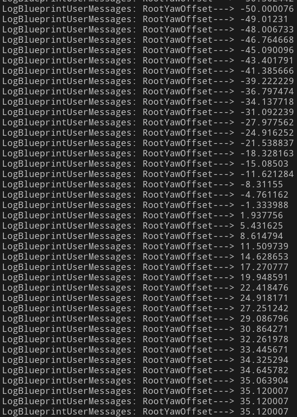

最后多转的35度，同样会用AimOffset补偿回来。

### AutomaticRuleBasedTransition 
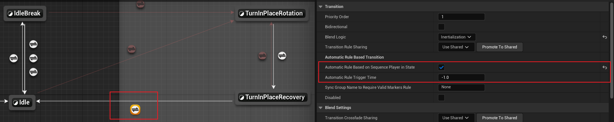
有一种特殊的过渡条件`bAutomaticRuleBasedOnSequencePlayerInState`，和`AutomaticRuleTriggerTime`配合使用，当前面一个勾上时，会基于最相关的正在播放的Anim的剩余时间决定开始转换：
* 如果`AutomaticRuleTriggerTime<0`，就用下面BlendSetting的Duration，当剩余这么长时间时开始Blendout。
* 如果`AutomaticRuleTriggerTime>0`，就用`AutomaticRuleTriggerTime`自己。

# Reference

* https://www.jaydengames.com/posts/ue5-black-magic-game-core-animation/
* [UE4/UE5 动画蒙太奇Animation Montage 源码解析](https://zhuanlan.zhihu.com/p/664971350)
* [UE5 白话Lyra动画系统](https://zhuanlan.zhihu.com/p/654430436)
* [Documentation Aim offset](https://dev.epicgames.com/documentation/en-us/unreal-engine/aim-offset-in-unreal-engine)
* [惯性化混合](https://dev.epicgames.com/documentation/zh-cn/unreal-engine/blend-nodes?application_version=4.27#%E6%83%AF%E6%80%A7%E5%8C%96)
* [animation-blueprint-node-functions-in-unreal-engine](https://dev.epicgames.com/documentation/zh-cn/unreal-engine/animation-blueprint-node-functions-in-unreal-engine)
* [Transition rules](https://dev.epicgames.com/documentation/zh-cn/unreal-engine/transition-rules-in-unreal-engine)