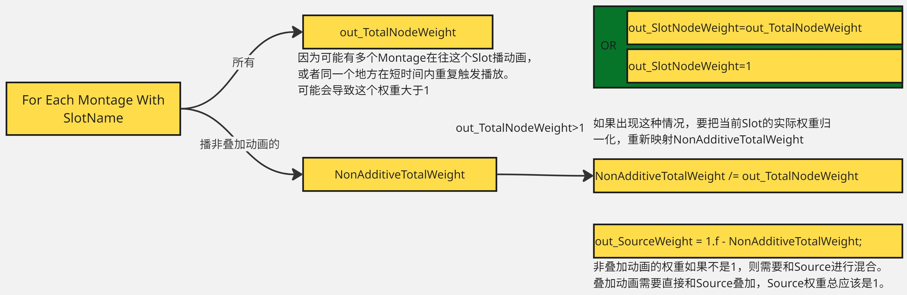
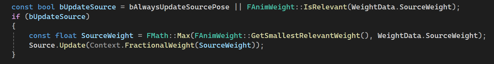
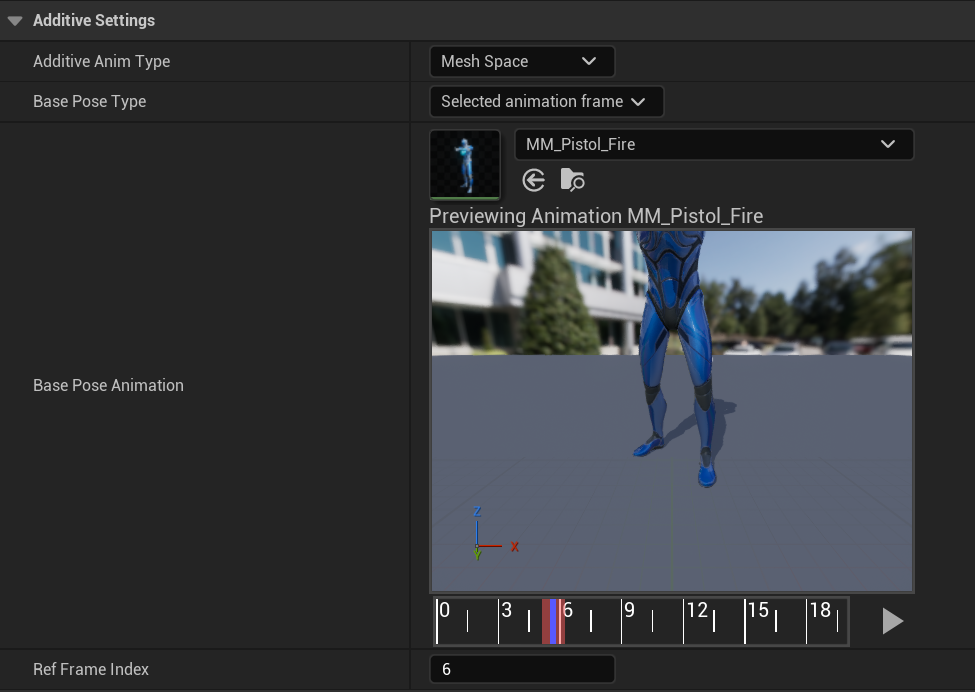

# Slot Node
可以插入到动画蓝图任何位置，指定一个SlotName，然后在外面播放Montage时，指定一个SlotName，就会在动画蓝图对应位置播放[^1][^2]。
* SlotName信息是保存在骨骼中的。
* SlotNode有一个Source输入，Slot没有Montage插入时，就会直接输出Source。
* 如果有Montage播放时，视情况直接输出Montage播放的动画或者与Source混合后再输出，`而不是文档说的直接覆盖Source`。
* 当不需要Source Pose时，默认会不更新Source Pose，有个属性可以控制这一行为。

`FAnimNode_Slot::Update_AnyThread`，会计算在当前Slot播放的Animation的权重：
* `FAnimInstanceProxy::GetSlotWeight`
```c++
void FAnimInstanceProxy::GetSlotWeight(const FName& SlotNodeName, float& out_SlotNodeWeight, float& out_SourceWeight, float& out_TotalNodeWeight) const
```
遍历当前`FAnimInstanceProxy`的所有Montage，对于在当前SlotNodeName播放的，累计混合权重，这个值可能大于1，要归一化。此外还要判断Montage在这个Slot播放的动画是否是NonAdditive，这种动画权重不是1时，需要和Source进行混合，在非BlendIn、BlendOut阶段，权重为1，就会直接覆盖Source，单独累计它的权重为`NonAdditiveTotalWeight`，那么`SourceWeight=1-NonAdditiveTotalWeight`。


如果配置了总是更新Source，或者Source权重不为0时，就会UpdateSource：



`FAnimNode_Slot::Evaluate_AnyThread`执行真正的混合，`SourceWeight`如果为0，就不会`Evaluate`。在`FAnimInstanceProxy::SlotEvaluatePose`中执行的真正的计算：
* 先遍历所有Montage，把有这个Slot的动画，它的权重和Pose都提取出来，分为`NonAdditivePoses`，和`AdditivePoses`。
* 对这两种所有Pose权重进行归一化。
* 如果没有`NonAdditivePoses`，OutBlendedAnimationPoseData初始化为SourcePose，有就按权重和Source混合。
* 最后再混合`AdditivePoses`。

# Animation Additive or NonAdditive
AnimationSequence播放时可以直接覆盖应用，或者叠加，这一点可以在`AnimationSequence`的`AssetDetial`中设置[^3]：


其中提取叠加动画时需要指定BasePose，通常是按配置，从指定动画中选一帧就行。

这里的`Additive Anim Type`，通常用的是Local Space，叠加动画将在Local Space生效，不论父骨骼的姿势，都能平滑地应用上。

而`Mesh Space`则是指将叠加在SkeletalMeshComponent空间应用，通常被用于`Aim Offset`，一种空间混合：


例如我们有向上瞄准的叠加动画，同时，角色可以左右探头，当角色向左探头时，如果用`Local Space`的叠加动画，向上瞄准就变成了向左上方瞄准，如图中2所示。我们当然希望这里仍然是向上探头，所以，将向上瞄准的叠加动画设为`Mesh Space`，在Component 空间叠加动画，就能保证叠加动画不会受父级骨骼的影响，依然保持向上。


# Reference
[^1]: [Documentation Montage](https://dev.epicgames.com/documentation/zh-cn/unreal-engine/animation-montage-in-unreal-engine)

[^2]: [Documentation Slot Node](https://dev.epicgames.com/documentation/zh-cn/unreal-engine/animation-slots-in-unreal-engine)

[^3]: [Documentation Animation Sequence](https://dev.epicgames.com/documentation/zh-cn/unreal-engine/animation-sequence-editor-in-unreal-engine)

[^4]: [Documentation Blend Node](https://dev.epicgames.com/documentation/zh-cn/unreal-engine/animation-blueprint-blend-nodes-in-unreal-engine#layeredblendperbone)
