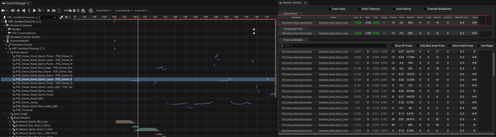

动画蓝图中与Motion matching相关的最关键的两个节点：Pose History和Motion Matching。

从RewindDebugger可以看出Motion matching是如何选择动画帧的，

Pose Search的基本单位是`PoseSearchDatabase`，就是一个AnimationSequence的集合。一个

# Debug tools
## Rewind Debugger

## reference 
状态机动画
* 角色当前状态直接决定动画状态（播什么动画）
* 玩家输入决定动画的切换
* 随着动画状态的增加，切换过渡也会急剧膨胀，动画状态机的复杂度上升，难以维护
 
Motion matching

key: 角色当前的状态：速度、动画姿势(pose)，轨迹可以决定动画帧。

对角色运动状态进行特征提取：
$$
e_c=(velocity,skeletonpose,trajectiory)
$$

$$
e_c=(v_i,p_i,t_i)
$$

对动画序列帧进行预处理，提取ei
* https://zhuanlan.zhihu.com/p/468756512
* https://zhuanlan.zhihu.com/p/586248403 