# 1. HLOD相关配置
Actor会BuildHLOD的条件：
* Actor开启bIsSpatiallyLoaded
* AActor::IsHLODRelevant() return true
  * 开启Include Actor in HLOD
  * 至少一个Component的IsHLODRelevant() return true:
    * Mobility != EComponentMobility::Movable
    * 开启Include Component in HLOD
满足这些条件后，Actor必会生成HLOD，没有配置HLODLayer则会给它分配WorldSetting中默认的HLODLayer。

不同的RuntimeHash对HLOD的配置处理不一样：
* UWorldPartitionRuntimeHashSet
  * HLOD与Grids配置在一起
  * 每个Grid配置有单独的HLODLayers配置
  * 这里可以给需要SpatiallyLoaded的HLODLayer配置PartitionLayer，配置LoadingRange
    * 由此生成的HLODActor会被分配至名为`GridName:HLODLayerName`的Grid，
    * 也就是说这样的HLODLayer会单独有一个Grid，这可能造成Cell数量过多。
    * 这个HLODLayer生成的Actor会按这里配置的CellSize和LoadingRange划分到Cell和动态加载。
  * 不需要SpatiallyLoad的HLODLayer生成的HLODActor会直接放进持久Cell。
  * Grid中的Actor，如果开启了自动HLOD，则它配置的HLODLayer必须出现在自己所在Grid的配置中。
  
* UWorldPartitionRuntimeSpatialHash
  * WorldSetting上的Grid配置不处理任何HLOD配置
  * 在HLODLayer上有开启SpatiallyLoaded的配置，开启后可以配置对应的CellSize和LoadingRange。
  * Build HLOD时，会生成这些HLODActor的SpatialHashGrid配置，直接是一个`ASpatialHashRuntimeGridInfo`。
  * 在`UWorldPartitionRuntimeSpatialHash::GenerateStreaming`中，会先搜集所有`ASpatialHashRuntimeGridInfo`的Grid配置，把他们与WorldSetting上的GridSetting一起处理。

# BuildHLOD
通常通过命令行构建，主要功能入口在:
```
UWorldPartitionHLODsBuilder::RunInternal()
```

BuildHLOD的大致流程：
* UWorldPartitionHLODsBuilder::SetupHLODActors()
  * UWorldPartition::SetupHLODActors()
  * 前面有着和BuildStreamingCell时一样的流程
    * 利用`FWorldPartitionStreamingGenerator`将所有Actor划分好Cluster。构成ActorSet。
  * 然后用整理好AsetSet进入UWorldPartitionRuntimeHash::SetupHLODActors()处理。

对于`UWorldPartitionRuntimeHashSet`：
* 与`GenerateStreaming`中同样的方法，先生成StreamingCell。这里是用当前World中所有的ActorSet生成的，MainGrid的配置。
* 用`FWorldPartitionHLODUtilities::CreateHLODActors`对每个Cell创建AWorldPartitionHLOD。所以每一级HLODActor数量是由它基于的Actor的Partition配置决定的。
  * 对Cell中所有HLODRelevant的Actor，`UHLODLayer`相同的划分在一起。
  * 每一个HLODLayer都会创建一个对应的AWorldPartitionHLOD(如果存在用了这个Layer的Actor)。
  * 如果对应的AWorldPartitionHLOD存在，就用旧的，不存在就用new一个。
    * 生成的AWorldPartitionHLOD会和所在Cell有一样的DataLayer
    * AWorldPartitionHLOD的成员变量`UWorldPartitionHLODSourceActors`记录了它对应的所有SourceActor。
    * AWorldPartitionHLOD上的设置大部分都是从UHLODLayer上同步来的。
    * 这里还会设置这个HLODActor对应的原来的Mesh们所在的CellGuid，这是HLODActor能够正确动态切换的关键。
    * 如果这个HLODLayer有ParentLayer，这个ParentLayer会作为HLODActor的HLODLayer，相当于下一级HLOD。
* 生成的所有HLODActor中，如果有任何Actor是有HLODLayer的，就进入下一级HLOD的生成流程。
  * 用所有新生成的AWorldPartitionHLOD构成一个`FHLODStreamingGenerationContext`，替代原来的Context，再走一遍和之前同样的AWorldPartitionHLOD生成流程。

对于`UWorldPartitionRuntimeSpatialHash`:
* 遍历所有Actor，拿到所有UHLODLayer和ParentLayer。
* 对开启了bIsSpatiallyLoaded的HLODLayer生成对应的`FSpatialHashRuntimeGrid`，CellSize和LoadingRange等参数从对应HLODLayer的配置上获得。
* 和上面一样，先把所有Actor划分到对应的Grid。
* 然后对每个Cell创建对应的`AWorldPartitionHLOD`。
  * 先创建HLOD0的`AWorldPartitionHLOD`。
  * 然后对新的`AWorldPartitionHLOD`创建下一级HLOD。
结果与`UWorldPartitionRuntimeHashSet`保持一致，都是每个Cell的每个HLODLayer都创建了一个对应的`AWorldPartitionHLOD`。

然后进入下一步`UWorldPartitionHLODsBuilder::BuildHLODActors()`:
* 获取所有的`AWorldPartitionHLOD`，排序，Child HLOD必须在Parent HLOD之前Build。
* AWorldPartitionHLOD::BuildHLOD()
* FWorldPartitionHLODUtilities::BuildHLOD(AWorldPartitionHLOD* InHLODActor)
  * HLODActor中的`UWorldPartitionHLODSourceActorsFromCell* SourceActor`保存了这个HLODActor对应的所有原始Actor。
  * 先加载它们：`UWorldPartitionHLODSourceActorsFromCell::LoadSourceActors`
  * 获取所有HLODRelevantComponents。
  * 将HLODActor(可以复用以前的)的HLODHash，与HLODActor的信息和HLODRelevantComponents计算的Hash比较，不同则说明数据发生变化，需要重新构建。否则跳过构建。
  * 根据配置确定不同的Builder：FWorldPartitionHLODUtilities::GetHLODBuilderClass(),后面再单独介绍。
    * Instancing
    * MergedMesh
    * SimplifiedMesh
    * ApproximatedMesh
    * Custom
  * 构建`FHLODBuildContext HLODBuildContext;`其中包含了所有要构建HLOD的Component。
  * HLODLayer还有个HLODModifier配置，这里会在调用Builder的构建之前
    * UWorldPartitionHLODModifier::BeginHLODBuild(HLODBuildContext)
    * 在Builder构建完之后，对生成的HLODComponent调用UWorldPartitionHLODModifier::EndHLODBuild(Comps).
    * 这里可以对构建HLOD的Component和构建结果作自定义的修改。
  * 调用`HLODBuilder->Build(HLODBuildContext)`执行真正的HLODBuild。
  * 构建的结果是一堆`UActorComponent`，通常可能是`UStaticMeshComponent`或`InstancedStaticMeshComponent`。
  * 然后把这些Component Attach到`AWorldPartitionHLOD`上。
  * 对于构建好HLODComponent，会强行设置一些东西：
    * 关闭EverAffectNavigation。
    * 关闭碰撞，关闭CanCharacterStepUpOn，关闭GenerateOverlapEvents。

## UWorldPartitionHLODModifier的用法
引擎中有一个案例`UWorldPartitionHLODModifierMeshDestruction`。

当采用MergedMesh这种把多个Mesh合成一个的HLODLayerType时，将无法移除单个Mesh。Instance的合并方法是合并成`UHierarchicalInstancedStaticMeshComponent`，是可以移除单个的。

`UWorldPartitionHLODModifierMeshDestruction`里面实现了监听MergedMesh的生成，并将ActorId写入Mesh的VertexColor，通过材质的MaskOpacity控制合并后的Mesh中部分显示出来，达到移除部分Actor的效果。`EndHLODBuild()`时，会把`UWorldPartitionDestructibleHLODMeshComponent`添加进HLODComponents，里面实现了Runtime下对单个Actor造成伤害和DestroyActor的逻辑，本质就是控制对应的材质参数、`VisibilityTexture`，达到销毁单个Actor的效果。甚至还包括了网络同步。

# HLOD Layer Type
`UHLODBuilder::Build`是真正构建HLODMesh的入口。
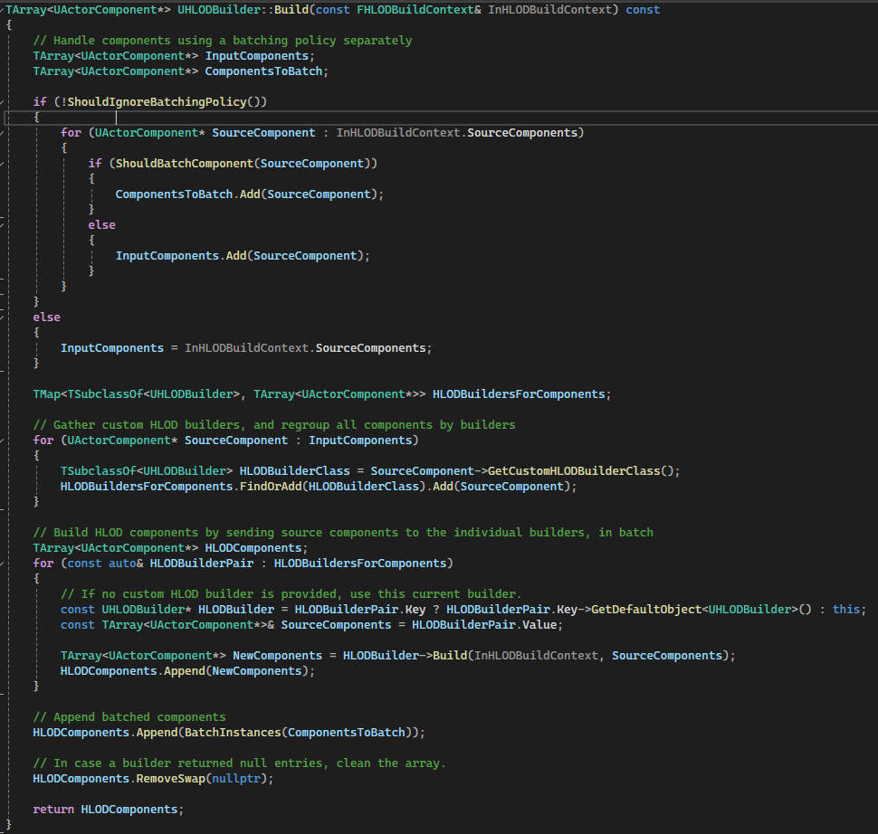

`UPrimitiveComponent`中有个配置：
```c++
EHLODBatchingPolicy HLODBatchingPolicy;
```
这里要先处理这个配置：
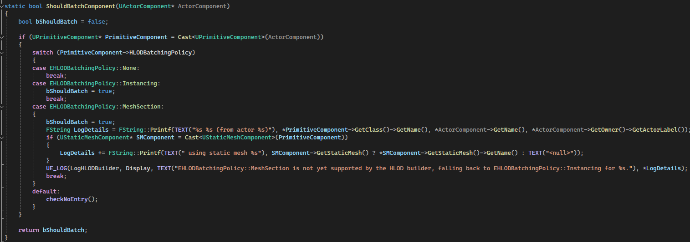
这个配置给了Component机会强制自己采用指定的方式生成HLOD，不论它所有的HLODLayer的配置如何。目前只要不是配置的None，就会强制用InstanceMesh的方式Batch，它们会在其它Component处理好之后，单独用`UHLODBuilder::BatchInstances()`合并。

但是`UHLODBuilder`的`ShouldIgnoreBatchingPolicy()`实现可以控制自己要不要处理Component上的BatchingPolicy。默认是要处理的。目前只有`UHLODBuilderInstancing`忽略，因为它本身就是用的这种合并策略。

`UActorComponent`上还有方法控制强行使用自己的自定义`UHLODBuilder`：
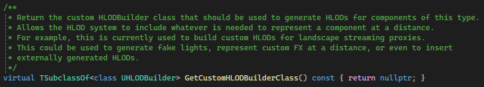

`ULandscapeComponent`就实现了自己的`ULandscapeHLODBuilder`。

`UHLODBuilder::Build()`中，会构建一个Map:
```c++
TMap<TSubclassOf<UHLODBuilder>, TArray<UActorComponent*>> HLODBuildersForComponents;
```
其中Key为nullptr的就是没有自定义UHLODBuilder的Component，那就用this，调用最终的Build方法。
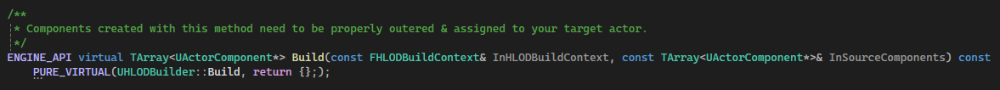
所有不同的`UHLODBuilder`就是实现这个方法。

## Instance
`UHLODBuilderInstancing`将相同的Mesh合并成InstancedStaticMesh。默认使用的是`UHLODInstancedStaticMeshComponent`。可以在Edtior的Config中配置：
```
GConfig->GetString(TEXT("/Script/Engine.HLODBuilder"), TEXT("HLODInstancedStaticMeshComponentClass"), ConfigValue, GEditorIni);
```
合并成InstancedMesh是在`UHLODBuilder::BatchInstances`中实现的：
* 仅处理`UStaticMeshComponent`。
* 利用`UHLODInstancedStaticMeshComponent`对应的`FISMComponentDescriptor`，将StaticMesh的大量属性生成一个Hash，只有Hash相同，即几乎所有`UStaticMeshComponent`的属性设置都相同的才能合成一个ISM。
  * 所以必须谨慎考虑`UStaticMeshComponent`的属性设置，虽然Mesh相同，但大量不同的Component属性设置会导致无法合并成一个ISM。
* `UHLODInstancedStaticMeshComponent`使用了派生的`FHLODISMComponentDescriptor`，初始化时，强制`UInstancedStaticMeshComponent`使用最后一级LOD:

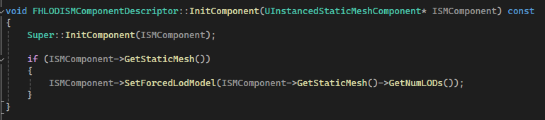

* `UHLODBuilderInstancing`中还有一个配置`bDisallowNanite`，如果开启，且ISM的Mesh开启了Nanite，且LOD数量大于一，则会关闭这个ISM的Nanite。

## MeshMerge
把所有StaticMeshComponent合并成一个StaticMesh。主要功能实现在`MeshMergeUtilities`模块中。
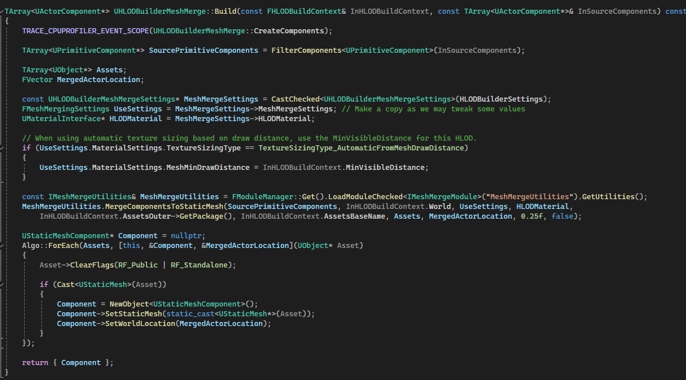

在选择MergedMesh之后，会出现`MeshMergeSettings`，关于如何合并Mesh的设置。

`UPrimitiveComponent`上有一个`HLODBatchingPolicy`，可以指定使用最后一级LOD用于合并。首先处理这个逻辑，将所有待合并的Mesh分成两部分`StaticMeshComponentsToMerge`和`ImposterComponents`，前者使用`MeshMergeSettings`上的`LODSelectionType`决定用哪一级LOD，后者使用最后一级LOD，合并成`Imposter`。这里还需要`MeshMergeSettings`上开启`bIncludeImposters`，否则全部都会被当作`StaticMeshComponentsToMerge`。

> "Imposter LODs"（仿真 LODs，或称为欺骗 LODs）通常是指使用纹理贴图来代替复杂的 3D 模型，以实现远距离视图的高效渲染。具体来说，Imposter LODs 是使用2D sprite或 billboard 技术来模拟远处的 3D 模型，以节省计算资源。

* 如果`LODSelectionType`配置的`EMeshLODSelectionType::AllLODs`：
  * 所有LOD的数据都会被记录下来
* 如果`LODSelectionType`配置的其它三个：
  * 合并的Mesh只会有一个LOD0
  * EMeshLODSelectionType::CalculateLOD会按以下规则计算：
    * 用一个ScreenSize下Mesh显示的LOD，UHLODBuilderMeshMerge::Build()中写死了这个值为`0.25`。
    * FHierarchicalLODUtilities::GetLODLevelForScreenSize()
  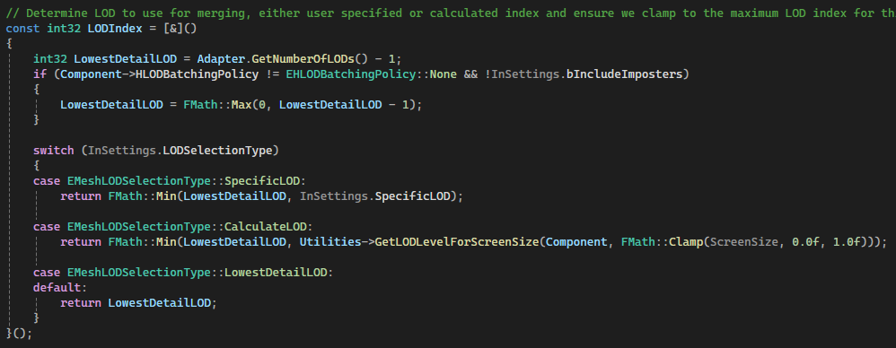
  * 对每个Mesh都会调用RetrieveRawMeshData()，把确定要用的LOD的Mesh添加到`DataTracker`中。
    * 每个Component的数据以`TMap<FMeshLODKey, FMeshDescription> RawMeshLODs;`存在`DataTracker`。
    * FMeshLODKey由ComponentIndex，LODIndex，UStaticMesh组成。
    * FMeshDescription里面包含经过处理的对应LOD的所有数据。
  * 提取Section信息，材质，材质SlotName。
  * 对于`UInstancedStaticMeshComponent`，有多少个Instance，顶点数据就会被复制多少份。
  * 如果开启`bUseLandscapeCulling`，在这里处理。
* 处理MergeSockets，物理数据，Sction，LOD，所有Mesh设置等，最后只会产生一个UStaticMesh。
* Nanite设置是完全Copy`MeshMergeSettings`上的。

创建一个对应的`UStaticMeshComponent`，这就是`UHLODBuilderMeshMerge`的输出。

这里不会主动对Mesh进行任何简化，它仅仅是根据选择的LOD，把对应的LODMesh全部合并成一个Mesh。如果是NaniteMesh，就只有一个LOD，即Fallback，这个通常也会有几万个面。此外，材质也不会进行任何简化合并，所有Mesh都使用原来的材质，都是合并后Mesh的一个MaterialSlot。

这种合并后的效果应该类似于InstanceStaticMesh，但这种合并中，相同的Mesh的数据会在最终Mesh中被Copy多份。相较于Instance，估计提升不大。

## SimplifiedMesh
这个和`MeshMerge`一样，都是把多个Mesh合并成一个。不同之处在于：
* MeshMerge 是直接使用Mesh某个LOD作为合并Mesh来源，把它们直接合并成一个Mesh。
* `SimplifiedMesh` 是采用算法计算出一个简化的Mesh，然后再合并成一个。 
  * UE自己实现了一个`FProxyLODMeshReduction`
  * 或者可以用号称业界标准的[simplygon](https://www.simplygon.com/)

`UHLODBuilderMeshSimplify::Build`：

* 计算在`LoadingRange`下，所有Component组成的Bound占屏幕的百分比，然后转成1K下的像素Size。设置到`FMeshProxySettings`中。
* 然后进入真正的模型简化：`FMeshMergeUtilities::CreateProxyMesh`
  * 确定每个`StaticMesh`使用哪一级LOD进行Mesh简化：
    * 如果不开启`bCalculateCorrectLODModel`，全都用LOD0。
    * 如果开启`bCalculateCorrectLODModel`，使用一个`ScreenSize`(这里写死了1)，计算出所有Mesh组成的SphereBound的DrawDistance。再用这个Distance计算出它对应的ScreenSize，再计算出这个ScreenSize对应的LODLevel，作为最终确定的LOD。（似乎这里应该也永远是LOD0？）
    * 对NaniteMesh，LOD0就是FallbackMesh。
  * 提取Mesh的原始数据，`UInstancedStaticMeshComponent`的各个Instance都会被展开。
  * 用`IMeshReductionModule`模块的相关方法合并成简化Mesh。
  * 材质也只会有一个，会生成一个极简的材质，根据`FMaterialProxySettings`的设置，生成对应的Texture，即可完成Shading。

以下分别测试NaniteMesh和普通Mesh，在不同的Scale下，简化后的情况。最小可见距离为25600：

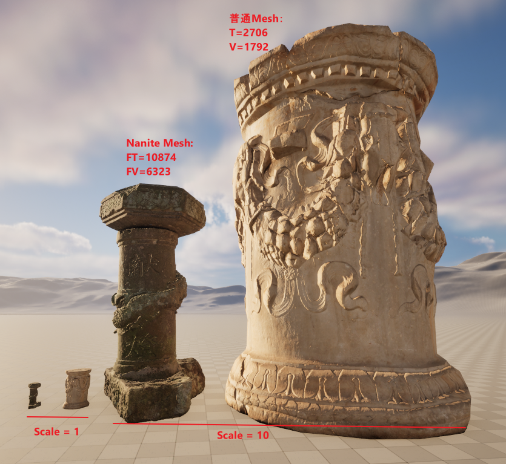

| MeshType | SourceTriangles | SourceVertices | Scale1 SimplifiedMesh | Scale10 SimplifiedMEsh|
|:----:|:----:|:----:|:----:|:----:|
|NaniteMesh| 10874 |6323|<table><tr><td>T:18</td><td>V:19</td></tr></table>|<table><tr><td>T:370</td><td>V:256</td></tr></table>|
|普通Mesh|2706|1792|<table><tr><td>T:22</td><td>V:26</td></tr></table>|<table><tr><td>T:1026</td><td>V:611</td></tr></table>|

其中NaniteMesh在简化时用的时FallbackMesh，所以这里显示的也是它的FallBackMesh的数据。

可以看到，即使简化后的Mesh面数与Mesh在屏幕上的大小占比有关，屏幕占比越大，简化后就需要的面数更多。

此外，这种合并方式还会合并材质，合并后的StaticMesh中，只有一个材质，原来的不同Mesh会被重新分配UV，仅生成设置中指定的Texture，用于Shading。

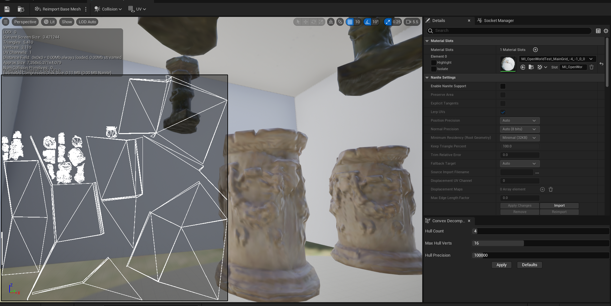


## MeshApproximate

对一组StaticMesh的输入，构建近似Mesh，和材质。

功能实现在`UHLODBuilderMeshApproximate::Build()`。这种`MeshApproximate`方法从结果上看，与`SimplifiedMesh`很相似。但是实际机制完全不同。

它主要是依赖`IGeometryProcessing_ApproximateActors`接口Actors近似方法:

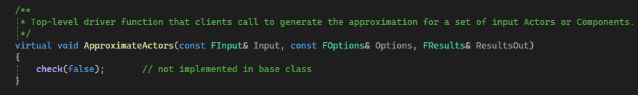

其中`FInput`就是一组`Actor`或者`UActorComponent`，`FOptions`是近似过程中的一切参数配置，大部分是从`FMeshApproximationSettings`初始化而来。`FResults`是`Input`的所有内容的近似结果：

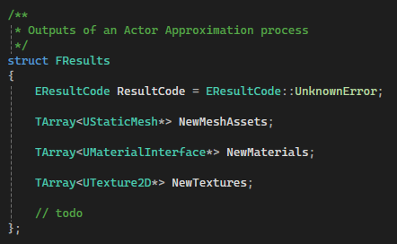

通常就一个StaticMesh和一个材质，以及配置的需要生成的Texture。

引擎给的实现是`FApproximateActorsImpl`。这里的过程有点复杂，用到了`MeshModelingToolset`模块中的`FMeshSceneAdapter`。

它与`SimplifiedMesh`相比，这里会剔除掉看不见的Mesh，这可以减少许多不必要的三角面。例如，上一节最后的截图中，展示一些完全被包围起来的StaticMesh，在用`SimplifiedMesh`合并后，其内部的`StaticMesh`仍然存在，但是，HLOD只会在远处出现，我们是不可能看到HLOD的内部的。所以这些内部的Mesh是完全不必要的。而用`MeshApproximate`方法生成的HLOD结果中：

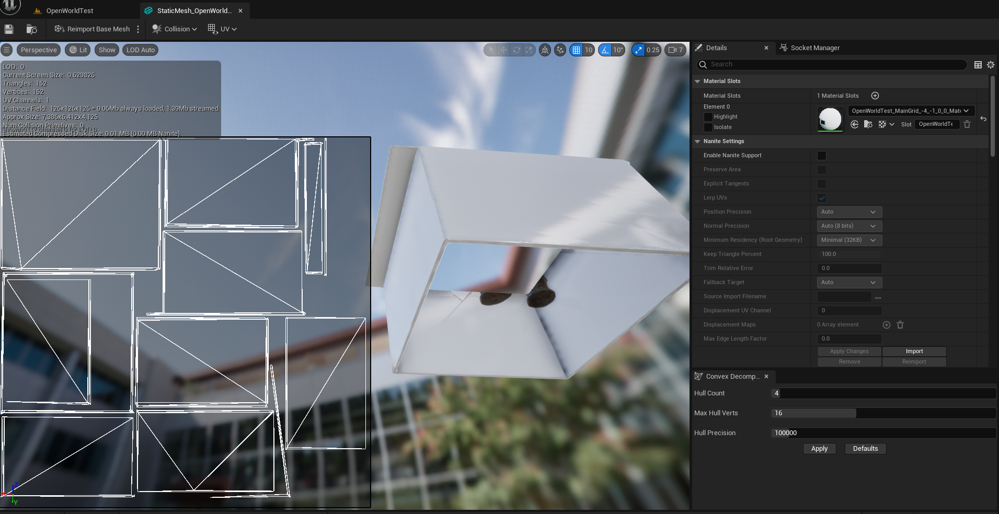

内部的Mesh就完全不存在，所以这种合并的结果通常比`SimplifiedMesh`的结果还要简化。这对于大规模的室内场景的HLOD是巨大的提升。