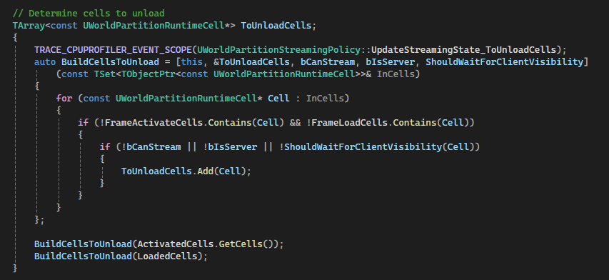

前面提到，Cook时，所有Actor都会被分配到合适的`StreamingCell`中，被保存在对应Level的UWorldPartition中。Runtime下需要通过`UWorldPartition`加载卸载这些`StreamingCell`。由于`ALevelInstance`可以配置为`Standalone`，使其代表的Level作为一个子世界分区独立考虑其`UWorldPartition`，所以还必须同时考虑多个`UWorldPartition`存在的情况。`UWorldPartitionSubsystem`是一个`WorldSubsystem`，用于管理多个`UWorldPartition`的流送。

# WorldParition初始化

初始化时，需要把`UWorldPartition`注册到`UWorldPartitionSubsystem`中，这里`PersistentLevel`与`LevelInstance`的处理稍有不同:


对于`PersistentLevel`，在`PersistentLevel->OnLevelLoaded()`中，如果this是`PersistentLevel`会直接调用`UWorldPartition::Initialize()`，进入`WorldParition`的初始化流程中。

而对于`LevelInstance`的子世界分区，只有配置为`Standalone`的`LevelInstance`才会在Cook后的World中存在，然后需要处理它的`UWorldPartition`。在`UWorld`正常处理`LevelStreaming`的流程中，如果`StremaingState`被更新为了`Visible`，最终会调用`OnLevelBeginMakingVisible`。而`UWorldPartitionSubsystem`初始化时监听了这个委托，里面会调用这个Level的`UWorldPartition::Initialize()`(如果有的话)。

`UWorldPartition::Initialize()`中，在Runtime下只进行简单的状态初始化，最后调用了`InWorld->BroadcastWorldPartitionInitialized(InWorldPartition)`，`UWorldPartitionSubsystem`监听了这个，最终把`UWorldPartition`注册到`RegisteredWorldPartitions`。

# WorldPartition更新流送状态
在`UWorld::Tick`中，会调用`UWorld::InternalUpdateStreamingState()`，其中对所有`WorldSubsystem`调用其`UpdateStreamingState`，这里自然会调到`UWorldPartitionSubsystem`中。

主要更新`StreamingCell`的逻辑全在`UWorldPartitionSubsystem::UpdateStreamingStateInternal`，每帧执行。

## StreamingSource
首先是更新`StreamingSource`，`UWorldPartitionSubsystem::UpdateStreamingSources()`，只有非DedicatedServer和ListenServer上才会更新。这里主要逻辑就是从每个`StreamingSourceProviders`中获取`FWorldPartitionStreamingSource`。`StreamingSourcesVelocity`保存了每个Source的历史速度信息，这里随后会更新`FWorldPartitionStreamingSource`的速度。

只要实现了`IWorldPartitionStreamingSourceProvider`，并主动把自己注册到`UWorldPartitionSubsystem`，就会被考虑进来。`UWorldPartitionStreamingSourceComponent`实现了这个接口，可以直接使用。`APlayerController`也实现了这个，其中有大量关于流送的设置，有选项可以开关，也判断了只有LocalController才会生成Source。如果是Server，则所有PlayerController都会生成`StreamingSource`:


此外，还可以配置被这个`StreamingSource`触发的一些行为，比如TargetState，表示Cell进入这个范围时，是应该直接加载并激活，还是仅预加载。`PlayerController`上还有个`StreamingSourceShapes`可以自定义这个StreamingSource的形状。


默认情况下，`StreamingSource`代表的加载范围是一个球形，以自己的位置为原点，Partition的LoadingRange为半径。判断与Cell是否相交用的是`FMath::SphereAABBIntersection()`，其实现的逻辑是：
```
for each i in (x, y, z)
	if (SphereCenter(i) < BoxMin(i)) d2 += (SphereCenter(i) - BoxMin(i)) ^ 2
	else if (SphereCenter(i) > BoxMax(i)) d2 += (SphereCenter(i) - BoxMax(i)) ^ 2

bIntersection = d2 < RadiusSquared
```
因为是轴对齐的Box，只需要计算球心任何不在Min，Max之间的坐标轴离Box最近的轴的距离的平方和，即是球心到Box的距离的平方和。

## Update Streaming State
更新Cell的流送状态是由每个`UWorldPartition`的`StreamingPolicy`实现的。`UWorldPartitionSubsystem::UpdateStreamingStateInternal`中会循环调用所有`UWorldPartition`的`StreamingPolicy->UpdateStreamingState()`。

这里处理了Server和Clinet的不同，还有是否开启了ServerStreaming。如果是Server，默认没有开启流送，一开始就认为所有Cell都需要考虑流送。如果是Client则会对每一个`StreamingSrouce`都判断与他相交的Cell，只有这些相交的Cell需要考虑流送。然后根据`GetCellEffectiveWantedState()`和`StreamingSource`的`TargetStat`确定这些Cell的目标状态`(Activaed或Loaded)`，其中`UWorldPartitionRuntimeCell::GetCellEffectiveWantedState()`主要处理DataLayer，如果一个Cell中的DataLayer不符合加载的要求，那Cell也不能加载。如果Cell不存在DataLayer，则直接返回Loaded。如存在DataLayer，根据所在WorldParition的配置`EWorldPartitionDataLayersLogicOperator`进行判断：


对于Server，可以通过`UWorldParition`上的`ServerStreamingMode`开启流送，`ServerStreamingOutMode`可以配置是否允许卸载Cell。还可以配置`GServerDisallowStreamingOutDataLayersString`，可以防止配置的这些DataLayer的Cell卸载。

把这一帧计算的`FrameActivateCells`和`FrameLoadCells`更新到`ToActivateCells`和`ToLoadCells`中，会考虑如果太卡，又没有开启`bBlockOnSlowLoading`的Cell会被跳过，下一帧重新考虑:


然后判断此前已经激活或加载的Cell是否还存在于当前帧计算的结果中，如果不在，则说明它们应该被卸载掉：


如果是Server，还会判断，如果Cell在Client上还是可见的，则要跳过Unload：


对于需要Unload的Cell，直接调用`UWorldPartitionRuntimeLevelStreamingCell::Unload()`。

`UWorldPartitionStreamingPolicy::UpdateStreamingState()`处理完后，`ToActivateCells`中是当前状态下所有应该激活的Cell，`ToLoadCells`是所有应该是Load状态的Cell。所有不在Load或Activate的状态的Cell都应该卸载，通过对比它们与`ActivatedCells`、`LoadedCells`，ToXXX中没有的Cell就该被卸载掉，直接调用`UWorldPartitionRuntimeLevelStreamingCell::Unload()`。对于Server，如果没有开启流送，则直接认为所有Cell都是应该加载的，但还是会处理DataLayer的可见性。默认情况下，在Server上，所有PlayerController Source都会被注册进来。此外，对于ClientVisible的Cell，Server有特殊处理，开启流送的情况下如果Server考虑卸载一个Cell，会尊重Client的状态，如果Client的这个Cell还是可见的，则先不卸载它。

### Streaming过程中的性能判断

在`UWorldPartitionRuntimeCellData::AppendStreamingSourceInfo`中，如果Source是`bBlockOnSlowLoading`，则会在这里更新Cell的`CachedMinSquareDistanceToBlockingSource`和`CachedMinBlockOnSlowStreamingRatio`。这个在计算出Source影响到这个Cell时立即调用。其中

* CachedMinSquareDistanceToBlockingSource
  * 表示的是Cell的`ContentBound`离`StreamingSource.Center`最近的的点，到`StreamingSource.Center`的距离的平方。
* CachedMinBlockOnSlowStreamingRatio = `CachedMinSquareDistanceToBlockingSource` / SourceShape.GetRadius()

`CachedMinBlockOnSlowStreamingRatio`越小表示造成流送当前Cell的`Source`离这个Cell就越进，此时就应该Block。


`GBlockOnSlowStreamingRatio`默认是0.25，`GBlockOnSlowStreamingWarningFactor`是2。如果Source的加载半径是256，则`StreamingSource.Center`离Cell 8m 时如果还没加载好，就会被判定为性能是`Critical`。11.3m 时还没加载好就会被判断为Slow。

在`UWorldPartitionStreamingPolicy::UpdateStreamingState()`的最后，针对当前帧判定需要激活的Cell，调用`UpdateStreamingPerformance(FrameActivateCells)`更新性能。只要有一个Cell是`Critical`，就阻塞加载，通过将World的`World->bRequestedBlockOnAsyncLoading`属性设为true实现。

在Engine的Tick中处理这种情况：


最终在`UWorld::BlockTillLevelStreamingCompleted()`中处理。里面会再执行一遍`UWorldPartitionSubsystem::UpdateStreamingStateInternal`，由于之前把性能转台设为了`Critical`，这一次会跳过所有不能阻塞加载的Cell(通常配置在对应的PartitionGrid上)，以最大程度上减少这次阻塞加载需要的时间。

### 执行加载Cell、处理优先级
回到`UWorldPartitionSubsystem::UpdateStreamingStateInternal()`中，从所有`WorldParition`的`StreamingPolicy`那儿获取刚刚计算好的`ToActivateCells`和`ToLoadCells`。首先分别给这两类Cell按优先级排序，确定谁先加载。


多个优先级因素之间，按以下顺序考虑，这里的优先级是Priority越小，优先级越高：
* CachedMinSourcePriority 是影响这个Cell的SteamingSource的Priority的最小值。越小表示优先级越高。
* HierarchicalLevel 是这个Cell所属的GridLevel，低GridLevel的优先级更高。
* Priority 是当前Cell所在Grid的优先级。通常配置在Grid上。
* CachedMinSpatialSortingPriority 是根据StreamingSource离这个Cell的距离和角度得出的，归一化到`[0, 1]`。
  * StremaingSource中心离CellBound的距离为0 ~ SourceRadius 映射到`[0, 1]`，
  * StremaingSource的朝向方向(如果开启bUseVelocityContributionToCellsSorting，还会加上Source的运动速度方向)，与StremaingSource和Cell的最近点的方向，形成的夹角的Cos值，归一化到`[0, 1]`。夹角0 ~ 180 映射到`[0,1]`。
  * 这两个值相乘得到CachedMinSpatialSortingPriority。

排序完成后，高优先级的Cell被排在前面。然后用`GetMaxCellsToLoad()`获取当前还可以加载多少个Cell：
* 如果是Server，则没有限制(直接MAX_int32)。
* 如果处于`InWorld->GetIsInBlockTillLevelStreamingCompleted()`中，也无限制。表明当前处理阻塞加载的更新中。
* GMaxLoadingStreamingCells 配置了最大可同时加载的Level数量，默认是4。
* `UWorldPartitionSubsystem`追踪了所有ULevelStreaming，这里要限制最大同时加载的Level数量不能超过GMaxLoadingStreamingCells，如果超过了，直接返回0。


随后直接遍历`ToActivateCells`和`ToLoadCells`进行加载。每加载一个Cell，MaxCellsToLoad就减一，当MaxCellsToLoad小于1时就不会再加载。这里的加载会创建对应的`UWorldPartitionLevelStreamingDynamic`，并调用对应的`Load()`或`Activate()`开始加载关卡。

对于这些PendingLoad的Cell，还要处理它们对应的`ULevelStreaming`的优先级。分别获取到`PendingToLoadCells`和`PendingToActivateCells`，即已经调用了`UWorldPartitionRuntimeLevelStreamingCell::Load()`或`UWorldPartitionRuntimeLevelStreamingCell::Activate()`，但对应的底层`UWorldPartitionLevelStreamingDynamic`还没有加载完。此时，要根据Cell的优先级，设置一下这些对应的`LevelStremaing`的优先级，这才是World处理这些Level加载的实际优先级。

## HLOD Actor是怎么切换的

要想HLODActor能够被切换出来，首先它们得被加载出来。对于没有开启bIsPatiallyLoaded的HLODLayer，它会被分配到一个持久Parition`URuntimePartitionPersistent`中，最终只会生成一个Cell，所有没有开启bIsPatiallyLoaded的Actor都会在这个Cell中，游戏一开始就持久加载。通常会给植被，悬崖，大型雕像这种大的东西生成一级极简的HLOD，永久加载。

对于开启了bIsPatiallyLoaded的HLODLayer，它对应的HLODActor就会是空间加载的，且会被分配到对应HLODSetups中配置的PartitionLayer中，根据这个配置生成专属于HLODActor的Cell。这些HLODActor的Cell，会和正经的RuntimePartition的Cell一样对待，根据Source动态加载卸载。

一旦HLODActor所在的Cell被加载出来时，HLODActor是显示还是隐藏，就完全由HLODActor和它基于的Cell的加载或卸载状态决定了。
