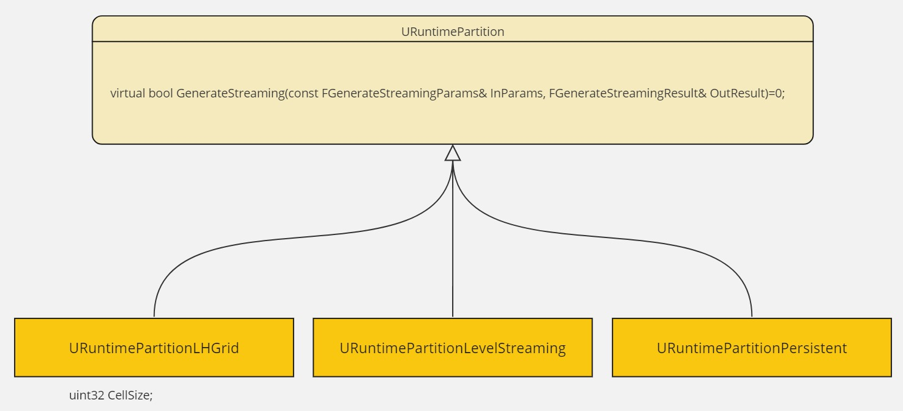
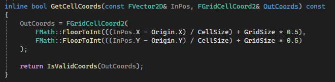

# 1. 基础配置

UE5中的世界分区是一种自动生成流送关卡，并在游戏中基于距离自动进行流关卡的加载卸载的系统。它根据每个`Level`的`WorldSetting`上关于`WorldPartition`的配置，自动生成流关卡和HLOD，基于`World`中`Actor`的配置，将`Actor`划分到各个流关卡中，通常称这种自动生成的流关卡为`Cell`或`StremaingCell`。一个`Cell`中包含若干个`Actor`，并最终将这些`Actor`组织在一个`LevelStreaming`中：`UWorldPartitionLevelStreamingDynamic`，它是`WorldPartition`加载卸载的最小单位。

`WorldSetting`上的配置项存在于`UWorldPartition`中，而关于Cell划分方式的配置在它的一个成员变量中`UWorldPartitionRuntimeHash* RuntimeHash;`，`RuntimeHash`主要定义了如何划分Cell，`UWorldPartitionRuntimeHash`本身是一个抽象基类，主要用于抽象`Cell`的生成和管理，目前有两个不同的实现`UWorldPartitionRuntimeHashSet`和`UWorldPartitionRuntimeSpatialHash`。`WorldPartitionDetailsCustomization.cpp`中自定义了`UWorldPartition`的`DetailLayout`，我们可以直接选择用哪一个`RuntimeHashClass`，后面我们假定用就是默认的`UWorldPartitionRuntimeHashSet`。

在`UWorldPartitionRuntimeHashSet`中，可以配置一组`FRuntimePartitionDesc`：
```c++
// 省略了其它注释、UPROEPRTY
struct FRuntimePartitionDesc
{
	TSubclassOf<URuntimePartition> Class;

	FName Name; // Partition Name

	TObjectPtr<URuntimePartition> MainLayer;

	TArray<FRuntimePartitionHLODSetup> HLODSetups;
};
```
每个`FRuntimePartitionDesc`描述了一种WorldPartition划分的基本信息：
* `URuntimePartition`的具体Class，有两种Class可供选择，实现了不同的`Cell`划分方式。
* `Name`是这个`Partition`的`Name`，`Actor`可以在配置中指定一个`PartitionName`，就会被划分到指定`Parition`。
  * 默认必有一个名为MainGrid的配置。
* `MainLayer`是具体配置`URuntimePartition`的地方，随所选Class的不同而不同。
* `HLODSetups`是这个`WorldPartition`的`HLOD`的配置，以及`HLOD Actor`本身的`WorldParition`划分和加载方式。
  * HLOD只有被加载了，才会在对应的原Cell卸载时被显示出来。

`URuntimePartition`目前有三种实现：

<p align="center">

</p>

核心就是实现`GenerateStreaming()`方法，实现不同的Cell划分方法。

* `URuntimePartitionLHGrid` 是最常用的一种`Partition`，它多了个`CellSize`的配置，将整个World三维空间均匀划分成边长为`CellSize`的立方体空间，且Cell之间是紧密无缝连接的。所有处于同一Cell中的Actor被划分到同一个StreamingCellLevel中，以Actor的Bound中心点位置为划分依据。

* `URuntimePartitionLevelStreaming` 这种`Partition`只会生成一个Cell，所有配置到这个`Partition`的Actor都划分到这一个Cell中，无论这些Actor相距有多远。一些特殊情况下，对`URuntimePartitionLHGrid`自动划分的结果不满意时，可以考虑用这个，作为一种对`URuntimePartitionLHGrid`机制的补充。

* `URuntimePartitionPersistent` 它也只会生成一个Cell，Name也是固定的`Persistent`。在WorldPartition的设置里面无法选择这个类。它极为特殊，所有不需要`SpatiallyLoaded`的Actor都会被分到这个Cell，默认就会完全加载。

每一个Actor都会有一个HLOD配置，然后构建HLOD时，会生成对应的HLODActor，`HLODSetups`主要配置的是生成的HLODActor的空间加载方式。这里可以选择是否需要空间加载。如果开启IsSpatiallyLoaded，下方的PartitionLayer会是`URuntimePartitionLHGrid`，然后还可以配置它的加载范围合CellSize。如果不开启IsSpatiallyLoaded则会是`URuntimePartitionPersisten`，HLODActor会持续存在于内存中。

:question:HLOD何时加载？何时卸载？如何与原始Actor的加载卸载联系起来的？

如果Actor配置的AHLODLayer在它配置的WorldPartition中不存在，则会报错，提示Actor配置了一个无效的HLOD Layer。

# 2. 组织Actor数据

在生成`Cell`的过程中，如何组织海量Actor的信息？因为巨大的开放世界中，可能有几万或者超过十万的Actor数量，编辑器下这些Actor是可以通过WorldPartion只加载指定区域的Actor。但是在生成`StreamingCell`的过程中，需要所有Actor的信息，此时如果直接加载所有Actor，可能会是个十分漫长的过程。所以，这里实现了一个机制，将所有的Actor都记录一个最小的用于WorldPartition需要的信息`FWorldPartitionActorDesc`。


`UWorldPartition`就是WorldSettings上关于WorldPartition的设置。`UWorldPartition`继承了`FActorDescContainerInstanceCollection`，其实就是`TActorDescContainerInstanceCollection<TObjectPtr<UActorDescContainerInstance>>`，它的一个关键成员变量是`TArray<UActorDescContainerInstance*> ActorDescContainerInstanceCollection;`，里面至少有一个`UActorDescContainerInstance`，保存有当前World中所有Actor的信息，且在World中的Actor发生变化（新增，删除）时会同步更新。因为`UWorldPartition`本质是存在于`WorldSetting`中的，这份数据相当于是存在了Level上。

对于`PersistentLevel`，`UWorldPartition::Initialize`会在`UWorld::InitWorld()`中调用。在这里初始化了`UActorDescContainerInstance`，这个过程中会相继创建`UActorDescContainer`，`UActorDescContainerInstance`。其中，`UActorDescContainer`是向`UActorDescContainerSubsystem`请求并创建。创建时，会用`AssetRegistry`扫描请求的Map下的所有Asset，对Actor创建对应的`FWorldPartitionActorDesc`，从`FAssetData`中读取`MetaData`信息初始化`FWorldPartitionActorDesc`，并避免了加载Actor。主要的初始化方法：
```c++
void FWorldPartitionActorDesc::Init(const FWorldPartitionActorDescInitData& DescData);
```

同时，对于动态编辑Level时添加删除Actor，它直接监听了`FCoreUObjectDelegates::OnObjectPreSave`和`FEditorDelegates::OnPackageDeleted`，对应地添加或者删除`FWorldPartitionActorDesc`。这里创建`FWorldPartitionActorDesc`是通过`AActor::CreateClassActorDesc`，随后调用`FWorldPartitionActorDesc::Init(AActor*)`初始化。可以重写这个方法，创建自己的`ActorDesc`。

`FWorldPartitionActorDesc`主要保存关卡中Actor实例的基本信息，其中与WorldPartition和HLOD相关的所有设置项，都会被单独保存一遍，主要原因还是Actor可以不加载，但是与它相关的WorldPartition信息必须有。

而`UActorDescContainerInstance`中，保存的是`FWorldPartitionActorDescInstance`，其中持有对`FWorldPartitionActorDesc`的引用，且包装了`FWorldPartitionActorDesc`的几乎所有方法，里面多了一些引用计数，强制改变的的一些设置`bIsForcedNonSpatiallyLoaded`。在创建时，会根据对应`UActorDescContainer`有的`ActorDesc`创建`ActorDescInstance`，同时监听`UActorDescContainer`添加和移除`ActorDesc`的事件，以更新`UActorDescContainerInstance`中的`ActorDescInstance`。

# 2. 生成StreamingCell

生成StreamingCell的过程，就是把所有Actor划分到各个Cell，并生成对应的StreamingLevel。这一过程主要从`UWorldPartition`开始的:


生成StreamingCell主要有两个时机，开始PIE或Cook的时候，生成好的`StreamingCell`中就会有自己的Actor的信息，就是一个StreamingLevel。两次调用不同之处仅仅是错误处理，要不要输出需要Cook的Package等等其它信息。这里对于生成Cell来说，最关键的就是所有Actor和WorldPartition的配置。`FGenerateStreamingParams`中有一个成员变量`FStreamingGenerationContainerInstanceCollection ContainerInstanceCollection;`表示当前这次`Generate`基于的所有Actor。


`FStreamingGenerationContainerInstanceCollection`是继承自`TActorDescContainerInstanceCollection<TObjectPtr<const UActorDescContainerInstance>>`，`FGenerateStreamingParams::SetContainerInstanceCollection()`中从`UWorldPartition`构建了一个`FStreamingGenerationContainerInstanceCollection`给后面使用，仅仅是把`UWorldPartition`中所有`UActorDescContainerInstance*`拷贝过来成了const。


`GenerateContainerStreaming()`中，构造了一个临时对象`FWorldPartitionStreamingGenerator StreamingGenerator;`，它负责构建生成Cell过程中需要的几乎所有信息，还有大量的中间计算结果。

第一步`StreamingGenerator.PreparationPhase(InParams.ContainerInstanceCollection)`利用`ContainerInstanceCollection`初始化所有ActorDesc，构建后续要用的数据结构。最关键的结果是：

```c++
class FWorldPartitionStreamingGenerator:
/** Maps containers IDs to their container collection instance descriptor */
TMap<FActorContainerID, FContainerCollectionInstanceDescriptor> ContainerCollectionInstanceDescriptorsMap;
```


在`CreateActorDescriptorViewsRecursive()`中，必会创建一个`FActorContainerID`为空的key对应的`FContainerCollectionInstanceDescriptor`：
```c++
class FContainerCollectionInstanceDescriptor:
    // 输入的原始 ContainerInstanceCollection
	TSharedPtr<FStreamingGenerationContainerInstanceCollection> ContainerInstanceCollection;

    // 保存了所有ActorDescView,数组，Guid - ActorDescView, ClassName - ActorDescView
    TUniqueObj<FStreamingGenerationActorDescViewMap> ActorDescViewMap; 
    
    TArray<const FWorldDataLayersActorDesc*> DataLayerResolvers;

    TSet<FGuid> EditorOnlyActorDescSet; 
    TArray<TArray<FGuid>> Clusters; // 所有有引用关系的Actor在一个数组里
    
    struct FPerInstanceData
    {
        bool bIsSpatiallyLoaded;
        FName RuntimeGrid;
        TArray<FName> DataLayers;
    }
    FPerInstanceData InstanceData; 
    TSet<FPerInstanceData> UniquePerInstanceData; 
    TMap<FGuid, FSetElementId> PerInstanceData; // 每个ActorDescView的关键数据
 
    TMap<FGuid, FTransform> EditorOnlyParentActorTransforms; // EditorOnly的Acotr，保存它们的Transform
```
在`CreateActorDescViewMap(FContainerCollectionInstanceDescriptor& InContainerCollectionInstanceDescriptor)`中：

* 对每一个`ContainerInstanceCollection`中的`ActorDescInstance`都创建了一个对应的`FStreamingGenerationActorDescView`。保存在`ActorDescViewMap`中。
* `AWorldDataLayers`还需要添加到`DataLayerResolvers`中。
* 如果是EditorOnly的Actor，则添加到`EditorOnlyActorDescSet`

下一步`ResolveContainerDescriptor()`，对`ActorDescViewMap`中所有ActorDescViewmap执行一系列操作：
* 如果WorldPartition没有开启Streaming：
  * 强制关掉Actor的SpatiallyLoaded：FStreamingGenerationActorDescView::SetForcedNonSpatiallyLoaded()。
  * 强行把RuntimeGrid设为None： FStreamingGenerationActorDescView::SetForcedNoRuntimeGrid()。
* DataLayer处理，兼容旧的配置
* HLODLayer，如果没有配置，则使用WorldPartition上配置的默认HLOD，无论如何，所有Actor都会有HLOD配置。
* 处理有父Actor的情况，更新ParentVew或者ParentActor的Transform(如果ParentActor是EditorOnly的)。

`FStreamingGenerationActorDescView`会持有其ParentActor的View, 如果Parent是EditorOnly的Actor，则只记一个Transform。
```c++
// WorldPartitionStreamingGeneration.cpp
void ResolveParentView(FStreamingGenerationActorDescView& ActorDescView, const FStreamingGenerationActorDescViewMap& ActorDescViewMap, const TSet<FGuid>& EditorOnlyActorDescSet, const TMap<FGuid, FTransform>& EditorOnlyParentActorTransforms)
{
    if (FGuid ParentGuid = ActorDescView.GetParentActor(); ParentGuid.IsValid())
    {
        if (const FStreamingGenerationActorDescView* ParentView = ActorDescViewMap.FindByGuid(ParentGuid))
        {
            ActorDescView.SetParentView(ParentView);
        }
        else if (const FTransform* EditorOnlyParentActorTransform = EditorOnlyParentActorTransforms.Find(ParentGuid))
        {
            ActorDescView.SetEditorOnlyParentTransform(*EditorOnlyParentActorTransform);
        }
    }
}
```
通过`ActorsReferencesUtils::GetActorReferences()`获取到actor引用的所有`RF_HasExternalPackage`的GUID：
```c++
FWorldPartitionActorDesc::Init(const AActor* InActor):
    const ActorsReferencesUtils::FGetActorReferencesParams Params = ActorsReferencesUtils::FGetActorReferencesParams(const_cast<AActor*>(InActor))
        .SetRequiredFlags(RF_HasExternalPackage);
    TArray<ActorsReferencesUtils::FActorReference> ActorReferences = ActorsReferencesUtils::GetActorReferences(Params);

    if (ActorReferences.Num())
    {
        References.Reserve(ActorReferences.Num());
        for (const ActorsReferencesUtils::FActorReference& ActorReference : ActorReferences)
        {
            const FGuid ActorReferenceGuid = ActorReference.Actor->GetActorGuid();

            References.Add(ActorReferenceGuid);

            if (ActorReference.bIsEditorOnly)
            {
                EditorOnlyReferences.Add(ActorReferenceGuid);
            }
        }
    }
```
还加上最外层的ParentAcotr引用。

Grid划分先考虑ParentActor的：
```c++
FName FStreamingGenerationActorDescView::GetRuntimeGrid() const
{
	if (bIsForcedNoRuntimeGrid)
	{
		return NAME_None;
	}

	if (ParentView)
	{
		return ParentView->GetRuntimeGrid();
	}

	return Super::GetRuntimeGrid();
}
```

随后在`ValidateContainerDescriptor()`还执行大量验证，检查所有Actor的设置与WorldPartition的设置有没有冲突，这里可能会强行改变一些ActorView的设置。这里还会处理Actor的引用，将ParentActor的所有ChildrenActor加到它的引用里面，其它属性的引用，在初始化ActorDesc的时候会通过`ActorsReferencesUtils::GetActorReferences()`处理。并且处于一套引用链下的Actor都应该在同一DataLayers、GridName下。

构建Clusters。因为Actor之间有强引用或者父子关系，则必须出现在同一个Cell，不然这个引用关系就会被打破。所以这里将有引用关系的Actor组合在一起，视为一个划分Cell的基本单位 —— Cluster。如果一个Actor没有引用任何别的Actor，也没被别的Actor引用，那这一个Actor就会单独处于一个Cluster中。Cluster中的Actor以它们组成的Bound计算Cell划分，这一过程在`UpdateContainerDescriptor()`中实现。后续计算Actor的Cell，也会将Clusters视为整体考虑。

最后还集中处理了所有Actor的`FPerInstanceData`，即Actor所属的RuntimeGrid，DataLayers，bIsSpatiallyLoaded等。

至此，`StreamingGenerator`中就包含了所有Actor的信息，以及将这些Actor按引用关系分好了组(Cluster)，同一组Actor的GridName、DataLayers是相同的。

在开始生成Cell前，为了将生成过程与ActorDesc的具体组织方式解耦，这里需要用前面生成的ActorDescView、Cluster信息，构建一个`IStreamingGenerationContext`。它将Cluster构建成一个个`FActorSetInstance`表示一组互相有引用，RuntimeGrid、DataLayer一致的Actor，且必须处于同一个Cell。这个接口管理的最小单位就是`FActorSetInstance`，里面记录了`ActorSet`的Bounds、RuntimeGrid、DataLayers等信息。处于同一个ContainerIsntance的Actor放在一个`FActorSetContainerInstance`中。具体构建过程在`FWorldPartitionStreamingGenerator::GetStreamingGenerationContext()`.

```c++
class FStreamingGenerationContext : public IStreamingGenerationContext ::
	struct FActorSetContainerInstance
	{
		const FStreamingGenerationActorDescViewMap* ActorDescViewMap;
		const TArray<const FWorldDataLayersActorDesc*>* DataLayerResolvers;
		const FStreamingGenerationContainerInstanceCollection* ContainerInstanceCollection; // 以上直接从`StreamingGenerator`获取
		TArray<TUniquePtr<FActorSet>> ActorSets; // 复制的Clusters
	};
    TArray<FActorSetContainerInstance> ActorSetContainerInstances;// 每个FActorContainerID一份

    struct FActorSetInstance
	{
		FBox Bounds; // 这个Cluster的所有Actor组成的Bound
		FName RuntimeGrid;
		bool bIsSpatiallyLoaded;
		TArray<const UDataLayerInstance*> DataLayers;
		FGuid ContentBundleID;
        
		const FActorSetContainerInstance* ActorSetContainerInstance = nullptr;

		FActorContainerID ContainerID;
		FTransform Transform;
		const FActorSet* ActorSet;
		const TSet<FGuid>* FilteredActors;
    }
    TArray<FActorSetInstance> ActorSetInstances; // 根据每个Cluster的第一个AcotrDesc记录这些数据
```
随后立即用这个创建了一个它的代理对象：
```c++
class FStreamingGenerationContextProxy : public IStreamingGenerationContext
{
public:
	FStreamingGenerationContextProxy(const IStreamingGenerationContext* InSourceContext)
		: SourceContext(InSourceContext)
	{}
    // ....
}

FStreamingGenerationContextProxy GenerationContextProxy(StreamingGenerator.GetStreamingGenerationContext(InParams.ContainerInstanceCollection));
```

## 2.1 UWorldPartitionRuntimeHashSet
然后开始生成Cell：
```c++
RuntimeHash->GenerateStreaming(StreamingPolicy, &GenerationContextProxy, InContext.PackagesToGenerate)
```
这里RuntimeHash通常是`UWorldPartitionRuntimeHashSet`。以下就以它分析整个生成Cell的过程。

在`UWorldPartitionRuntimeHashSet::GenerateStreaming()`中首先构建了`PersistentPartitionDesc`，


然后，先将所有`FActorSetInstance`分配到不同的`URuntimePartition`：
* bIsSpatiallyLoaded=false的Actor会被分配到`PersistentPartition`。
* RuntimeGrid=None，分配到第一个我们配置的`RuntimePartitions`。
* RuntimeGrid还可以是`GridName：HLODLayerObjectName`这种形式。则这个Actor会被分配到`GridName`下的HLOD配置`HLODLayerObjectName`对应的`PartitionLayer`。
  * 生成的HLODActor会自动把GridName配置成这种形式。
  * 如果`GridName`没有这个HLOD配置，这个ActorSet会被直接忽略！！！
  * 如果HLODActor上配置的HLODLayer在对应的WorldPartition上不存在，则在前面的验证中就会报错。

这样就得到了一组`[URuntimePartition <-> TArray<FActorSetInstance>]`。对所有Pair调用`URuntimePartition::GenerateStreaming`，生成`URuntimePartition::FCellDesc`，每个CellDesc都包含一组`FActorSetInstance`。注意这里根据配置，有不同的`URuntimePartition`子类，实现了不同的Cell划分方式，其中最常用的是`URuntimePartitionLHGrid`，它的划分方式最复杂，也最常用。

`URuntimePartitionLHGrid`本质上是把整个World划分成具有MipLevel等级的3D格子。

计算某个`ActorSet`属于哪个`Cell`时，根据这组`ActorSet`的Bound计算它应该所处的Cell。输出为`FCellCoord`:
```c++
struct FCellCoord
{
	int64 X;
	int64 Y;
	int64 Z;
	int32 Level;
}
```
这里的Level类似于MipLevel，以ActorBound的最大长度的Extent计算Level:
```c++
static inline int32 GetLevelForBox(const FBox& InBox, int32 InCellSize)
{
    const FVector Extent = InBox.GetExtent();
    const FVector::FReal MaxLength = Extent.GetMax() * 2.0;
    return FMath::CeilToInt32(FMath::Max<FVector::FReal>(FMath::Log2(MaxLength / InCellSize), 0));
}
```
如果`MaxLength<=CellSize` Level为0， `CellSize<MaxLength<=2*CellSize` Level为1， `2CellSize<MaxLength<=4*CellSize` Level为2，如下图：


然后以ActorBound的中心点坐标计算所处的Cell坐标，这里没有别的处理，就是把整个`3D World`划均匀分成`CellSizeForLevel`大小的三维格子，Bound中心点的坐标除以`CellSizeForLevel`向上取整，得到Bound中心点所在的格子，作为这个ActorSet最终划分到的格子：
```c++
static inline FCellCoord GetCellCoords(const FVector& InPos, int32 InCellSize, int32 InLevel)
{
    check(InLevel >= 0);
    const int64 CellSizeForLevel = (int64)InCellSize * (1LL << InLevel);
    return FCellCoord(
        FMath::FloorToInt(InPos.X / CellSizeForLevel),
        FMath::FloorToInt(InPos.Y / CellSizeForLevel),
        FMath::FloorToInt(InPos.Z / CellSizeForLevel),
        InLevel
    );
}
``` 

划分好Cell之后，我们得到一组`[URuntimePartition <-> FCellDesc]`，其中`FCellDesc`包含了一组`ActorSet`。`FCellDesc`没有考虑处于不同DataLayer的ActorSet的情况，所以再将`FCellDesc`重新划分成`FCellDescInstance`：
```
如果一个`FCellDesc`的ActorSet处于不同DataLayer，其它参数保持一致的情况下分裂成两个`FCellDescInstance`，仅DataLayer不同。
```
然后对每一个`FCellDescInstance`创建`UWorldPartitionRuntimeCell`：


`UWorldPartitionRuntimeCell`的具体类型是由`UWorldPartitionStreamingPolicy`决定的，这里通常是`UWorldPartitionLevelStreamingPolicy -> UWorldPartitionRuntimeLevelStreamingCell`。并对每一个处于这个Cell中的`FActorInstance`调用`UWorldPartitionRuntimeCell::AddActorToCell`，构建对应的`TArray<FWorldPartitionRuntimeCellObjectMapping> Packages;`，每个Package都是一个Actor的路径引用，用于最终生成`UWorldPartitionLevelStreamingDynamic`，实现通过流关卡加载卸载Cell。最终，Cell会保存在`UWorldPartitionRuntimeHashSet::RuntimeStreamingData`中。有关`UWorldPartitionRuntimeCell`动态加载卸载的逻辑后面再讲。


所有的`UWorldPartitionRuntimeCell`都保存在`UWorldPartitionRuntimeHashSet`。

此外，生成的CellName包含了一些有用的调试信息：

Cell ID : WorldName_CellName_DataLayerID_ContextBundleID

CellGUID也由这个ID的MD5组成

CellName : PartitionName_CellName


## 2.2 UWorldPartitionRuntimeSpatialHash

`FSpatialHashRuntimeGrid`等同于`UWorldPartitionRuntimeHashSet`中的`FRuntimePartitionDesc`，定义了Grid划分方式的配置。

可以配置多个`FSpatialHashRuntimeGrid`。其划分方式为：
* 可以配置一个Origin点，扩展整个世界的Bounds到以这个原点为中心，得到新的Bounds。
* 根据CellSize计算GridSize，确保GridSize是2的幂，并用Log2向上取整得到Level层数。
  * 如果一个2K的图，Origin就是原点，那
    ```
    GridSize=2*Ceil(100800/ 12800)=16;
    GridLEvelCount=Floor(Log2 GridSize) + 1;
    ```

* Level每高一级，GridSize就减小一倍,但是这样会导致下一个Level的Cell的边与上一个是完美重合的，这会导致边界上的Actor在向上查找完全包含自己的Cell时过度向上提升。
  * bUseAlignedGridLevels取消勾选这个选项，会给每一Level的GridSize加1，避免完美对齐。

* 最终划分出的Cell为：

| Level    | CellSize | GridSize |
| :-------:| :-------:| :------: |
| 0        |   12800  |  17      |
| 1        |   25600  |  9       |
| 2        |   51200  |  5       |
| 3        |   102400 |  3       |
| 4        |   204800 |  1       |

有两种方式计算一个ActorSet应该位于哪个GridCell，所有方法都不考虑Z方向的Bound长度。
* 使用ActorSet Bound中心点位置
  * 如果`UWorldPartitionRuntimeSpatialHash`的设置上勾选了`bPlaceSmallActorsUsingLocation`，并且ActorSet的Bounds面积小于等于第0个Level的Cell面积。且GridLevel为0。
  * 如果勾选了`bPlacePartitionActorsUsingLocation`，并且ActorSet中全是`APartitionActor`(`ALandscapeStreamingProxy`就是)。用它的最长Bound计算所处的GridLevel。
    ```
    OutGridLevel = FMath::Min(FMath::CeilToInt(FMath::Max<float>(FMath::Log2(MaxLength / CellSize), 0)), GridLevelCount - 1);
    ```
  * 用的是ActorSet的Bound中心位置(不考虑Z坐标)，计算它所处的Cell坐标。
    
* 使用ActorSet的Bound
  * 如果不满足上面的条件，或者Bound的XY面积大于Level0，则用这里的方法。
  * 先找出能够容纳Bound.XY的最长长度的Level。
  * 计算Bound在这一Level与几个Cell相交。
    * 计算Bound.Min和Bound.Max分别所处的Cell坐标，然后两个Cell坐标XY分别相减。
    
  * 如果只有一个Cell相交，那么就把当前ActorSet放在这一级Level的这个相交的Cell中。
  * 与多个Cell相交则Level++，直到找到只和一个Cell相交的那一级Level。最差情况下会找到顶级Level，只有一个Cell，即WorldBound的大小，就会永久加载。

所有ActorSet都会被分配给`FSquare2DGridHelper::FGridLevel::FGridCell`。然后就是创建`UWorldPartitionRuntimeCell`，在`UWorldPartitionRuntimeSpatialHash::CreateStreamingGrid`中实现。这里与前面的`UWorldPartitionRuntimeHashSet`的区别在于，`RuntimeCellData`的Calss为
`UWorldPartitionRuntimeCellDataSpatialHash`，里面记录下了自己所属的Level等级，Position，GridName等信息。也是同样调用`UWorldPartitionRuntimeHash::PopulateRuntimeCell`把所有Actor添加到对应的`UWorldPartitionRuntimeLevelStreamingCell`中。

对于HLODActor，在构建HLOD时，会生成对应的`ASpatialHashRuntimeGridInfo`，里面包含了`FSpatialHashRuntimeGrid`配置，这个配置是在HLODLayer上，勾选bIsSpatiallyLoaded时会显示额外的配置。这和`UWorldPartitionRuntimeHashSet`完全不同，它是直接与WorldParition一起配置的。而且HLODActor的GridName的机制也不同。

Reference:
* https://dev.epicgames.com/documentation/zh-cn/unreal-engine/world-partition-in-unreal-engine
* https://zhuanlan.zhihu.com/p/502053365
