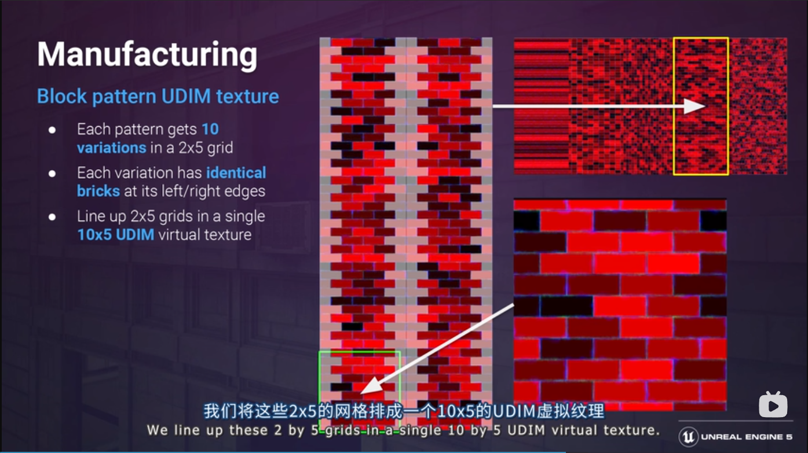
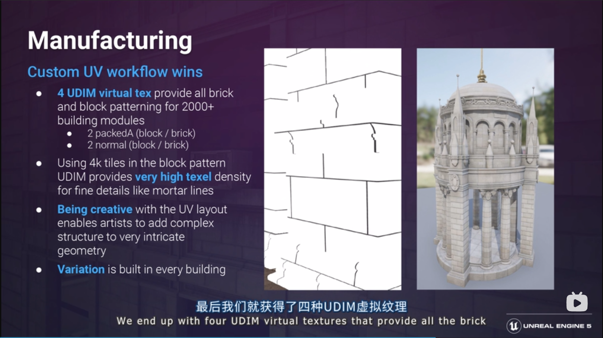
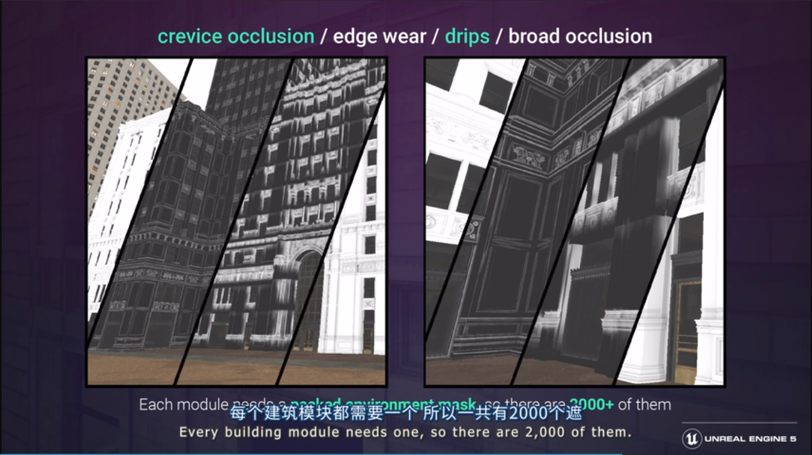
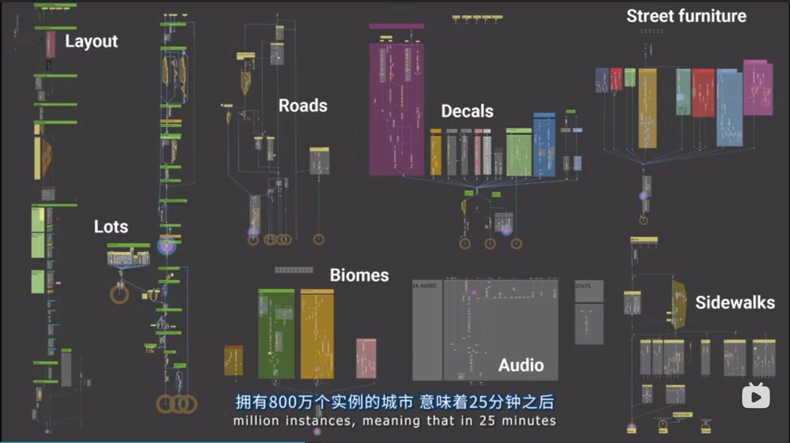

https://www.bilibili.com/video/BV1TP4y1T7Pj : 
* 00 建筑拆分，HLOD
  * 建筑外的小道具，在生成建筑时，生成对应的道具锚点，然后按分类，随机放置道具
* 27:24 基础模型，材质，纹理制作 Look Dev
  * 建筑材质
    * 砖块纹理，UDIM
    * 
    * Trim Sheet approach Texture
      * 在一个Texture上做好一系列高度复用的元素
      * 不同的模型设计好UV采样到一个Texture
      * 用PerInstanceRandom 随机选择UDIM
      * 
    * Env mask ， pack
      * 
  * 42:16 路 M_Freeway_Asphalt
    * 路面积水，贴花，解决Tile重复，维诺图噪声
    * MF_TextureCellBombing
  * Z-Rotation Aligned world space texture projection，可以绕z旋转的WorldAlignedUV

https://www.bilibili.com/video/BV1W5411D7HT
* 程序化生成，Houdini - Introduction
* 6：00， 用样条线控制high level形状
  * City processor， Road section
  * 基本图元
* 17：27 the city ground

* 25:04 Building generate
  * Shape grammar
  * module placement
  * WFC Wave function collapse

* 45:01 Crowd & Traffic System