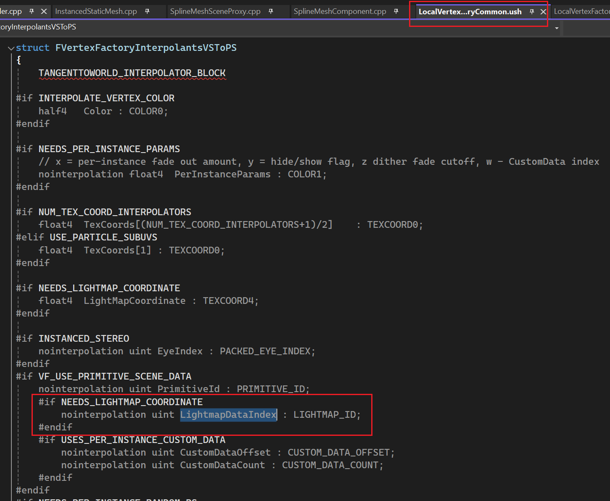
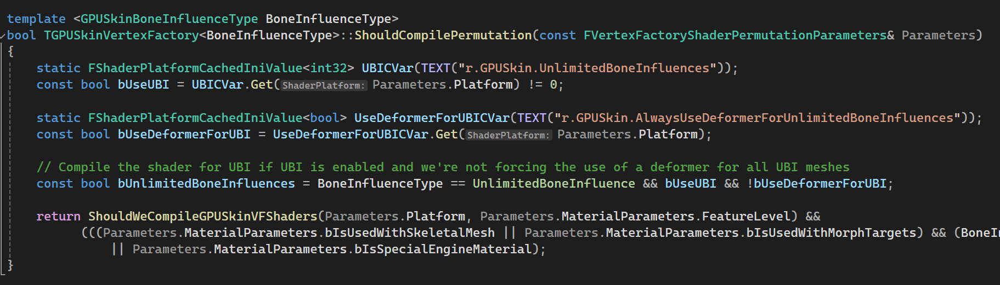

* [Creating a Custom Mesh Component in UE4 | Part 1: An In-depth Explanation of Vertex Factories](https://medium.com/realities-io/creating-a-custom-mesh-component-in-ue4-part-1-an-in-depth-explanation-of-vertex-factories-4a6fd9fd58f2)

* [Creating a Custom Mesh Component in UE4 | Part 0: Intro](https://medium.com/realities-io/creating-a-custom-mesh-component-in-ue4-part-0-intro-2c762c5f0cd6)
* [Global Uniform Shader Parameter(1)](https://medium.com/@solaslin/learning-unreal-engine-4-adding-a-global-shader-uniform-1-b6d5500a5161)
* https://outerra.blogspot.com/2012/05/procedural-grass-rendering.html
* https://gdcvault.com/play/1026177/Instancing-and-Order-Independent-Transparency

* [Shader参数绑定](https://zhuanlan.zhihu.com/p/485239547)
  * 在HLSL代码中可以不显示指定资源的绑定位置register(t0)
  * 编译时会自动生成
  * 然后用ID3D12ShaderReflection获取编译好的Shader代码的参数绑定信息
    * 可以拿到参数名字，绑定Space，BindPoint等所有信息。
  * 在C++端就可以动态决定资源的绑定位置
* [graphics-programming-overview-for-unreal-engine](https://dev.epicgames.com/documentation/zh-cn/unreal-engine/graphics-programming-overview-for-unreal-engine)


最近发现一个插件，实现了DrawInstanced SkeletalMesh。这里需要实现自定义的`UPrimitiveComponent`和对应的`FPrimitiveSceneProxy`、`FVertexFactory`等。本文首先简要介绍实现自定义`UPrimitiveComponent`需要的基本操作，然后分析`Skelot`渲染方面的实现细节。

# FLocalVertexFactory
不同的VertexFactory实现了不同的顶点处理方式，即如何从VertexShader中传进来的Vertex数据得到VS输出给PS的顶点数据。通常，对于StaticMesh，直接把模型的VertexBuffer传给GPU，直接读顶点数据中的Position进行MVP变换即可，复杂一点，如果有顶点偏移，再加上顶点偏移，这就是`UStaticMeshComponent`实现的Mesh渲染方式。此外，如果是`USkeletalMeshComponent`这种骨骼动画的渲染，除了普通Mesh的顶点数据和处理逻辑，在顶点中还需要传入影响当前顶点的骨骼Index和对应的蒙皮权重，然后还需要一个额外的Buffer，传入当前帧的Pose，即每个骨骼对应的位置信息。渲染时，在VertexShader中根据这些数据计算出顶点的最终位置。这种顶点数据和处理逻辑的差异就是由`FLocalVertexFactory`处理的。而`FLocalVertexFactory`就是`UStaticMeshComponent`使用的顶点工厂，后面以它为例分析VertexFactory的工作机制。

VertexFactory
* 创建并绑定VertexBuffer
* 创建并绑定InputLayout
* 创建并绑定VertexShader

[顶点工厂的类图]粗略的继承关系

VertexFactory首先要负责从模型资源获取渲染需要的数据，把它们上传到GPU，即各种GPUBuffer，这些在UE中被抽象成以`FRHI`开头的各种资源，这些资源才可以直接被绑定到渲染管线中。

这一切自然要从`UStaticMesh`说起，毕竟一个模型导入到UE后，就成为了一个`UStaticMesh`。模型的原始数据保存在`UStaticMesh`的`FStaticMeshSourceModel`：
```c++
TArray<FStaticMeshSourceModel> SourceModels;
```
它在`UStaticMesh::Serialize()`中序列化。里面的模型数据仅编辑器下才会存在：


而真正的渲染数据是`UStaticMesh`中的`FStaticMeshRenderData`：
```c++
TUniquePtr<class FStaticMeshRenderData> RenderData;
```
[补一个FStaticMeshRenderData类图，到VF]

`FStaticMeshRenderData`中，以每个LOD的Mesh数据单独保存为一个`FStaticMeshLODResources`，其中包含了一个LODMesh的VertexBuffer和IndexBuffer等数据，以及对应的MeshSection，不同的Section对应不同的MaterialIndex，引用了不同VertexBuffer和IndexBuffer范围。`FStaticMeshLODResources`相当于是从原始的模型数据`SourceModels`中，提取并重新组织了自己用得到的顶点数据，这些数据仍然是CPU端的。

每个`FStaticMeshLODResources`都对应了一个`FStaticMeshVertexFactories`，里面就是`FLocalVertexFactory`，这里面就有对应的GPUBuffer。

`UObject::PostLoad()`会在对象加载出来之后调用一次，`UStaticMesh::PostLoad()`中触发了`RenderData`的初始化，在编辑器下：
```c++
UStaticMesh::PostLoad()
* UStaticMesh::ExecutePostLoadInternal()
    * UStaticMesh::CacheDerivedData()   
    * 在这里实现了生成`RenderData`。
```
这里会处理从`SourceModels`生成各级`LODResources`中的模型数据，也有可能直接从DDC加载。在打包好的流程中，直接就在`UStaticMesh::Serialize()`反序列化出`RenderData`：


此时的`RenderData`只有CPU端的模型数据，`LODResources`和`LODVertexFactories`还没有初始化。随后对`RenderData`进行初始化：

UStaticMesh::PostLoad()
  * UStaticMesh::FinishPostLoadInternal()
    * UStaticMesh::InitResources()
      * FStaticMeshRenderData::InitResources()
      * 初始化所有LODResource和VertexFactory
        * FStaticMeshLODResources::InitResources()
        * FStaticMeshVertexFactories::InitResources()

在`FStaticMeshLODResources::InitResources()`中，对每一种Buffer都调用`BeginInitResource(Resource)`，里面`ENQUEUE_RENDER_COMMAND`创建渲染线程执行的命令，即简单地调用`Resource->InitResource()`：


而`InitResource()`中主要功能就是调用`InitRHI()`方法，从`FRenderResource`派生的Buffer需要实现这个方法，创建当前Resource对应的GPU资源。例如，在`FRawStaticIndexBuffer IndexBuffer`中，


当`FStaticMeshLODResources`加载好之后，其中的IndexStorage就是完整的索引数据，但IndexBufferRHI还没有创建，而且RHIBuffer的创建必须在RenderThread中执行。在`FRawStaticIndexBuffer::InitRHI()`中调用`FRawStaticIndexBuffer::CreateRHIBuffer()`创建`IndexBufferRHI`，并将`IndexStorage`上传到GPU。如果是DX12，具体的创建在`FD3D12DynamicRHI::CreateD3D12Buffer()`。

`VertexBuffers`中分了三种Buffer：


这三者都是`FRenderResource`，都会执行一样的初始化流程。
`StaticMeshVertexBuffer`里面有两种顶点数据：


其中TangentsData和TexcoorData是原始数据，然后是它们对应的RHIBuffer和SRV。在`FStaticMeshVertexBuffer::InitRHI()`中分别创建这两种Buffer和对应的SRV：


`PositionVertexBuffer`和`ColorVertexBuffer`也是同样的模式，这里不在赘述。

初始化好`LODResources`后，就可以用它去初始化`LODVertexFactories`，在`FStaticMeshVertexFactories::InitResources()`中：


而这里的`InitVertexFactory()`也仅仅是将输入的`LodResource`和`VertexFactory`打包成参数，发到RenderThread上进行初始化：


在`FLocalVertexFactory`中，有一个成员变量`FDataType Data;`，这里主要就是初始化它。`FDataType`继承自`FStaticMeshDataType`：


可以看到`FStaticMeshDataType`中保存的就是对`LODResources`中各种顶点数据RHIBuffer的引用，包括RHIBuffer指针的直接引用和对应的SRV。在渲染命令`ENQUEUE_RENDER_COMMAND(InitStaticMeshVertexFactory)`中，直接创建一个`FDataType`，用`LODResource`中各个Buffer的`BindXXX`方法构建`FDataType`中的内容，Position的初始化：


都是直接引用`LODResource`中这些资源创建的RHIBuffer和SRV。其它的也是一样。

然后调用`FLocalVertexFactory::SetData()`设置上数据，紧接着就调用`FLocalVertexFactory::InitResource()`初始化`FLocalVertexFactory`，别忘了它也是一个`FRenderResource`。有了所有的顶点数据后`(Data)`，就可以在`FLocalVertexFactory::InitRHI()`中声明对应的InputLayout了。InputLayout相关的数据都定义在父类`FVertexFactory`中：


通常顶点数据中都包含了Position、Normal、TexCoord等数据，在正常渲染中使用，但也有一些Pass不需要这么多数据，例如DepthOnlyPass。所以这里需要声明三种顶点数据的布局，对应到枚举`EVertexInputStreamType`的三个枚举项，以正常渲染使用的顶点数据为例，即`Streams`和`Declaration`，`FVertexStream`的结构很简单：


就是一种顶点元素对应的VertexBuffer和Offset，顶点数据中的元素按顺排在`Streams`中，而`Declaration`就是对应的图形API对顶点数据布局的描述信息，在DX12中即是`FD3D12VertexDeclaration`，里面就是存了一组`D3D12_INPUT_ELEMENT_DESC`。`InitRHI()`首先就完成了从`FDataType Data`到对应顶点输入布局的转换。

然后就是创建ConstantBuffer：


这里代码的命名是UniformBuffer，似乎是OpenGL里面的叫法，和DX12中的Constantbuffer应该是一个意思。这里判断要不要创建`Uniformbuffer`在Windows上多半是能通过的。这个Buffer主要是把前面说的那些顶点数据，以Buffer的形式传给Shader，然后再HLSL中我们手动读取。里面创建时，会把`Data`中的那些Buffer初始化给它。而另外一个`LooseParametersUniformBuffer`似乎是和GPUSkin相关的？

至此，一个`UStaticMesh`的`FLocalVertexFactory`就初始化好啦。从`FStaticMeshRenderData`这里开始，把每一级LODResource的Mesh数据分开存，且一个LODResource对应一个VertexFactory，在GameThread，先加载好`FStaticMeshRenderData`中的原始数据，然后调用它的初始化创建GPU资源。对LODResource中的每一个Buffer都调用它的初始化方法，创建渲染线程的命令，从对应的原始数据创建RHIBuffer，并上传数据，然后用LODResource初始化对应的VertexFactory，根据有的VertexBuffer和里面的格式，引用这些Buffer和对应的SRV，创建对应的`VertexDeclaration`，将来Renderer会通过`FVertexFactory::GetStreams()`使用它。最后再创建VertexFactory需要的UniformBuffer。

# Vertex Shader
`FLocalVertexFactory`最后都会编译出对应的VertexShader，那这一步又是怎么完成的呢？

一个VertexFactory对应的的HLSL文件中通常只需要实现一些函数和结构体即可，例如`BasePassVertexShader.usf`中用了很多它这个文件和它直接Include的文件中并没有定义的函数和结构体，我们的VertexFactory对应的HLSL文件，例如`LocalVertexFactory.ush`，就需要定义这些函数和结构体，编译时会把它们当成Include文件在`BasePassVertexShader.usf`中展开。可以看看函数`VertexFactoryGetInterpolantsVSToPS()`，结构体`FVertexFactoryInterpolantsVSToPS`。

此外，UE中的Shader组织采用了一种被称为`Uber Shader`的方式，在一个大的Shader文件中实现所有功能，用不同的宏可以选择性开启或关闭一些功能，可以参考[这个](https://medium.com/@lordned/unreal-engine-4-rendering-part-5-shader-permutations-2b975e503dd4)。例如，`FLocalVertexFactory`中的`FVertexFactoryInterpolantsVSToPS`结构体定义：



顶点工厂可以实现一个函数，定义一些宏：

不同的宏定义处理后的VertexShader HLSL结果：


这里`TBasePassVSTLightMapPolicyHQ`还多了许多其它代码，都是通过宏定义开启的：


所以一个顶点工厂，根据不同宏的排列组合，会编译出很多个VertexShader：


可以看到，仅对于BasePass的VertexShader就有7中不同的情况，针对不同的光照模式、DistanceFieldShadow。估计多改一下渲染设置，材质的设置，开启不同的渲染效果组合，这还会更多。此外，不同的顶点工厂实现都会生成这么多的排列结果。好在大部分代码都是直接复用的。

回到C++这边，`FLocalVertexFactory`又是怎么控制VertexShader的呢？

VertexFactory可以控制自己应该生成什么样的permutations，通常如果我们可以预知我们的`VertexFactory`会被用于什么样的材质，不会用于什么样的材质或效果，就可以排除部分permutations的编译，通过`ShouldCompilePermutations()`实现，例如GPUSkinVertexFactory的实现：


每个VertexFactory都需要用宏，声明一个静态成员`FVertexFactoryType`和对应的Get方法:


然后在CPP文件中用`IMPLEMENT_VERTEX_FACTORY_TYPE`初始化这个静态实例，实现对应的方法：


用一系列枚举表明这个VertexFactory支持的功能。这个宏还通过传入的类名，拼接出`FLocalVertexFactory`实现的一些静态方法，或作为模板参数生成一些对`VertexFactory.h`中的静态函数的调用，都作为函数指针传给`FVertexFactoryType`，还有ush文件路径，`FVertexFactoryType`就有了这个VertexFactory的几乎所有信息，后续的编译就全靠它了。

## 参数传递
确定了ush文件后，我们还需要确定向VertexShader传递什么参数？比如SplineMesh需要传入Spline的开始点，结束点，Tangent，Scale等等，参考`SplineMeshShaderParams.h`。

我们可以继承`FVertexFactoryShaderParameters`，实现向VertexShader中绑定数据。


以`FLocalVertexFactoryShaderParameters`为例，首先继承并实现自己绑定参数的逻辑，细节后面再说。声明`FLocalVertexFactory`的参数类型，指定VertexFactory类型、Parameter类型、适用的着色阶段：


可以看到实际就是根据这三个参数，特化了一个模板类，相当于确定了`FLocalVertexFactory`在`SF_Vertex`阶段的Shader参数是`FLocalVertexFactoryShaderParameters`类型的。这个特化的模板类中实现了三个静态方法，与之前实现顶点工厂的宏`IMPLEMENT_VERTEX_FACTORY_TYPE`展开后看到的传进去的三个以`FLocalVertexFactory`为模板参数的函数指针有关，是一一对应的，包括创建`FLocalVertexFactoryShaderParameters`结构体指针，获取布局信息，绑定参数。例如在渲染时绑定参数，实现FVertexFactory时传的`GetVertexFactoryParametersElementShaderBindings<FLocalVertexFactory>()`将被调用：


这里用`FLocalVertexFactory`类型和SF_Vertex就确定了特化的ParamterTraits结构体，然后就只能调用到`FLocalVertexFactoryShaderParameters`的实现中。这也说明了一种顶点工厂的一个着色阶段只能由一个这种GlobalUniformBuffer的绑定。

### 绑定Global Shader Parameter

如果想绑定一个UniformBuffer，首先定义UniformBuffer的结构：


`FLocalVertexFactory`要先创建它的UniformRHIBuffer，可以直接在`FLocalVertexFactory::InitRHI()`中创建并初始化数据，并作为成员变量保存起来。在`FLocalVertexFactoryShaderParameters::GetElementShaderBindings()`中绑定数据：


绑定时，传入的第一个参数是参数位置，通过`Shader->GetUniformBufferParameter<FLocalVertexFactoryUniformShaderParameters>()`获得绑定位置，第二个参数传入实际的`FRHIUniformBuffer`即可。这种GlobalShaderParameter，在VertexShader中直接使用同名`(LocalVF)`的ConstantBuffer就行。

### 在FVertexFactoryShaderParameters中绑定参数
我们还可以在`FVertexFactoryShaderParameters`的成员变量中声明Shader参数。例如在`FLocalVertexFactoryShaderParameters`中：


可以用`LAYOUT_FIELD`声明一个Shader参数，在对应的HLSL代码中，直接这样使用:


在编译好对应的Shader后，就会执行`FLocalVertexFactoryShaderParameters::Bind()`，参数`ParameterMap`，是从HLSL代码的编译结果中获取的Shader参数信息，里面包含了HLSL中用到的所有参数和绑定信息：


注意到在UE的HLSL代码中，没有显示使用`register(b0)`指定Buffer的绑定位置，而是让编译器自动为资源分配寄存器，然后通过`ID3D12ShaderReflection`从编译好的代码中获取绑定信息。具体可以参考`ID3D12ShaderReflection`和`CompileAndProcessD3DShaderDXC()`。

这里也可以看到，如果HLSL代码中使用了对应的`GLOBAL_SHADER_PARAMETER_STRUCT`，也会出现在`ParameterMap`中，但这里不用保存这种Buffer的绑定信息，因为它们可以在`GetElementShaderBindings`中通过Shader直接获得绑定点。

在C++这一侧，对每一个用`LAYOUT_FIELD`声明的Shader参数，都要在这里调用自己的`MyCustomParam.Bind(ParameterMap，ParamName)`方法，从`ParameterMap`中读取名为`ParamName`的参数的绑定信息。这样`MyCustomParam`就知道了自己绑定到ShaderParameter的位置信息，这样后面就能用`MyCustomParam`绑定实际的数据。在`GetElementShaderBindings()`绑定具体数据：


这里的数据类型要与HLSL中使用的一致。

# 实现InstancedSkeletalMesh

如何组织需要的数据？

Skelot里面实现了一个继承自UDataAsset的类USkelotAnimCollection，把Skeleton和对应的动画Sequence配置在一起，还有对应的模型。

## 动画数据预处理
预先计算好所有Sequence在绑定空间的最终变换，存到一个巨大TransformBuffer中。这里的动画数据可以直接用`UAnimSequenceBase`的方法读取。对每个Sequence，还可以配置它能混合到什么Sequence，以及混合的时长。然后进行预处理，从起始Sequence中的每一帧到目标Sequence的混合Pose，只用生成配置的时长即可。假设我们一个Skeleton有三个Sequence，其中，S1可以混合到S2和S3，混合时长为0.2s。在生成的AnimationBuffer中，前面三个Sequence的动画数据依次排列，且Sequence自己记下在生成的Buffer中的开始位置。然后开始生成混合帧，如果动画都是60帧/s的，混合0.2s就是要混合前12帧，则从S1的每一帧开始，都要混合S2的前12帧，这里也是混合好后，计算好绑定空间的变换矩阵。这里每个混合都要记下自己有多少帧，从Buffer中的什么位置开始的。最终生成的AnimationBuffer的布局如下：

```
[        S1         ][        S2         ][        S3         ]
[ S1_1->S2 ][ S1_2->S2 ]...[ S1_i->S2 ][ S1_1->S3 ][ S1_2->S3 ]...[ S1_i->S3 ]
```
插件`Skelot`中的一个配置：


只需要配置好骨骼，支持的Sequence，及可混合的目标，Meshes配置的是支持的模型。灰色的数据是构建好之后的结果。可以看到一共有差不多1.8W个Pose，其中1.68W都是混合后生成的。

这样一来，我们只用每帧更新每个实例播放到了AnimationBuffer中的哪一个Index，把它传给GPU，就可以实现在VertexShader中更新动画。

这个AnimationBuffer需要上传到GPU，所以必须构建RHI资源。所以，要先从`FRenderResource`继承：


这里需要把预计算的动画`Transform`数据存在`FStaticMeshVertexDataInterface* Transforms`中，还要实现序列化。最重要的是实现`InitRHI()`，在渲染线程执行，创建对应的`FBufferRHIRef`。编辑器下预计算好动画数据后，就可以立即发送渲染命令，执行`AnimationBuffer.InitResource(RHICmdList)`。

## 模型数据处理

支持骨骼动画的模型中，每个顶点还要保存受影响的BoneIndex和对应权重。这些数据在引擎的`USkeletalMesh`中就有，我们可以直接从中读取，然后转换成我们需要的格式，同样也要处理LOD。这里的思路与前面分析过的`UStaticMesh`很相似。

在预处理的同时，也处理一下模型。模型数据我们配置的是`USkeletalMesh`，讲道理里面顶点也有BoneIndex和权重，直接用不就行了？UE的BoneIndex和蒙皮权重都是uint16：


我们想直接用uint8，节约一点。骨骼动画还有个概念，就是每个顶点可以被多少根骨骼影响？我们这里简单点，顶点数据统一存四个。由于这里要作为顶点数据，所以必须从`FVertexBuffer`继承，用一个成员变量存储原始数据，直接用`USkeletalMesh`中的`TArray<FSkinWeightInfo>`初始化它，这是引擎SkeletonMesh的顶点蒙皮信息，一个顶点最多存储了12个骨骼。我们这里需要转换一下数据格式，一个顶点用4个uint8表示四个BoneIndex(最多256个骨骼)，4个uint8表示权重，多的直接不要，数据直接static_cast。


其它的诸如顶点位置，纹理坐标之类的数据就还是用`USkeletalMesh`里面原来的就行了。

接下来就可以构建顶点工厂了。对每一级LOD都要构建对应的`SkinWeight`数据和顶点工厂。
而且不同MeshSection能影响的骨骼数量还不同，所以每级LOD Mesh都要准备四种顶点工厂。


--------------------------------------
必须实现的结构体：
FVertexFactoryInput VertexShader 的顶点数据输入
FVertexFactoryIntermediates 会调用 GetVertexFactoryIntermediates(FVertexFactoryInput) 计算出这个中间结构体，保存中间数据，避免多次计算。Main里面不直接使用它。
FVertexFactoryInterpolantsVSToPS LocalVertexFactoryCommon.ush 调用`VertexFactoryGetInterpolantsVSToPS()`计算出来。

VF中必须实现的函数：
FVertexFactoryIntermediates GetVertexFactoryIntermediates(FVertexFactoryInput) // 计算中间数据
float4 VertexFactoryGetWorldPosition(FVertexFactoryInput Input, FVertexFactoryIntermediates Intermediates) // 计算出WorldPosition，没有材质中的顶点偏移
half3x3 VertexFactoryGetTangentToLocal( FVertexFactoryInput Input, FVertexFactoryIntermediates Intermediates ) // 获取TangentToLocal变换
FMaterialVertexParameters GetMaterialVertexParameters(FVertexFactoryInput Input, FVertexFactoryIntermediates Intermediates, float3 WorldPosition, half3x3 TangentToLocal) // 计算材质中需要的数据，FMaterialVertexParameters，MaterialTemplate.ush
float4 VertexFactoryGetRasterizedWorldPosition(FVertexFactoryInput Input, FVertexFactoryIntermediates Intermediates, float4 InWorldPosition)

FVertexFactoryInterpolantsVSToPS VertexFactoryGetInterpolantsVSToPS(FVertexFactoryInput Input, FVertexFactoryIntermediates Intermediates, FMaterialVertexParameters VertexParameters) // 计算插值到PS的数据


-----------------------

Vertex Factory 如何控制到Common base pass vertex shader的输入 ?

Tessellations 是如何处理的(Hull, Domain stages) ? 

Material Graph 最终是如何到HLSL Code中的?

Deferred pass 是如何Work的?

### A Second Look at Vertex Factories
以LocalVertexFactory.ush和 BasePassVertexCommon.ush为例. 对比GpuSkinVertexFactory.ush.

### Changing Input Data
CPU端, 用FVertexFactory处理不同类型的Mesh有着不同的顶点数据传递给GPU.

GPU端, 由于所有VertexFactories都用同样的VertexShader(至少BasePass是), 所以用一个通用命名的结构体FVertexFactoryInput来将这些数据传输到GPU. 每一种VertexFactory的shader factory中都定义自己的FVertexFactoryInput的具体实现, BasePassVertexCommon.ush中Include /Engine/Generated/VertexFactory.ush.这个文件在shader编译的时候会include到对应的*VertexFactory.ush, 其中就定义了对应的FVertexFactoryInput结构体.

此前提到, 在实现一种Mesh的VertexFactory时, 还需要用一个宏将这个VertexFactory和一个Shader代码的文件关联起来, 这个文件
```c++
IMPLEMENT_VERTEX_FACTORY_TYPE_EX(FLocalVertexFactory,"/Engine/Private/LocalVertexFactory.ush",true,true,true,true,true,true,true);
```
就是上面提到的VertexFactory的HLSL版本, 其中定义了GPU端的顶点数据表示FVertexFactoryInput.

这样, BasePassVertexShader就匹配上了顶点数据.

不同的VertexFactories在VS和PS之间需要不同的数据插值 ?

和FVertesFactoryInput的思路一样, BasePassVertexShader.usf中也会调用一些Generic function--GetVertexFactoryIntermediates, VertexFactoryGetWorldPostion, GetMaterialVertexParameters, 这些和FVertexFactoryInput一样都实现在对应的*VertexFactory.ush中.

### Changing Output Data
从VertexShader到PixelShader的输出数据, 同样的套路, 在BasePassVertexShader.usf, 用另一个Generically named struct FBasePassVSOutput, 它的实现同样也是看VertexFactory. 这里还有另一个障碍, 如果开启了Tessellation, 在Vertex Shader和Pixel shader之间还有两个阶段(Hull and Domain Stages), 这两个阶段需要不同数据(和仅仅是VS 到PS相比).

在BasePassVertexCommon.ush中, 用宏定义改变FBasePassVSOutput的定义, 根据是否开启了Tessellation, 选择FBasePassVSToDS或FBasePassVSToPS.

在最终的FBasePassVSOutput中, 有两个结构体成员FVertexFactoryInterpolantsVSToPS 和 FBasePassInterpolantsVSToPS(或DS版本), 其中, FVertexFactoryInterpolantsVSToPS是在具体的*VertexFactory.ush中定义的, 另外一个就是BasePassVertexShader通用的输出.

在BasePassVertexShader中, 用不同的inlcude, 重定义结构体和一些函数抽象出通用代码, 而不依赖于具体的VertexFactory和Tessellation的开启.

### BasePassVertexShader
在BasePassVertexShader.usf中, 所做的就是计算BasePassInterpolants和VertexFactoryInterpolants的值. 而这些计算过程就有点复杂了. 有许多的特殊情况, 由preprocessor定义 选择声明不同的interpolators, 决定给哪些属性赋值.

例如, 在BasePassVertexShader.usf中, 利用#if WRITES_VELOCITY_TO_GBUFFER , 根据这一帧和上一帧当前顶点世界坐标的差值计算出这个顶点的速度, 并存储在BasePassInterpolants变量中. 这意味着仅仅需要把Velocity写到GBuffer的Shader变体才会执行这个计算, 这减少了Shader stage之间的数据传输, 和计算量.


# Reference：

* [skelot instanced skeletal mesh rendering](https://www.unrealengine.com/marketplace/en-US/product/skelot-instanced-skeletal-mesh-rendering)
* [基于UE4的 Mobile Skeletal Instance - VS Shader](https://zhuanlan.zhihu.com/p/339031851)
* https://www.zhihu.com/question/377037950/answer/1067763870
* [Shader Permutations](https://medium.com/@lordned/unreal-engine-4-rendering-part-5-shader-permutations-2b975e503dd4)
* https://medium.com/@solaslin/learning-unreal-engine-4-adding-a-global-shader-uniform-1-b6d5500a5161
* https://medium.com/@lordned/unreal-engine-4-rendering-part-5-shader-permutations-2b975e503dd4
* https://dev.epicgames.com/documentation/en-us/unreal-engine/debugging-the-shader-compile-process-in-unreal-engine
* https://dev.epicgames.com/documentation/en-us/unreal-engine/shader-debugging-workflows-unreal-engine?application_version=5.4
* [ShaderParamBind](https://zhuanlan.zhihu.com/p/485239547)
* https://developer.nvidia.com/gpugems/gpugems3/part-i-geometry/chapter-2-animated-crowd-rendering