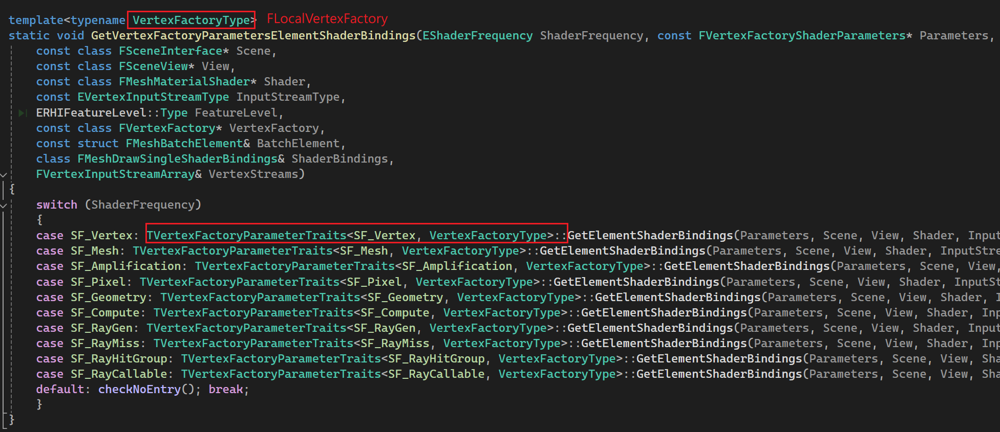
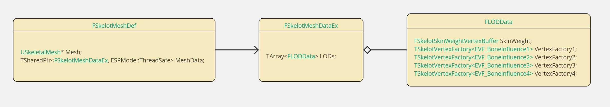

最近发现一个插件`Skelot`，实现了`Instaned Skeleton Mesh Rendering`。可以实现同时渲染几万个SkeletonMesh，而且每个实例都可以播着不同的动画，不同动画之间还能有混合过渡，[效果视频](https://www.bilibili.com/video/BV1aogKesEYs)。本质就是实现了一个SkeletonMesh版的`UInstancedStaticMesh`。要实现实例化绘制SkeletonMesh，通常需要实现自定义的`UPrimitiveComponent`和对应的`FPrimitiveSceneProxy`、`FVertexFactory`等。本文首先简要介绍实现自定义`UPrimitiveComponent`需要的基本操作，然后分析`Skelot`渲染方面的实现细节。

# FLocalVertexFactory

不同的VertexFactory实现了不同的顶点处理方式，即如何从VertexShader中传进来的Vertex数据得到VS输出给PS的顶点数据。通常，对于StaticMesh，直接把模型的VertexBuffer传给GPU，直接读顶点数据中的Position进行MVP变换即可，复杂一点，如果有顶点偏移，再加上顶点偏移，这就是`UStaticMeshComponent`实现的Mesh渲染方式。此外，如果是`USkeletalMeshComponent`这种骨骼动画的渲染，除了普通Mesh的顶点数据和处理逻辑，在顶点中还需要传入影响当前顶点的骨骼Index和对应的蒙皮权重，然后还需要一个额外的Buffer，传入当前帧的Pose，即每个骨骼对应的位置信息。渲染时，在VertexShader中根据这些数据计算出顶点的最终位置。这种顶点数据和处理逻辑的差异就是由`FLocalVertexFactory`处理的。而`FLocalVertexFactory`就是`UStaticMeshComponent`使用的顶点工厂，后面以它为例分析VertexFactory的工作机制。

VertexFactory首先要负责从模型资源获取渲染需要的数据，构建顶点数据布局。这些数据还需要以VertexBuffer的形式上传到GPU，即各种GPUBuffer，这些在UE中被抽象成以`FRHI`开头的各种资源，这些资源才可以直接被绑定到渲染管线中。

这一切自然要从`UStaticMesh`说起，毕竟一个模型导入到UE后，就成为了一个`UStaticMesh`。模型的原始数据保存在`UStaticMesh`的`FStaticMeshSourceModel`：
```c++
TArray<FStaticMeshSourceModel> SourceModels;
```
它在`UStaticMesh::Serialize()`中序列化。里面的模型数据仅编辑器下才会存在：


而真正的渲染数据是`UStaticMesh`中的`FStaticMeshRenderData`：
```c++
TUniquePtr<class FStaticMeshRenderData> RenderData;
```


`FStaticMeshRenderData`中，以每个LOD的Mesh数据单独保存为一个`FStaticMeshLODResources`，其中包含了一个LODMesh的VertexBuffer和IndexBuffer等数据，以及对应的MeshSection，不同的Section对应不同的MaterialIndex，引用了不同VertexBuffer和IndexBuffer范围。`FStaticMeshLODResources`相当于是从原始的模型数据`SourceModels`中，提取并重新组织了自己用得到的顶点数据，这些数据仍然是CPU端的。

每个`FStaticMeshLODResources`都对应了一个`FStaticMeshVertexFactories`，里面就是`FLocalVertexFactory`，这里面就有对应的GPUBuffer。

`UObject::PostLoad()`会在对象加载出来之后调用一次，`UStaticMesh::PostLoad()`中触发了`RenderData`的初始化，在编辑器下：
```c++
UStaticMesh::PostLoad()
* UStaticMesh::ExecutePostLoadInternal()
    * UStaticMesh::CacheDerivedData()   
    * 在这里实现了生成`RenderData`。
```
这里会处理从`SourceModels`生成各级`LODResources`中的模型数据，也有可能直接从DDC加载。在打包好的流程中，直接就在`UStaticMesh::Serialize()`反序列化出`RenderData`：


此时的`RenderData`只有CPU端的模型数据，`LODResources`和`LODVertexFactories`还没有初始化。随后对`RenderData`进行初始化：

UStaticMesh::PostLoad()
  * UStaticMesh::FinishPostLoadInternal()
    * UStaticMesh::InitResources()
      * FStaticMeshRenderData::InitResources()
      * 初始化所有LODResource和VertexFactory
        * FStaticMeshLODResources::InitResources()
        * FStaticMeshVertexFactories::InitResources()

在`FStaticMeshLODResources::InitResources()`中，对每一种Buffer都调用`BeginInitResource(Resource)`，里面`ENQUEUE_RENDER_COMMAND`创建渲染线程执行的命令，即简单地调用`Resource->InitResource()`：


而`InitResource()`中主要功能就是调用`InitRHI()`方法，从`FRenderResource`派生的Buffer需要实现这个方法，创建当前Resource对应的GPU资源。例如，在`FRawStaticIndexBuffer IndexBuffer`中，


当`FStaticMeshLODResources`加载好之后，其中的IndexStorage就是完整的索引数据，但IndexBufferRHI还没有创建，而且RHIBuffer的创建必须在RenderThread中执行。在`FRawStaticIndexBuffer::InitRHI()`中调用`FRawStaticIndexBuffer::CreateRHIBuffer()`创建`IndexBufferRHI`，并将`IndexStorage`上传到GPU。如果是DX12，具体的创建在`FD3D12DynamicRHI::CreateD3D12Buffer()`。

`VertexBuffers`中分了三种Buffer：


这三者都是`FRenderResource`，都会执行一样的初始化流程。
`StaticMeshVertexBuffer`里面有两种顶点数据：


其中TangentsData和TexcoorData是原始数据，然后是它们对应的RHIBuffer和SRV。在`FStaticMeshVertexBuffer::InitRHI()`中分别创建这两种Buffer和对应的SRV：


`PositionVertexBuffer`和`ColorVertexBuffer`也是同样的模式，这里不在赘述。

初始化好`LODResources`后，就可以用它去初始化`LODVertexFactories`，在`FStaticMeshVertexFactories::InitResources()`中：


而这里的`InitVertexFactory()`也仅仅是将输入的`LodResource`和`VertexFactory`打包成参数，发到RenderThread上进行初始化：


在`FLocalVertexFactory`中，有一个成员变量`FDataType Data;`，这里主要就是初始化它。`FDataType`继承自`FStaticMeshDataType`：


可以看到`FStaticMeshDataType`中保存的就是对`LODResources`中各种顶点数据RHIBuffer的引用，包括RHIBuffer指针的直接引用和对应的SRV。在渲染命令`ENQUEUE_RENDER_COMMAND(InitStaticMeshVertexFactory)`中，直接创建一个`FDataType`，用`LODResource`中各个Buffer的`BindXXX`方法构建`FDataType`中的内容，Position的初始化：


都是直接引用`LODResource`中这些资源创建的RHIBuffer和SRV。其它的也是一样。

然后调用`FLocalVertexFactory::SetData()`设置上数据，紧接着就调用`FLocalVertexFactory::InitResource()`初始化`FLocalVertexFactory`，别忘了它也是一个`FRenderResource`。有了所有的顶点数据后`(Data)`，就可以在`FLocalVertexFactory::InitRHI()`中声明对应的InputLayout了。InputLayout相关的数据都定义在父类`FVertexFactory`中：


通常顶点数据中都包含了Position、Normal、TexCoord等数据，在正常渲染中使用，但也有一些Pass不需要这么多数据，例如DepthOnlyPass。所以这里需要声明三种顶点数据的布局，对应到枚举`EVertexInputStreamType`的三个枚举项，以正常渲染使用的顶点数据为例，即`Streams`和`Declaration`，`FVertexStream`的结构很简单：


就是一种顶点元素对应的VertexBuffer和Offset，顶点数据中的元素按顺排在`Streams`中，而`Declaration`就是对应的图形API对顶点数据布局的描述信息，在DX12中即是`FD3D12VertexDeclaration`，里面就是存了一组`D3D12_INPUT_ELEMENT_DESC`。`InitRHI()`首先就完成了从`FDataType Data`到对应顶点输入布局的转换。

然后就是创建ConstantBuffer：


这里代码的命名是UniformBuffer，似乎是OpenGL里面的叫法，和DX12中的Constantbuffer应该是一个意思。这里判断要不要创建`Uniformbuffer`在Windows上多半是能通过的。这个Buffer主要是把前面说的那些顶点数据，以Buffer的形式传给Shader，然后再HLSL中我们手动读取。里面创建时，会把`Data`中的那些Buffer初始化给它。而另外一个`LooseParametersUniformBuffer`似乎是和GPUSkin相关的？

至此，一个`UStaticMesh`的`FLocalVertexFactory`就初始化好啦。从`FStaticMeshRenderData`这里开始，把每一级LODResource的Mesh数据分开存，且一个LODResource对应一个VertexFactory，在GameThread，先加载好`FStaticMeshRenderData`中的原始数据，然后调用它的初始化创建GPU资源。对LODResource中的每一个Buffer都调用它的初始化方法，创建渲染线程的命令，从对应的原始数据创建RHIBuffer，并上传数据，然后用LODResource初始化对应的VertexFactory，根据有的VertexBuffer和里面的格式，引用这些Buffer和对应的SRV，创建对应的`VertexDeclaration`，将来Renderer会通过`FVertexFactory::GetStreams()`使用它。最后再创建VertexFactory需要的UniformBuffer。

# Vertex Shader
`FLocalVertexFactory`最后都会编译出对应的VertexShader，那这一步又是怎么完成的呢？

一个VertexFactory对应的的HLSL文件中通常只需要实现一些函数和结构体即可，在`BasePassVertexShader.usf`中用了很多它这个文件和它直接Include的文件中并没有定义的函数和结构体，我们的VertexFactory对应的HLSL文件，例如`LocalVertexFactory.ush`，就需要定义这些函数和结构体，编译时会把它们当成Include文件在`BasePassVertexShader.usf`中展开。可以看看函数`VertexFactoryGetInterpolantsVSToPS()`，结构体`FVertexFactoryInterpolantsVSToPS`。

此外，UE中的Shader组织采用了一种被称为`Uber Shader`的方式，在一个大的Shader文件中实现所有功能，用不同的宏可以选择性开启或关闭一些功能，可以参考[这个](https://medium.com/@lordned/unreal-engine-4-rendering-part-5-shader-permutations-2b975e503dd4)。例如，`FLocalVertexFactory`中的`FVertexFactoryInterpolantsVSToPS`结构体定义：


顶点工厂可以实现一个函数，定义一些宏：

不同的宏定义处理后的VertexShader HLSL结果：


这里`TBasePassVSTLightMapPolicyHQ`还多了许多其它代码，都是通过宏定义开启的：


所以一个顶点工厂，根据不同宏的排列组合，会编译出很多个VertexShader：


可以看到，仅对于BasePass的VertexShader就有7中不同的情况，针对不同的光照模式、DistanceFieldShadow。估计多改一下渲染设置，材质的设置，开启不同的渲染效果组合，这还会更多。此外，不同的顶点工厂实现都会生成这么多的排列结果。好在大部分代码都是直接复用的。

回到C++这边，`FLocalVertexFactory`又是怎么控制VertexShader的呢？VertexFactory可以控制自己应该生成什么样的permutations，通常如果我们可以预知我们的`VertexFactory`会被用于什么样的材质，不会用于什么样的材质或效果，就可以排除部分permutations的编译，通过`ShouldCompilePermutations()`实现，例如GPUSkinVertexFactory的实现：


在定义一个VertexFactory时还需要用宏生成一些额外的代码，声明一个静态成员`FVertexFactoryType`和对应的Get方法:


然后在CPP文件中用`IMPLEMENT_VERTEX_FACTORY_TYPE`关联FLocalVertexFactory和对应的ush文件，以及初始化这个静态实例，实现对应的方法：


用一系列枚举表明这个VertexFactory支持的功能。这个宏还通过传入的类名，拼接出`FLocalVertexFactory`实现的一些静态方法，或作为模板参数生成一些对`VertexFactory.h`中的静态函数的调用，都作为函数指针传给`FVertexFactoryType`，还有ush文件路径，`FVertexFactoryType`就有了这个VertexFactory的几乎所有信息，后续的编译就全靠它了。

## 参数传递
确定了ush文件后，我们还需要确定向VertexShader传递什么参数？比如SplineMesh需要传入Spline的开始点，结束点，Tangent，Scale等等，参考`SplineMeshShaderParams.h`。

我们可以继承`FVertexFactoryShaderParameters`，实现向VertexShader中绑定数据。


以`FLocalVertexFactoryShaderParameters`为例，首先继承并实现自己绑定参数的逻辑，细节后面再说。声明`FLocalVertexFactory`的参数类型，指定VertexFactory类型、Parameter类型、适用的着色阶段：


可以看到实际就是根据这三个参数，特化了一个模板类，相当于确定了`FLocalVertexFactory`在`SF_Vertex`阶段的Shader参数是`FLocalVertexFactoryShaderParameters`类型的。这个特化的模板类中实现了三个静态方法，与之前实现顶点工厂的宏`IMPLEMENT_VERTEX_FACTORY_TYPE`展开后看到的传进去的三个以`FLocalVertexFactory`为模板参数的函数指针有关，是一一对应的，包括创建`FLocalVertexFactoryShaderParameters`结构体指针，获取布局信息，绑定参数。例如在渲染时绑定参数，实现`FLocalVertexFactory`时传的`GetVertexFactoryParametersElementShaderBindings<FLocalVertexFactory>()`将被调用：



这里用`FLocalVertexFactory`类型和SF_Vertex就确定了特化的ParamterTraits结构体，然后就只能调用到`FLocalVertexFactoryShaderParameters`的实现中。这也说明了一种顶点工厂的一个着色阶段只能由一个这种GlobalUniformBuffer的绑定。

### 绑定Global Shader Parameter

如果想绑定一个UniformBuffer，首先定义UniformBuffer的结构：


`FLocalVertexFactory`要先创建它的UniformRHIBuffer，可以直接在`FLocalVertexFactory::InitRHI()`中创建并初始化数据，并作为成员变量保存起来。在`FLocalVertexFactoryShaderParameters::GetElementShaderBindings()`中绑定数据：


绑定时，传入的第一个参数是参数位置，通过`Shader->GetUniformBufferParameter<FLocalVertexFactoryUniformShaderParameters>()`获得绑定位置，第二个参数传入实际的`FRHIUniformBuffer`即可。这种GlobalShaderParameter，在VertexShader中直接使用同名`(LocalVF)`的ConstantBuffer就行。

这种GlobalShaderParameter不需要显式指定与顶点工厂绑定，在编译顶点工厂时，每个 `GlobalShaderParameter`都会生成自己的定义HLSL代码到一个临时的ush文件中，然后编译VertexShader时，把这些文件当成Include文件一起编译：


### 在FVertexFactoryShaderParameters中绑定参数
我们还可以在`FVertexFactoryShaderParameters`的成员变量中声明Shader参数。例如在`FLocalVertexFactoryShaderParameters`中：


可以用`LAYOUT_FIELD`声明一个Shader参数，在对应的HLSL代码中，直接这样使用:


在编译好对应的Shader后，就会执行`FLocalVertexFactoryShaderParameters::Bind()`，参数`ParameterMap`，是从HLSL代码的编译结果中获取的Shader参数信息，里面包含了HLSL中用到的所有参数和绑定信息：


注意到在UE的HLSL代码中，没有显示使用`register(b0)`指定Buffer的绑定位置，而是让编译器自动为资源分配寄存器，然后通过`ID3D12ShaderReflection`从编译好的代码中获取绑定信息。具体可以参考`ID3D12ShaderReflection`和`CompileAndProcessD3DShaderDXC()`。

这里也可以看到，如果HLSL代码中使用了对应的`GLOBAL_SHADER_PARAMETER_STRUCT`，也会出现在`ParameterMap`中，但这里不用保存这种Buffer的绑定信息，因为它们可以在`GetElementShaderBindings`中通过Shader直接获得绑定点。

在C++这一侧，对每一个用`LAYOUT_FIELD`声明的Shader参数，都要在这里调用自己的`MyCustomParam.Bind(ParameterMap，ParamName)`方法，从`ParameterMap`中读取名为`ParamName`的参数的绑定信息。这样`MyCustomParam`就知道了自己绑定到ShaderParameter的位置信息，这样后面就能用`MyCustomParam`绑定实际的数据。在`GetElementShaderBindings()`绑定具体数据：


这里的数据类型要与HLSL中使用的一致。

# 实现InstancedSkeletalMesh

如何组织需要的数据？

Skelot里面实现了一个继承自UDataAsset的类USkelotAnimCollection，把Skeleton和对应的动画Sequence配置在一起，还有对应的模型。然后直接在`USkelotAnimCollection`中预处理动画和模型数据。

## 动画数据预处理
预先计算好所有Sequence在绑定空间的最终变换，存到一个巨大TransformBuffer中。这里的动画数据可以直接用`UAnimSequenceBase`的方法读取。对每个Sequence，还可以配置它能混合到什么Sequence，以及混合的时长。然后进行预处理，从起始Sequence中的每一帧到目标Sequence的混合Pose，只用生成配置的时长即可。假设我们一个Skeleton有三个Sequence，其中，S1可以混合到S2和S3，混合时长为0.2s。在生成的AnimationBuffer中，前面三个Sequence的动画数据依次排列，且Sequence自己记下在生成的Buffer中的开始位置。然后开始生成混合帧，如果动画都是60帧/s的，混合0.2s就是要混合前12帧，则从S1的每一帧开始，都要混合S2的前12帧，这里也是混合好后，计算好绑定空间的变换矩阵。这里每个混合都要记下自己有多少帧，从Buffer中的什么位置开始的。最终生成的AnimationBuffer的布局如下：

```
[        S1         ][        S2         ][        S3         ]
[ S1_1->S2 ][ S1_2->S2 ]...[ S1_i->S2 ][ S1_1->S3 ][ S1_2->S3 ]...[ S1_i->S3 ]
```
插件`Skelot`中的一个配置：


只需要配置好骨骼，支持的Sequence，及可混合的目标，Meshes配置的是支持的模型。灰色的数据是构建好之后的结果。可以看到一共有差不多1.8W个Pose，其中1.68W都是混合后生成的。

这样一来，我们只用每帧更新每个实例播放到了AnimationBuffer中的哪一个Index，把它传给GPU，就可以实现在VertexShader中更新动画。

这个AnimationBuffer需要上传到GPU，所以必须构建RHI资源。所以，要先从`FRenderResource`继承：


这里需要把预计算的动画`Transform`数据存在`FStaticMeshVertexDataInterface* Transforms`中，还要实现序列化。最重要的是实现`InitRHI()`，在渲染线程执行，创建对应的`FBufferRHIRef`。编辑器下预计算好动画数据后，就可以立即发送渲染命令，执行`AnimationBuffer.InitResource(RHICmdList)`。

## 模型数据处理

支持骨骼动画的模型中，每个顶点还要保存受影响的BoneIndex和对应权重。这些数据在引擎的`USkeletalMesh`中就有，我们可以直接从中读取，然后转换成我们需要的格式，同样也要处理LOD。这里的思路与前面分析过的`UStaticMesh`很相似。模型数据我们配置的是`USkeletalMesh`，讲道理里面顶点也有BoneIndex和权重，直接用不就行了？UE的BoneIndex和蒙皮权重都是uint16：


我们想直接用uint8，节约一点。骨骼动画还有个概念，就是每个顶点可以被多少根骨骼影响？我们这里简单点，顶点数据统一存四个。由于这里要作为顶点数据，所以必须从`FVertexBuffer`继承实现一个`FSkelotSkinWeightVertexBuffer`，用一个成员变量存储原始数据，直接用`USkeletalMesh`中的`TArray<FSkinWeightInfo>`初始化它，这是引擎SkeletonMesh的顶点蒙皮信息，一个顶点最多存储了12个骨骼。我们这里需要转换一下数据格式，一个顶点用4个uint8表示四个BoneIndex(最多256个骨骼)，4个uint8表示权重，多的直接不要，数据直接static_cast。


其它的诸如顶点位置，纹理坐标之类的数据就还是用`USkeletalMesh`里面原来的就行了。在构建Animation的同时构建这份数据，注意，这里只是构建好CPU端的数据，并没有初始化RHIBuffer。

## 顶点工厂初始化

至此，CPU端的数据就处理好了，包括动画和顶点数据，这些数据都可以直接序列化保存下来，这样打包后就不用再进行这些处理。游戏开始时，通常在加载`USkelotAnimCollection`出来后就要初始化GPU端的数据，需要发送渲染线程命令，到渲染线程执行：


这里首先初始化AnimationBuffer的渲染资源。然后初始化配置的所有Meshes的渲染资源，即顶点数据和VertexFactory：


对每个Mesh的每一级LOD都要分别构建对应的顶点工厂。虽然前面构建SkinWeight数据时，统一了影响每个顶点的骨骼数量为4，但是不同MeshSection中，影响一个顶点的骨骼数量可能不同，所以要把影响顶点的骨骼数量作为顶点工厂的模板参数，然后在编译时设置一个宏的值：


在对应的`SkelotVertexFactory.ush`中处理不同情况：


所以对每级LOD Mesh都要准备四种顶点工厂：


构建VertexStrem时，从`FStaticMeshDataType`派生一个`FSkelotBaseVertexFactory::FDataType`，因为要用它里面的常规模型顶点数据类型，在其中再加上骨骼和权重数据的声明：


然后直接使用`FSkeletalMeshLODRenderData`中的PositionBuffer、TangentBuffer、ColorBuffer、TexCoorBuffer，再加上之前构建的`FSkelotSkinWeightVertexBuffer`，填充`FSkelotBaseVertexFactory::FDataType`。最后调用`FSkelotBaseVertexFactory::SetData()`初始化顶点布局声明`FVertexFactory::Declaration`。

同时还要调用顶点权重数据和每个顶点工厂的`InitResources()`，初始化上传对应的GPU资源。在渲染时，会通过对应顶点工厂自动帮我们绑定顶点数据。这里Mesh数据的组织结构如图：



## VertexShader参数

除了顶点权重数据，我们还需要把一些数据传给VertexShader：

* BoneCount 总的骨骼数
* InstanceOffset 当前实例Index在总的InstanceBuffer中的偏移量，因为不同LODMesh的Draw用的是用一个`Instance_AnimationFrameIndices`和`Instance_Transforms`。
* MaxInstance 当前DrawInstanced的实例数量
* NumCustomDataFloats 一个Instance有几个CustomFloats
* CustomDataInstanceOffset Instance_CustomData的偏移
* AnimationBuffer 最开始准备的巨大AnimationBuffer
* Instance_Transforms 每个Instance的Transform
* Instance_AnimationFrameIndices 每个Instance当前的动画帧Index
* Instance_CustomData 每个Instance的自定义数据，用于材质中。

这么多数据，适合用一个`GLOBAL_SHADER_PARAMETER`传给VertexShader，首先定义它`FSkelotVertexFactoryParameters`：


然后从`FVertexFactoryShaderParameters`派生，实现`FSkelotShaderParameters`，其中最重要的就是在`GetElementShaderBindings`中绑定我们的`UniformBuffer`，这个Buffer是在`FSkelotProxy::GetDynamicMeshElements()`中构建`FMeshBatchElement`时传递的。


还要记得用宏实现顶点工厂`TSkelotVertexFactory`使用的Shader参数是`FSkelotShaderParameters`：


在对应的`SkelotVertexFactory.ush`Shader文件中，直接用实现的GlobalShaderParameter的名字`SkelotVF`访问这些数据，例如，获取第AnimationFrameIndex帧，骨骼BoneIndex的变换矩阵：


直接用`参数名.数据成员名`访问，最终用于编译的代码中，UE首先会为GlobaleShaderParameter生成对应的变量声明的代码：


UE会帮我们把`SkelotVertexFactory.ush`中的代码替换成实际的名字：


## FSkelotProxy构建MeshBatch
在游戏中，如何开始渲染呢？这里的思路和InstancedStaticMesh几乎一样。首先继承`UMeshComponent`实现一个GameThread的`USkelotComponent`，向外提供添加、删除实例，更新实例的Transform，为某个Instance播放动画等操作。还需要在Tick里更新每个实例的动画状态，即播放到哪一帧，然后调用`MarkRenderDynamicDataDirty()`，随后在GameThread的每一帧的末尾会调用`USkelotComponent::SendRenderDynamicData_Concurrent()`，在其中构建所有需要的渲染数据，包括所有Instance播放的AnimationFrameIndex数组，所有Instance的Transforms等数据，最后再用一个渲染命令把数据发到RenderThread，更新`FSkelotProxy`的数据：


总体更新流程：


这种动态数据也就会每帧更新。随后在渲染线程发起渲染时，会调用`FSkelotProxy::GetDynamicMeshElements()`搜集绘制的MeshBatch。在`GetViewRelevance()`返回`bDynamicRelevance`为true的情况下，也是每帧都会调用。其中执行的流程大致为：
* 对每个Instance作剔除
  * 视锥剔除
  * 距离剔除
* 计算通过剔除的Instance应该以哪一级LOD绘制。
* 得到每一级LOD和它对应的Instance。
* 根据总的可见Instance数量，Alloc Per Instance的数据GPUBuffer`FSkelotInstanceBuffer`，里面包含Transform和AnimationFrameIndex。
  * 如果有CustomData，还要Alloc自定义数据GPUBuffer`FSkelotCIDBuffer`。
* AnimationFrameIndex 中，每个元素32位，前16位是当前帧AnimationIndex，后16位是上一帧AnimationIndex。
* 所有LOD共用一个`FSkelotInstanceBuffer`和`FSkelotCIDBuffer`。
* 构建MeshBatch
  * CreateUniformBuffer() 创建针对每个LODMesh Draw的`FSkelotVertexFactoryParameters`。分配各种Buffer，针对LOD中Instance数量，初始化InstanceOffset。
  * 处理每个MeshSection可能EVF_BoneInfluence不同，用不同的VertexFactory。
  * 对每个LOD的每个Section生成MeshBatch。

这里最最重要的就是`FSkelotMeshGenerator::CreateUniformBuffer()`，创建了`FSkelotVertexFactoryParameters`的RHIBuffer，`FSkelotMeshGenerator::AllocateMeshBatch()`把这些数据传给了MeshBatch。这就和`FSkelotShaderParameters::GetElementShaderBindings()`对应上了。

# Reference：
* [GPU Gems 3 Animated Crowd Rendering](https://developer.nvidia.com/gpugems/gpugems3/part-i-geometry/chapter-2-animated-crowd-rendering)
* [skelot instanced skeletal mesh rendering](https://www.unrealengine.com/marketplace/en-US/product/skelot-instanced-skeletal-mesh-rendering)
* [基于UE4的 Mobile Skeletal Instance - VS Shader](https://zhuanlan.zhihu.com/p/339031851)
* [一位大佬关于万人同屏的回答](https://www.zhihu.com/question/377037950/answer/1067763870)
* [Shader Permutations](https://medium.com/@lordned/unreal-engine-4-rendering-part-5-shader-permutations-2b975e503dd4)
* [Debugging the Shader Compile Process](https://dev.epicgames.com/documentation/en-us/unreal-engine/debugging-the-shader-compile-process-in-unreal-engine)
* [Shader Debugging Workflows](https://dev.epicgames.com/documentation/en-us/unreal-engine/shader-debugging-workflows-unreal-engine?application_version=5.4)
* [UE4 Shader Parameter Bind](https://zhuanlan.zhihu.com/p/485239547)
* [Global Uniform Buffer](https://medium.com/@solaslin/learning-unreal-engine-4-adding-a-global-shader-uniform-1-b6d5500a5161)
* [Creating a Custom Mesh Component in UE4 | Part 1: An In-depth Explanation of Vertex Factories](https://medium.com/realities-io/creating-a-custom-mesh-component-in-ue4-part-1-an-in-depth-explanation-of-vertex-factories-4a6fd9fd58f2)
* [Creating a Custom Mesh Component in UE4 | Part 0: Intro](https://medium.com/realities-io/creating-a-custom-mesh-component-in-ue4-part-0-intro-2c762c5f0cd6)
* [Global Uniform Shader Parameter(1)](https://medium.com/@solaslin/learning-unreal-engine-4-adding-a-global-shader-uniform-1-b6d5500a5161)
* [Instancing and Order Independent Transparency in Total War: THREE KINGDOMS](https://gdcvault.com/play/1026177/Instancing-and-Order-Independent-Transparency)
* [graphics-programming-overview-for-unreal-engine](https://dev.epicgames.com/documentation/zh-cn/unreal-engine/graphics-programming-overview-for-unreal-engine)
* [Skelot Instaned Skeleton Mesh Rendering](https://www.bilibili.com/video/BV1aogKesEYs)