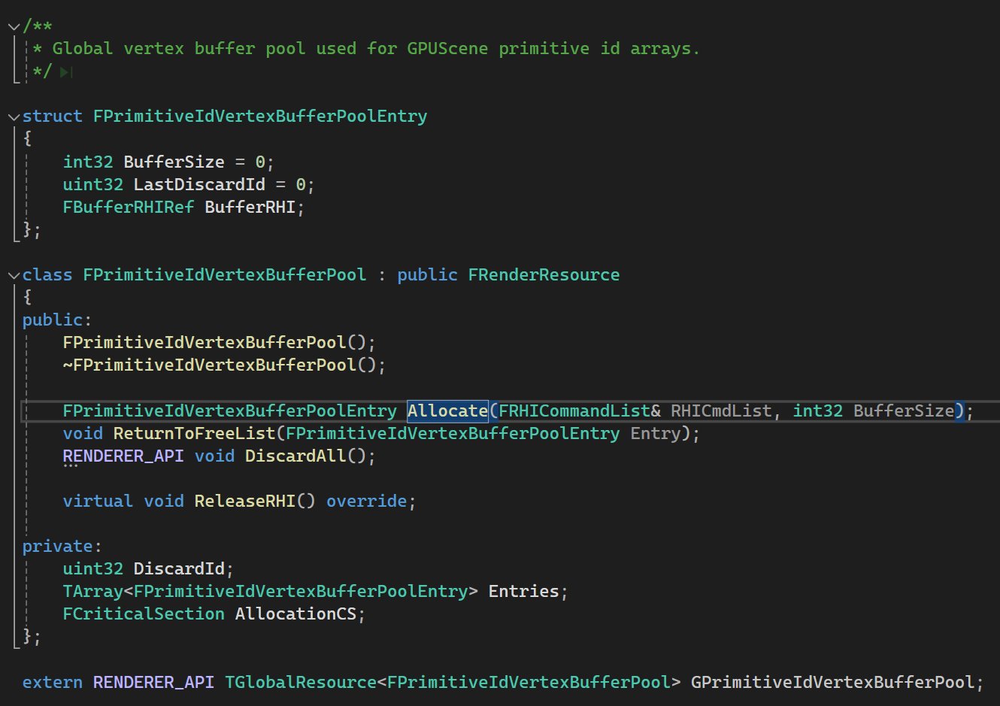

refernece: https://zhuanlan.zhihu.com/p/614758211


每个Primitive的数据，LocalToRelativeWorld，CustomPrimitiveData等数据，Shader中对应结构体：FPrimitiveSceneData。

FPrimitiveUniformShaderParameters

FPrimitiveSceneProxy::CreateUniformBuffer()
FPrimitiveSceneProxy::UpdateUniformBuffer()

FInstanceSceneShaderData ， Shader中FInstanceSceneData。


# Shader
BasePassVS中：
通过它获取`FInstanceSceneData`和`FPrimitiveSceneData`,

用的是`（FVertexFactoryInput）Input .InstanceIdOffset, Input .DrawInstanceId`，

uint InstanceIdOffset : ATTRIBUTE13 ; 			uint DrawInstanceId : SV_InstanceID;

FSceneDataIntermediates GetSceneDataIntermediates(uint InstanceIdOffset, uint DrawInstanceId)

被存到FVertexFactoryIntermediates.Common中。

开始绑定：FMeshPassProcessor::BuildMeshDrawCommands() 顶点数据，各种View。

在VS里，用GetPrimitiveData从PrimitiveIndex获取FPrimitiveSceneData。
对应到Shader中，G:\workspace\UnrealEngine\Engine\Shaders\Private\SceneData.ush Line351

```c++
float4 LoadPrimitivePrimitiveSceneDataElement(uint PrimitiveIndex, uint ItemIndex)
{
	uint TargetIdx = PrimitiveIndex + ItemIndex;

#if SHADER_USES_PRIMITIVE_UBO
	return 0; // FIXME LoadPrimitivePrimitiveSceneDataElement for UBO case
#elif USE_GLOBAL_GPU_SCENE_DATA
	checkStructuredBufferAccessSlow(GPUScenePrimitiveSceneData, TargetIdx);
	return GPUScenePrimitiveSceneData[TargetIdx];
#elif USE_GLOBAL_GPU_SCENE_DATA_RW
	checkStructuredBufferAccessSlow(GPUScenePrimitiveSceneDataRW, TargetIdx);
	return GPUScenePrimitiveSceneDataRW[TargetIdx];
#else
	checkStructuredBufferAccessSlow(Scene.GPUScene.GPUScenePrimitiveSceneData, TargetIdx);
	return Scene.GPUScene.GPUScenePrimitiveSceneData[TargetIdx];
#endif
}
```
Mesh的顶点数据中的PrimitiveId，即Shader中的InstanceIdOffset，在Draw的时候动态绑定，与其它数据在构建顶点工厂时就绑定不一样：

```
DrawDynamicMeshPassPrivate()
  SortAndMergeDynamicPassMeshDrawCommands中构建Primitiveindex
	TranslatePrimitiveId处理索引，最高位。
  SubmitMeshDrawCommandsRange
    FMeshDrawCommand::SubmitDraw(
		FMeshDrawCommand::SubmitDrawBegin
			RHICmdList.SetStreamSource(Stream.StreamIndex, SceneArgs.PrimitiveIdsBuffer, SceneArgs.PrimitiveIdOffset);
		FMeshDrawCommand::SubmitDrawEnd 提交绘制
```

# Static Mesh 渲染流程：
Primitive通过ENQUEUE_RENDER_COMMAND发送渲染线程命令，FScene::PrimitiveSceneInfo_RenderThread()，添加到FScene的成员变量AddedPrimitiveSceneInfos中，在下一次渲染开始的FScene::Update()中处理。

FPrimitiveSceneInfo::CacheMeshDrawCommands(this, SceneInfosWithStaticDrawListUpdate);
* 对每个FPrimitiveSceneInfo，的每个StaticMeshes，搜集起来处理
  * 每个StaticMeshes，创建与EMeshPass::Num相同数量的Command，在StaticMeshCommandInfos。
* 对每个Pass - EMeshPass::Num，创建CreateMeshPassProcessor
  * 对每个MeshBatch调用Processor->AddMeshBatch

# DynamicMesh渲染流程

// 对所有GatherDynamicMesh进行操作
FVisibilityTaskData::SetupMeshPasses()
FParallelMeshDrawCommandPass::DispatchPassSetup() // 对每个Pass进行处理，EMeshPass::Num

FMeshPassProcessor::BuildMeshDrawCommands

直接看有没有进BassPass： 
FBasePassMeshProcessor::TryAddMeshBatch()

最终都要走到提交这里：
FMeshDrawCommand::SubmitDraw()
FMeshDrawCommand::SubmitDrawEnd()