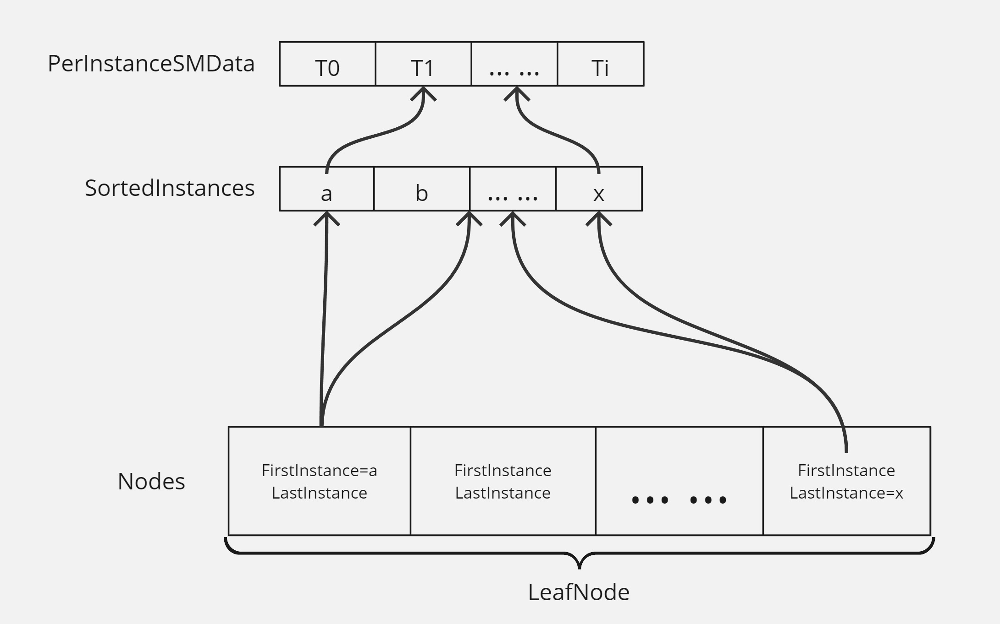
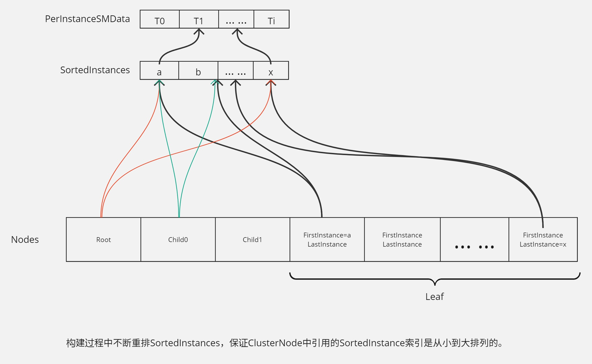
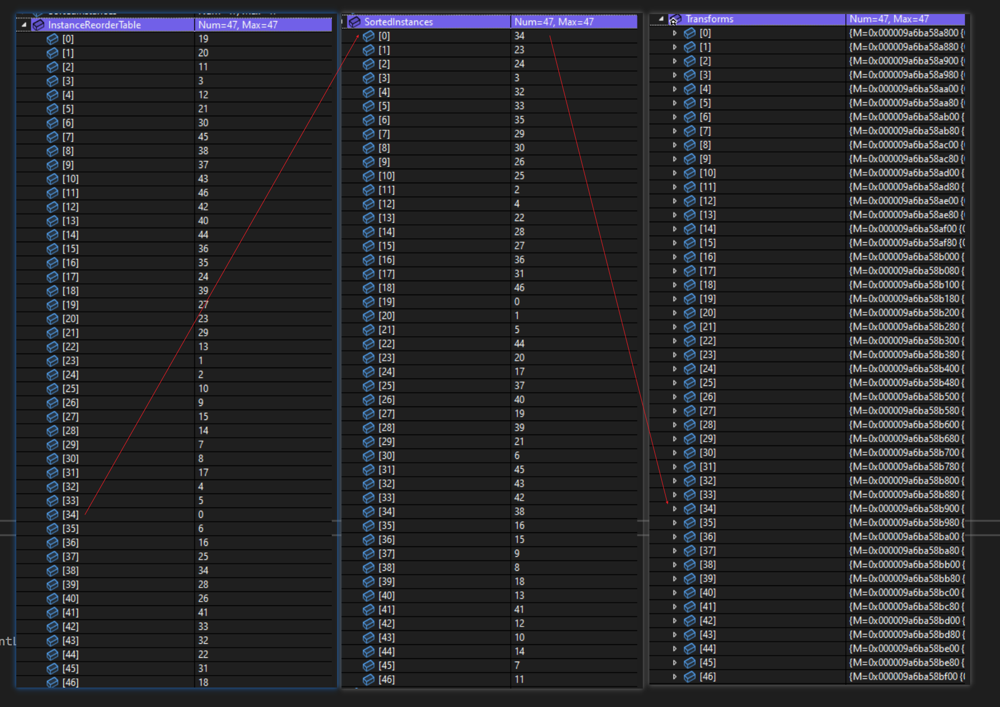
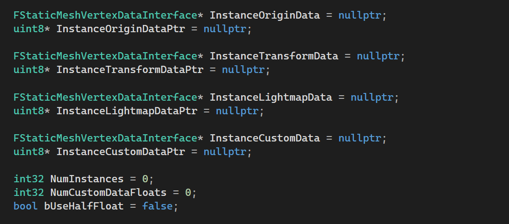
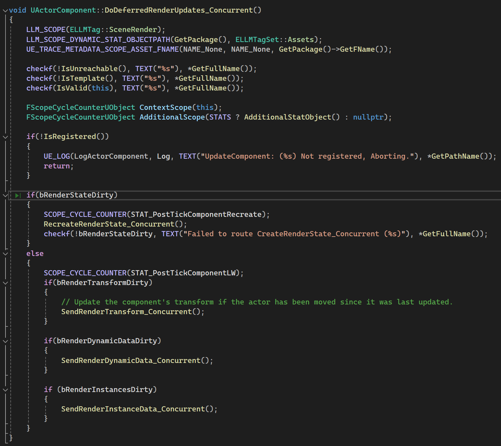

# 划分Leaf节点

UHierarchicalInstancedStaticMeshComponent::FClusterBuilder::BuildTreeAndBuffer()
	BuildTree();

InternalNodeBranchingFactor = CVarFoliageSplitFactor.GetValueOnAnyThread();（16） 
划分节点时，小于这个数就可以合并成一个父Cluster。

MaxInstancesPerLeaf初始化为LOD0顶点数/`foliage.MinVertsToSplitNode=8192`，`FMath::Clamp(VertsToSplit / LOD0Verts, 1, 1024);`。
也就是说希望叶节点总的实例数量*顶点数=8192.

还要保证叶节点数量尽量不要小于可合并节点数`InternalNodeBranchingFactor`。
```c++
if (Num / MaxInstancesPerLeaf < InternalNodeBranchingFactor) // if there are less than InternalNodeBranchingFactor leaf nodes
{
    MaxInstancesPerLeaf = FMath::Clamp<int32>(Num / InternalNodeBranchingFactor, 1, 1024); // then make sure we have at least InternalNodeBranchingFactor leaves
}
```

* 先确定最大划分单位（划分到元素数量<=BranchingFactor就可以成为一个Cluster）
  * BranchingFactor = MaxInstancesPerLeaf
* SortIndex里是(0~NumInstance-1)的Index。
* SortPoints是对应Instance的Location
* Split(Range(StartIndex,EndIndex))
  * 如果范围内元素数量<=BranchingFactor
    * 向Clusters添加这个Range的起点Index和范围内的元素数量
  * 获取范围内的点组成的Bound
  * 找到这个Bound的最长轴Axis
  * 对这个范围内的Instance按Axis的坐标从小到大排序。
  * 更新这个Range内Index顺序，按对应Instance的Axis坐标从小到大排列。
  * 将这个Range分为两部分
    * 如果Range中有偶数个元素，均分。奇数个元素，中间元素离谁近就分给谁。
    * Split(Start, EndLeft);
	* Split(StartRight, End);
* 完事儿之后SortIndex中是一组组连续的在某个Axis方向上最近的InstanceIndex
* 由Clusters指示哪些Range是一个Clusters。

从Cluster构造`TArray<FClusterNode> Nodes;`数组，并把`SortIndex`Copy一份到`TArray<int32> SortedInstances;`。`Nodes`的顺序是按引用的`FirstInstance`从小到大排列的。



# 合并Leaf节点

与上面叶节点的划分采用一样的算法：
* BranchingFactor 初始化为 InternalNodeBranchingFactor(16)
* SortIndex:0~NumRoot-1  -> Result->Nodes
* SortPoints:对应FClusterNode Bound的中心点
划分结果：
* Clusters.Start -> Index to SortIndex Array,
* Clusters.Num ElementNum begin with Start
Clusters中就是对上一级节点合并后的Cluster结果。因为要把叶节点重新按Bound中心位置排序，以保证当前Cluster对`SortedInstances`的引用仍然是连续的，所以这里还要重排SortedIstances中的顺序以保证这件事。

一直循环处理每一级，直到只剩一个Root节点，且顶层节点按顺序排在最前面。（中间的过程巨TM复杂）



# InstanceReorderTable



InstanceReorderTable记下了Transform对应在SortedInstances中的Index。

# Build Buffer
UHierarchicalInstancedStaticMeshComponent::FClusterBuilder::BuildTreeAndBuffer()
	BuildTree();
    BuildInstanceBuffer();

绘制的顺序是按SortedInstances中排的顺序。For循环Transform，用`InstanceReorderTable[i]`得到`Transform[i]`是第几个绘制的。一个一个设置所有instance的数据初始化Buffer，最终Buffer中的Transform就是按照SortedInstances的Index排列的。

FStaticMeshInstanceData：



# ApplyBuildTree

触发更新
MarkRenderInstancesDirty(); 
    UWorld::MarkActorComponentForNeededEndOfFrameUpdate()

GameThread帧末尾
UWorld::SendAllEndOfFrameUpdates()
    UActorComponent::DoDeferredRenderUpdates_Concurrent()




添加，删除，移动 Instance 都会导致整个ClusterTree重新构建，然后重新创建渲染状态。

