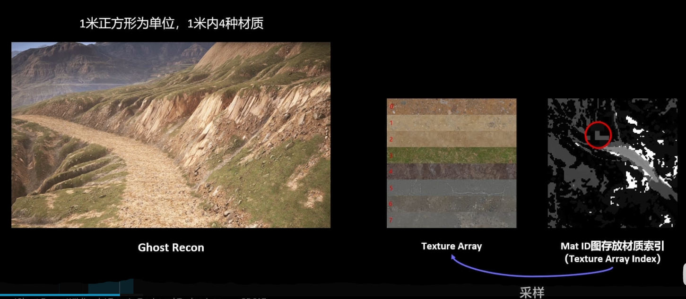

## AlphaBrush
可以将一个高度图作为笔刷，直接将结果叠加在当前Landscape上。

Doc：
https://docs.unrealengine.com/5.1/zh-CN/landscape-brushes-in-unreal-engine/


# Splat map

https://www.bilibili.com/video/BV1MC4y1Y7ft

每层材质都要占用一个8bit WeightMap通道，PS中采样每层材质的纹理，乘以Weight并相加。

8层材质，2个RGBA8 WeightMap，每像素采样18次=8*Albedo + 8*Normal+2*WeightMap。

2张RGBA占用空间也较大。

端游比手游材质层数翻倍。

大世界需要有32层及以上的材质层数。

ULandscape中，按每个地块使用到的材质层情况划分材质变体，减少不必要的Layer采样，增加DrawCall，不够灵活？

**需要的是整个大世界整体支持更多的材质，而不是局部。**

Ghost Recon Wildlands Terrain Tools and Technology -- GDC2017
* https://www.gdcvault.com/play/1024708/-Ghost-Recon-Wildlands-Terrain
* https://zhuanlan.zhihu.com/p/34223867
* https://zhuanlan.zhihu.com/p/364242852

Far Cry 5 :
* https://zhuanlan.zhihu.com/p/364546293
* https://zhuanlan.zhihu.com/p/589351932
* https://www.cnblogs.com/TracePlus/p/9202567.html



MatID Texture中，每个纹素代表实际1m的方块范围，其中有四个MatID，索引向TextureArray，这四个材质怎么混合 ？ 还是说只采样一个？

再采样周围四个MatID根据距离把这四种材质混合，使MatID边界过渡自然。

Blend everything depending on the normal axis ？


Reference:
* https://zhuanlan.zhihu.com/p/668278748
* https://blog.csdn.net/qq_29523119/article/details/134173248


# UE5 Landscape 

ULandscapeSubsystem : public UTickableWorldSubsystem，ALandscape
ULandscapeComponent，FLandscapeComponentSceneProxy
FLandscapeComponentSceneProxy

* Section是LOD计算、剔除的基本单位。
* HeightMap一样的情况下，也就是整体地形大小一样的情况下，
  * 一个Component4个Section，可以减少4倍的Component数量，对CPU性能友好
  * 增大Section大小，可以减少Component数量，提升CPU性能
    * 但GPU性能下降，因为一个Section会渲染过多的顶点。

总体来说：
* Seciton越小，剔除、LOD优化更多，但CPU开销高
* Section越大，组件就少，CPU消耗降低，但GPU开销增加

以Section为单位考虑，一个Section对应一张HeightMap，HeightMap中一个纹素对应Section中一个顶点，所以，
* 如果一个Section 64个顶点，对应一个64*64纹理，可以表示63个Quads，即63米。
  * 4*4Component,每个Component一个Seciton的情况下
    * Quads为63*4 252个
    * 分辨率（有效顶点数量）为 252+1
* 如果一个Component有两个Section，4*4个Component
  * 每个Component有126个Quads，127个Verts
  * 整体有126*4=504个Quads
  * 分辨率（有效顶点数量）为504+1

考虑总体分辨率时，总是和Section数和Quads数入手，分辨率总是Quads数+1，HeightMap分辨率总是Quads数+1.

## ULandscapeComponent
```
int32 SectionBaseX; // Quad为单位，属于这个Component的开始的Quad。
int32 SectionBaseY;
int32 ComponentSizeQuads;
int32 SubsectionSizeQuads;
int32 NumSubsections;
TObjectPtr<UTexture2D> HeightmapTexture;
TArray<TObjectPtr<UTexture2D>> WeightmapTextures;
TArray<FWeightmapLayerAllocationInfo> WeightmapLayerAllocations;

TMap<TObjectPtr<UMaterialInterface>, int8> MaterialPerLOD;
int32 LODBias;
TArray<int8> LODIndexToMaterialIndex;
```

```
Component 1. /Game/Map/MyTestLevel.MyTestLevel:PersistentLevel.Landscape_1.LandscapeComponent_0
    SectionBaseXY[0,0], ComponentSizeQuads: 126, SubsectionSizeQuads: 63, NumSubsections: 2
Component 2. /Game/Map/MyTestLevel.MyTestLevel:PersistentLevel.Landscape_1.LandscapeComponent_1
    SectionBaseXY[126,0], ComponentSizeQuads: 126, SubsectionSizeQuads: 63, NumSubsections: 2
Component 3. /Game/Map/MyTestLevel.MyTestLevel:PersistentLevel.Landscape_1.LandscapeComponent_2
    SectionBaseXY[252,0], ComponentSizeQuads: 126, SubsectionSizeQuads: 63, NumSubsections: 2
Component 4. /Game/Map/MyTestLevel.MyTestLevel:PersistentLevel.Landscape_1.LandscapeComponent_3
    SectionBaseXY[0,126], ComponentSizeQuads: 126, SubsectionSizeQuads: 63, NumSubsections: 2
Component 5. /Game/Map/MyTestLevel.MyTestLevel:PersistentLevel.Landscape_1.LandscapeComponent_4
    SectionBaseXY[126,126], ComponentSizeQuads: 126, SubsectionSizeQuads: 63, NumSubsections: 2
Component 6. /Game/Map/MyTestLevel.MyTestLevel:PersistentLevel.Landscape_1.LandscapeComponent_5
    SectionBaseXY[252,126], ComponentSizeQuads: 126, SubsectionSizeQuads: 63, NumSubsections: 2
Component 7. /Game/Map/MyTestLevel.MyTestLevel:PersistentLevel.Landscape_1.LandscapeComponent_6
    SectionBaseXY[0,252], ComponentSizeQuads: 126, SubsectionSizeQuads: 63, NumSubsections: 2
Component 8. /Game/Map/MyTestLevel.MyTestLevel:PersistentLevel.Landscape_1.LandscapeComponent_7
    SectionBaseXY[126,252], ComponentSizeQuads: 126, SubsectionSizeQuads: 63, NumSubsections: 2
Component 9. /Game/Map/MyTestLevel.MyTestLevel:PersistentLevel.Landscape_1.LandscapeComponent_8
    SectionBaseXY[252,252], ComponentSizeQuads: 126, SubsectionSizeQuads: 63, NumSubsections: 2
```