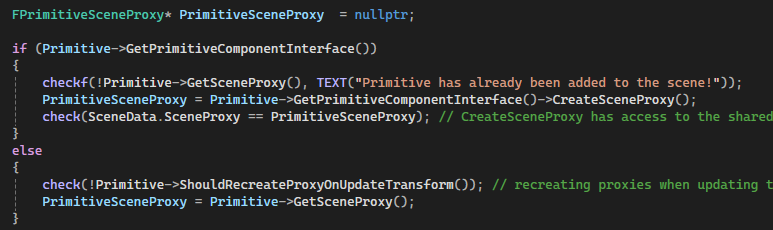
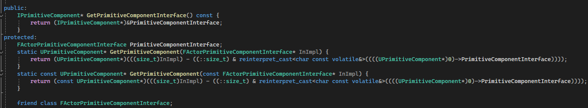
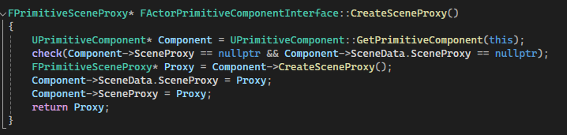
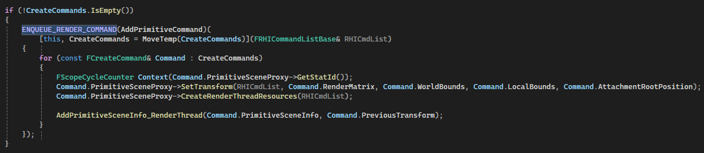
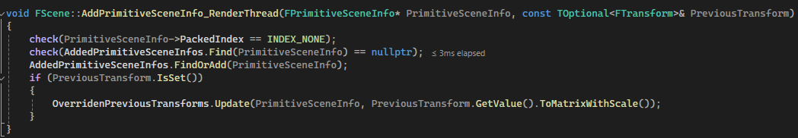
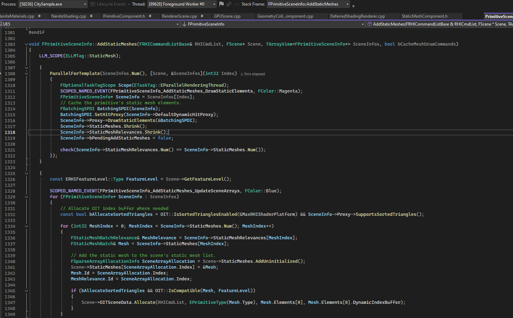

* https://dev.epicgames.com/documentation/en-us/unreal-engine/graphics-programming-for-unreal-engine

* [InstancedDraw ISM HISM](https://www.jianshu.com/p/a086bd856634)
* [模型绘制机制](https://blog.csdn.net/ttod/article/details/134377780)


一种情况，创建一个AStaticMeshActor，调用SetStaticMesh:
* UStaticMeshComponent::SetStaticMesh()
  * 如果已经创建了渲染状态
    * MarkRenderStateDirty()
    * bRenderStateDirty = true;
    * MarkForNeededEndOfFrameRecreate()
  * 没有，则马上创建，RecreateRenderState_Concurrent()
    * UPrimitiveComponent::CreateRenderState_Concurrent()
    * 用UWorld上的`FSceneInterface* Scene;`进行创建
      * FScene::AddPrimitive() ->  FScene::BatchAddPrimitivesInternal<>()

这里通过这段代码创建`FPrimitiveSceneProxy`：



这里的`GetPrimitiveComponentInterface()`是在`UPrimitiveComponent`中用一个宏实现的:
```c++
UE_DECLARE_COMPONENT_ACTOR_INTERFACE(PrimitiveComponent)
```


就是定义了一个`FActorPrimitiveComponentInterface`成员变量，它实现了接口`IPrimitiveComponent`，全是获取`UPrimitiveComponent`状态相关的接口，里面的实现都是调用前面的宏实现的`UPrimitiveComponent::GetPrimitiveComponent()`，用地址偏移，得到当前`FActorPrimitiveComponentInterface`成员变量所在对象的地址，不理解为什么一定要这么做(=_=)。例如这里用到的
`CreateSceneProxy()`:



将创建好的`FPrimitiveSceneProxy`和`FPrimitiveSceneInfo`构成一个`FCreateCommand`，用`ENQUEUE_RENDER_COMMAND`送到渲染线程处理：



等RenderThread执行到这个命令时，最终把PrimitiveSceneInfo添加到FScene中：



这里的AddedPrimitiveSceneInfos会在`FDeferredShadingSceneRenderer::Render()`中处理，在`FSceneRenderer::OnRenderBegin()`的最后调用`FScene::Update()`，更新渲染Scene的相关信息，处理各种Primitive上的数据改变，包括Primitve添加删除、Transform、VirtualTexture更新等。处理新加进来的`AddedPrimitiveSceneInfos`，完成后清空它。

构建GPUScene，场景有多少个`FPrimitiveSceneInfo`就要构建多少个实例。

AddStaticMesh, StaticPath



初始化View，计算Visibiliy，搜集可见元素的Mesh。
FDeferredShadingSceneRenderer::BeginInitViews()
  FVisibilityTaskData::ProcessRenderThreadTasks()
    FVisibilityViewPacket::BeginInitVisibility()
      如果场景种FPrimitiveSceneInfo太多，这里会创建超级多的数据，用于计算每个Primitive的Visibility
      每个Primitive至少循环处理一次

void FRelevancePacket::ComputeRelevance(FDynamicPrimitiveIndexList& DynamicPrimitiveIndexList)
对所有可见的Primitive计算相关性，
  PrimitiveSceneProxy->GetViewRelevance(&View);
  DynamicPrimitiveViewMasks->Primitives[PrimitiveIndex]
  FDynamicMeshElementContext::GatherDynamicMeshElementsForPrimitive(FPrimitiveSceneInfo* Primitive, uint8 ViewMask)


FNaniteMeshProcessor