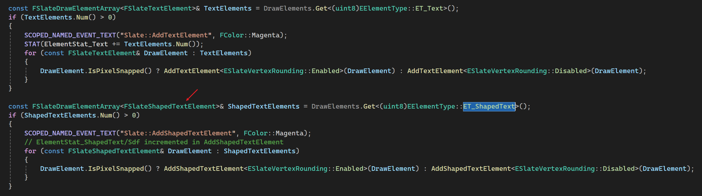
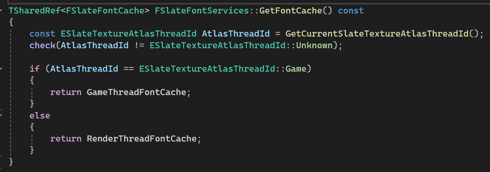

# 主流程
FSlateRHIRenderer::DrawWindow_RenderThread() 起源：`SlateUI Title = `, RenderThread

GameThread:

`FSlateElementBatcher::AddElements(FSlateWindowElementList)`

处理每一类元素：`FSlateElementBatcher::AddElementsInternal`

`FSlateShapedTextElement`字形相关信息全在`FShapedGlyphSequencePtr ShapedGlyphSequence`，其父类`FSlateDrawElement`主要记录了当前元素的位置、缩放、Transform等信息。

`FSlateElementBatcher::AddShapedTextElement`，

`FSlateFontRenderer::GetRenderData(FShapedGlyphEntry...)`

`FSlateFontRenderer::GetRenderDataInternal()`

FontCache分为GameThread和RenderThread:

`FSlateFontCache::AddNewEntry()`
* `FontRenderer->GetRenderData()`得到当前字形的Pixels，直接从freetype2拿，
* 根据`ESlateFontAtlasContentType FCharacterRenderData::ContentType`，拿到对应的AtlasTexture，所有纹理都在FSlateFontCache::AllFontTextures，具体类型是`FSlateFontAtlasRHI`。
  * 对每一个Atlas都尝试调用`AddCharacter()`，现有的都没空间时，通过`FSlateRHIFontAtlasFactory::CreateFontAtlas`创建新的。
  * 如果新Entry的大小超过了Atlas的大小，就专门创建一个新Entry大小的Texture,`FSlateRHIFontAtlasFactory::CreateNonAtlasedTexture`

* `FSlateTextureAtlas::AddTexture()`将前面拿到的bitmap pixels数据copy到Atlas
  * 如何从Atlas中找到一块可用的区域`FSlateTextureAtlas::FindSlotForTexture`(InWidth, InHeight)：
  * 给宽高都加上Padding，量由FSlateTextureAtlas::PaddingStyle决定。
  * `AtlasEmptySlotsMap`中的元素是链表`FAtlasedTextureSlot`的头。
    * 其中的索引这样计算`FMath::CeilLogTwo(InWidth)`，按字形宽分桶。
    * 如果是1024*1024的Atlas，就会有10组。
    * 粗略分组减少了每次查找目标区域扫描的长度。
    * 仅用宽分组，因为实际字形大小的变化主要体现在宽度上？
    * 初始化的时候，直接把一整个Texture放到`AtlasEmptySlotsMap`中。
  * 从`FMath::CeilLogTwo(InWidth)`计算出开始搜索的桶索引，遍历`AtlasEmptySlotsMap`
    * 遍历链表
    * 找到一个可以容纳需要大小的Slot后，从左上角分出为本次找到的区域，剩下的区域分成两个Slot，再次放到`AtlasEmptySlotsMap`。
    * 更新本次找到的Slot的长宽，为需要使用的长宽，并Unlink，然后Link到`AtlasUsedSlots`
* `FSlateTextureAtlas::CopyDataIntoSlot()`，把Pixel数据copy到找到的Texture中的可用区域，`TArray<uint8> FSlateTextureAtlas::AtlasData`
* `FSlateTextureAtlas::MarkTextureDirty()` 标记一下，后面再上传到GPU。

# Reference 
* [UE5 UMG的SDF字体渲染](https://zhuanlan.zhihu.com/p/3295334910)
* [【UE5】动态字体图集渲染](https://zhuanlan.zhihu.com/p/635341028)
* [Unreal Engine UI字体SDF渲染支持情况](https://zhuanlan.zhihu.com/p/1915374569801389273)
* [slug](https://sluglibrary.com)
* [UE中的Slug实现](https://codeartworks.com/2023/05/23/rendering-scalable-vector-text-in-unreal-engine/)
* [GPU Font Rendering](https://github.com/GreenLightning/gpu-font-rendering)