# Overview
UE的UI最开始只支持Bitmap字体，从UE5.4开始，现在已经完全同时支持了Bitmap和SDF字体了:
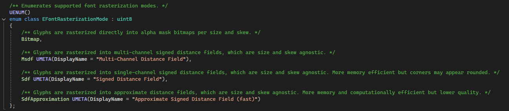

其中，SDF字体有多种模式，

* `Msdf` 用RGB三个通道，存距当前点最近的三条边的距离。渲染时，通过线性插值采样出当前像素点对应的RGB，然后取其中的中值作为当前像素的SDF值。
  * 解决单通道`SDF`锐角的交点变模糊的问题。
  * 为什么取中值？
  * 如果第三近的边其实很远，例如(0.2, 0.18, 4.7)，取中间值可以过滤掉这种情况。
  * 上面这个例子，在纹理采样插值后可能变成(-0.05, 0.30, 4.6)，如果选最小的，会导致出现凹陷。
  * 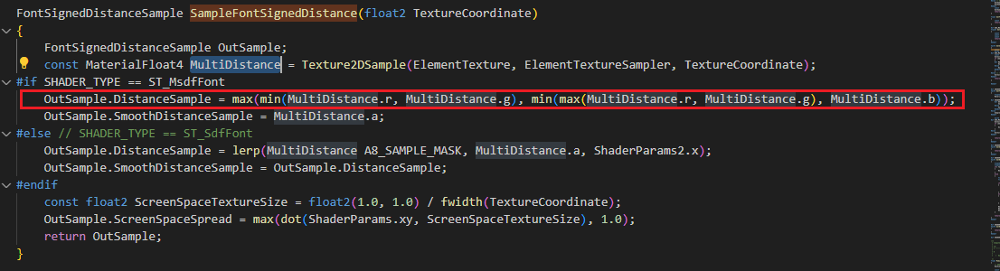
  * UE这里还还多了个alpha通道
  * 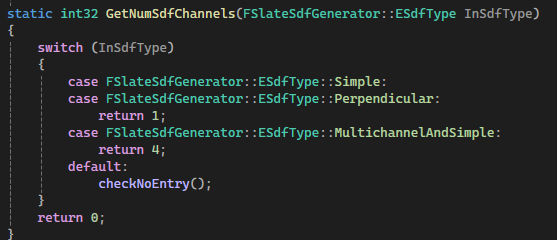
  * 存的是普通的SDF值，它会和上面的三个通道计算出的MSDF值同时暴露给材质，材质可以决定用什么。
* `SDF`用单个通道存储距当前点最近的边的距离，但是锐角交点会变得圆润。
* `SdfApproximation` 生成更快，距离场分辨率更低。

SDF字体相较于Bitmap字体优势：
* 不用为每一种大小字体生成一块Atlas bitmap，可以节省内存
* 对于描边、阴影等，SDF字体可以直接用Shader实现，而Bitmap字体必须从freetype渲染出不同的bitmap。
* SDF字体可以清晰渲染缩放，只用一种分辨率的SDF。
* SDF字体还可以方便地做一些字体渲染的材质特效，例如阴影、边框等。

劣势：
* 对于小size的字体，SDF字体会比Bitmap糊，因为小字号的字体，从Freetype2生成bitmap时可以利用字体中的hinting信息生成更清晰的对应字号的bitmap。而SDF的分辨率只有一种，在下采样太狠的时候，就是容易糊。
* 实时渲染时Shader比Bitmap字体复杂。

字体可以设置距离场数据质量，不同质量其实就是生成的距离场分辨率：

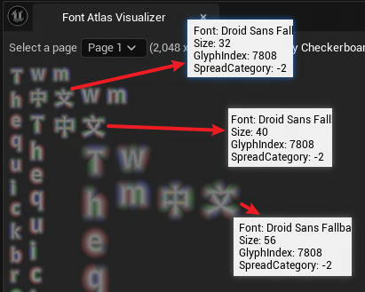

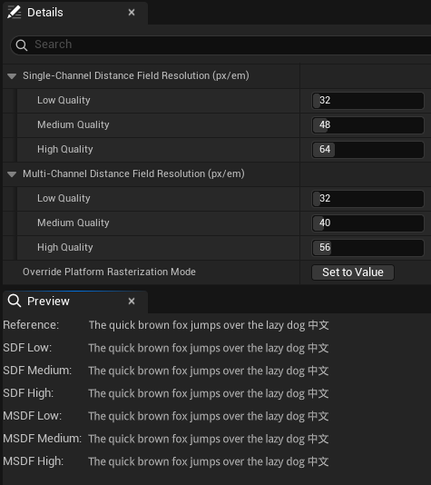

上图显示的字号是9，可以看到SDF小字体确实不如Bitmap。而且SDF和MSDF小字体情况下都表现很差。

24号较大看起来一样清晰，似乎MSDF理论上的优势并没有体现出来：

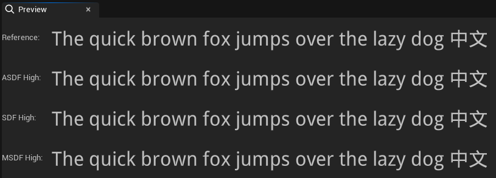

而Bitmap的优势：
* 渲染效率高。
* 在目标分辨率下清晰度最高，因为用Freetype2和字体中的hinting信息生成的bitmap。
* 形状精确。

劣势：
* 不同的字号大小、描边等字体样式等都需要单独的Atlas图集，如果需要多种字号，内存占用较大。
* 轮廓、粗细等调节不方便，不好做各自字体材质效果。

SDF字体放大后质量无损失：
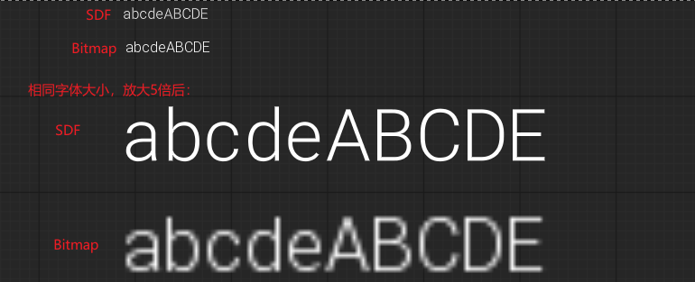

em is a font face metric approximately representing the width of the letter "M"

# 主流程
FSlateRHIRenderer::DrawWindow_RenderThread() 起源：`SlateUI Title = `, RenderThread

GameThread:

FontCache分为GameThread和RenderThread，可能是因为RenderThread有时候也会用上一些DebugDraw：

每一帧的Tick中，`FSlateApplication::PrivateDrawWindows`是UI相关绘制的入口。`DrawWindowAndChildren(CurrentWindow, DrawWindowArgs)`搜集所有Window的绘制元素。

然后调用渲染器开始生成绘制数据`Renderer->DrawWindows( DrawWindowArgs.OutDrawBuffer );`
> FSlateRHIRenderer::DrawWindows()

对每一个元素调用`ElementBatcher->AddElements(*WindowElementList);`

> FSlateElementBatcher::AddElements(FSlateWindowElementList& WindowElementList)

其中就有Text相关的元素：

`FSlateShapedTextElement`字形相关信息全在`FShapedGlyphSequencePtr ShapedGlyphSequence`，其父类`FSlateDrawElement`主要记录了当前元素的位置、缩放、Transform等信息。

`FSlateElementBatcher::AddShapedTextElement`

`FSlateElementBatcher::BuildShapedTextSequence()`，这里实际处理的是一个文本序列，对每一个字都会处理，会同时处理bitmap和sdf字体，创建字形数据，bitmap或sdf数据，并更新AtlasTexture。创建Vertex，Index数据，构建RenderBatch数据。

* Bitmap字体： `FSlateFontCache::GetShapedGlyphFontAtlasData`
* SDF字体：`FSlateFontCache::GetSdfGlyphFontAtlasData`

后面构建RenderBatch信息也只是简单if一下。这里会将每个字的RenderBatch信息记录到`FSlateElementBatcher`中。
这里WindowElement信息都处理完后，回到`FSlateRHIRenderer::DrawWindows_Private`，会调用`FSlateFontCache::UpdateCache()`，因为SDF字体数据的生成比较慢，前面生成是异步的，这里会调用`FSlateSdfGeneratorImpl::Update`处理所有生成的好的SDF数据，copy到Atlas纹理中。然后向渲染线程发送命令，更新字体Atlas纹理。

然后向渲染线程发送SlateDrawWindowsCommand的命令：

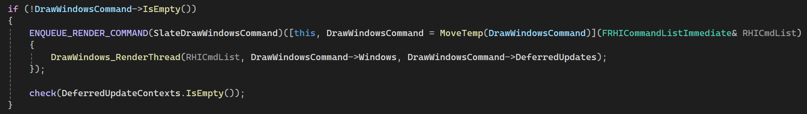

# Bitmap字体生成和更新
`FSlateFontCache::GetShapedGlyphFontAtlasData`

`FSlateFontRenderer::GetRenderData(FShapedGlyphEntry...)`

`FSlateFontRenderer::GetRenderDataInternal()`

`FSlateFontCache::AddNewEntry()`
* `FontRenderer->GetRenderData()`得到当前字形的Pixels，直接从freetype2拿，
* 根据`ESlateFontAtlasContentType FCharacterRenderData::ContentType`，拿到对应的AtlasTexture，所有纹理都在FSlateFontCache::AllFontTextures，具体类型是`FSlateFontAtlasRHI`。
  * 对每一个Atlas都尝试调用`AddCharacter()`，现有的都没空间时，通过`FSlateRHIFontAtlasFactory::CreateFontAtlas`创建新的。
  * 如果新Entry的大小超过了Atlas的大小，就专门创建一个新Entry大小的Texture,`FSlateRHIFontAtlasFactory::CreateNonAtlasedTexture`

* `FSlateTextureAtlas::AddTexture()`将前面拿到的bitmap pixels数据copy到Atlas
  * 如何从Atlas中找到一块可用的区域`FSlateTextureAtlas::FindSlotForTexture`(InWidth, InHeight)：
  * 给宽高都加上Padding，量由FSlateTextureAtlas::PaddingStyle决定。
  * `AtlasEmptySlotsMap`中的元素是链表`FAtlasedTextureSlot`的头。
    * 其中的索引这样计算`FMath::CeilLogTwo(InWidth)`，按字形宽分桶。
    * 如果是1024*1024的Atlas，就会有10组。
    * 粗略分组减少了每次查找目标区域扫描的长度。
    * 仅用宽分组，因为实际字形大小的变化主要体现在宽度上？
    * 初始化的时候，直接把一整个Texture放到`AtlasEmptySlotsMap`中。
  * 从`FMath::CeilLogTwo(InWidth)`计算出开始搜索的桶索引，遍历`AtlasEmptySlotsMap`
    * 遍历链表
    * 找到一个可以容纳需要大小的Slot后，从左上角分出为本次找到的区域，剩下的区域分成两个Slot，再次放到`AtlasEmptySlotsMap`。
    * 更新本次找到的Slot的长宽，为需要使用的长宽，并Unlink，然后Link到`AtlasUsedSlots`
    * 首次分割后会形成两个空Slot，因为前面分桶的原因，经常可以看到字形在Atlas中是从上往下竖着排列的。
    * 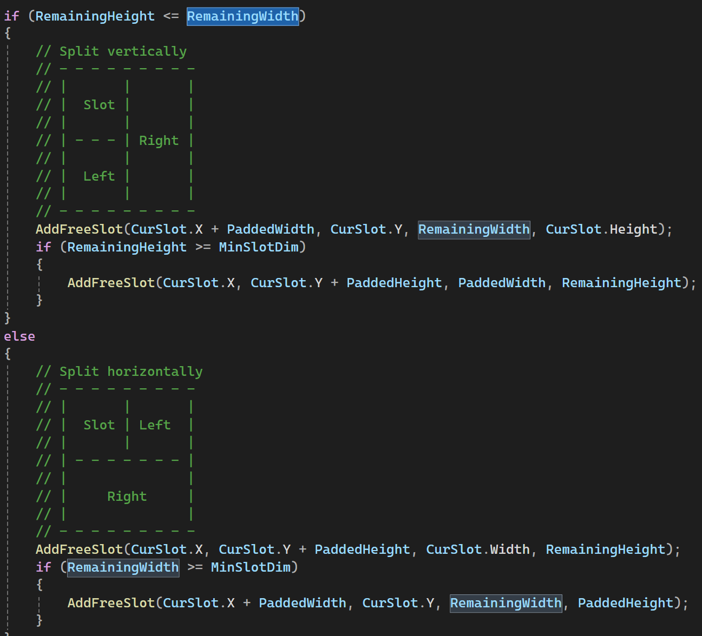
* `FSlateTextureAtlas::CopyDataIntoSlot()`，把Pixel数据copy到找到的Texture中的可用区域，`TArray<uint8> FSlateTextureAtlas::AtlasData`
* `FSlateTextureAtlas::MarkTextureDirty()` 标记一下，后面再上传到GPU。

# SDF字体生成和更新
`FSlateFontCache::GetSdfGlyphFontAtlasData`

利用freetype2和msdfgen生成距离场数据。和Bitmap不一样的只是生成的atlas数据代表的是距离场，渲染的时候用的Shader不一样罢了。

# TextRender in World
实现：`UTextRenderComponent`

这里只能用离线字体，不过支持一下动态上传字形应该也不难：

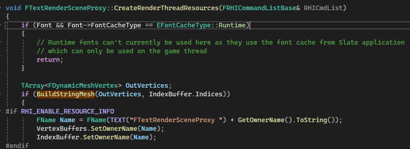

在`FTextRenderSceneProxy::BuildStringMesh`中，从原始文本和Font Atlas构建渲染Mesh数据：

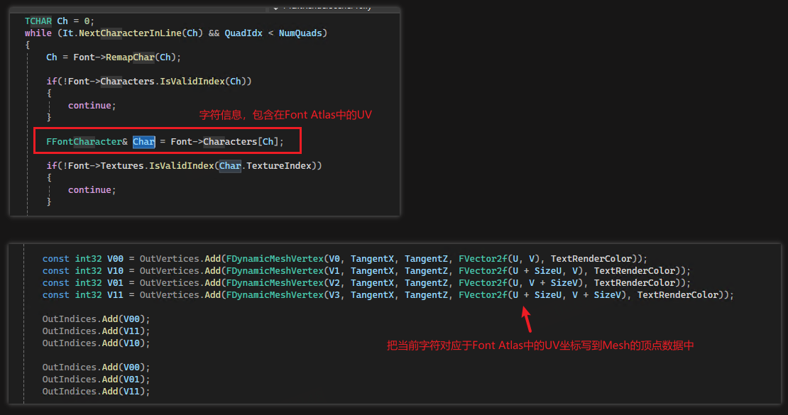

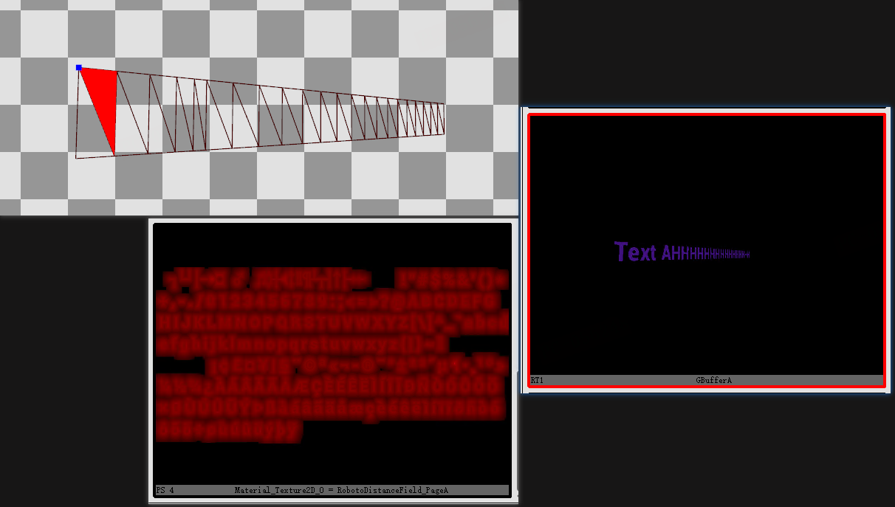

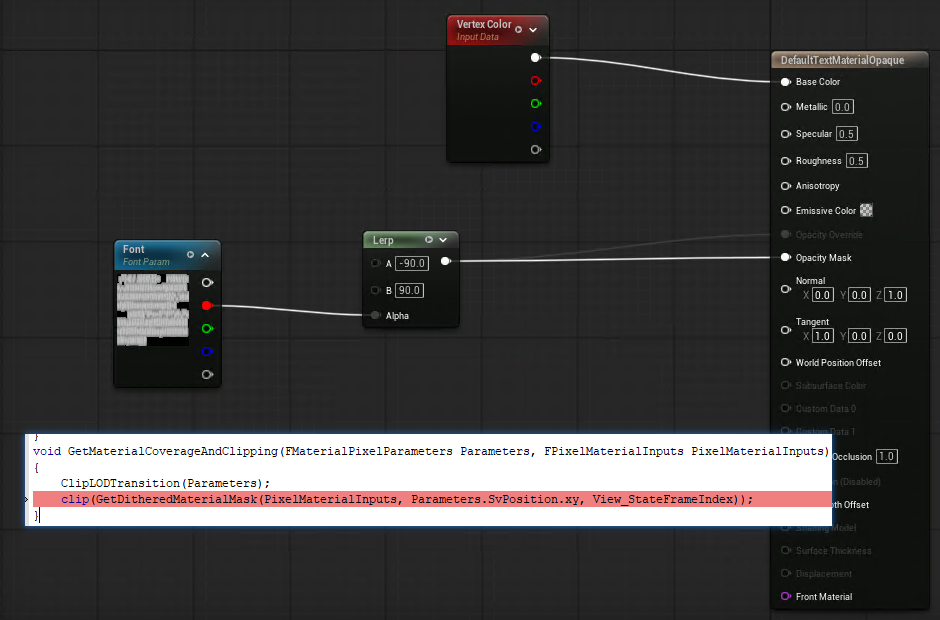
这里不一定要用Mask材质，也可以用半透材质，应该是自己想写成啥就是啥，反正Font节点输出的是当前字形的Mask信息。如果是SDF字体，就是SDF的值。

# Reference 
* [signed-distance-field-text-rendering-in-unreal-engine](https://dev.epicgames.com/documentation/en-us/unreal-engine/using-signed-distance-field-text-rendering-in-unreal-engine)
* [UE5 UMG的SDF字体渲染](https://zhuanlan.zhihu.com/p/3295334910)
* [【UE5】动态字体图集渲染](https://zhuanlan.zhihu.com/p/635341028)
* [Unreal Engine UI字体SDF渲染支持情况](https://zhuanlan.zhihu.com/p/1915374569801389273)
* [slug](https://sluglibrary.com)
* [UE中的Slug实现](https://codeartworks.com/2023/05/23/rendering-scalable-vector-text-in-unreal-engine/)
* [GPU Font Rendering](https://github.com/GreenLightning/gpu-font-rendering)
* [Multi-channel signed distance field generator](https://github.com/Chlumsky/msdfgen)
* [FreeType2](https://github.com/freetype)