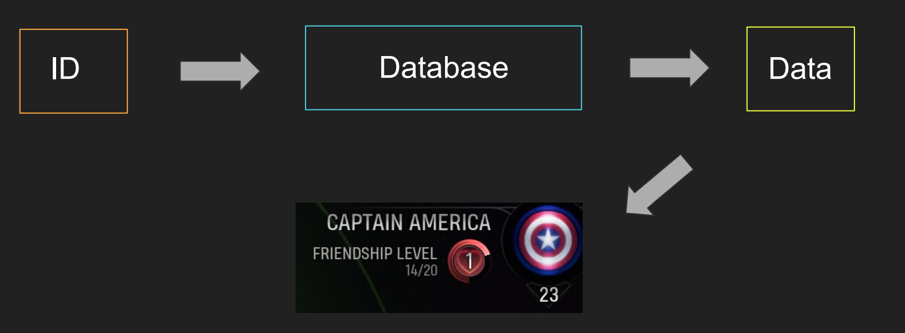
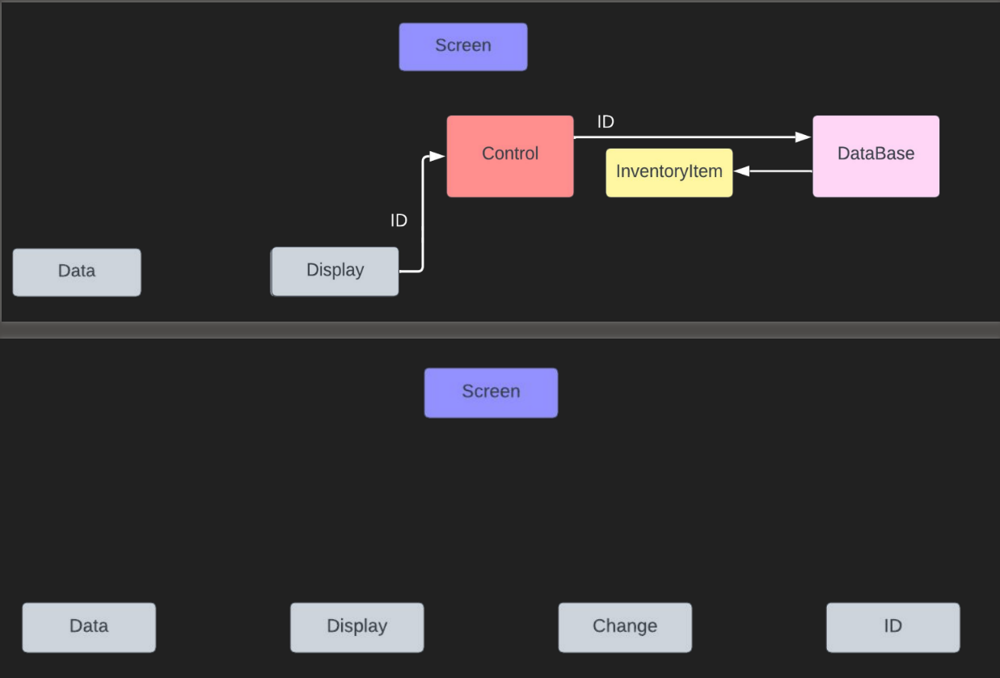
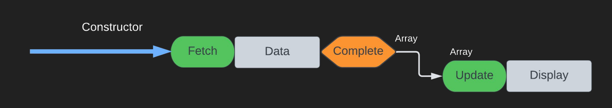
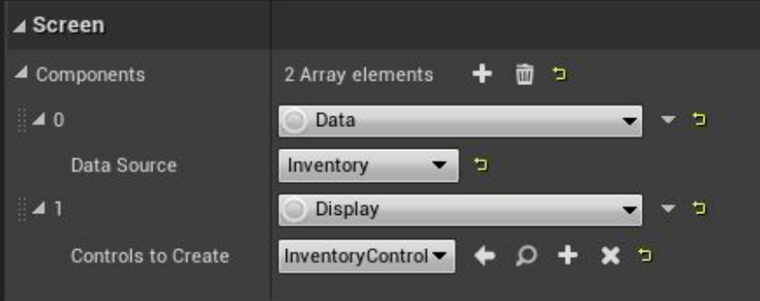

# UI Engineering Patterns from 'Marvel's Midnight Suns'

https://www.gdcvault.com/play/1028880/UI-Engineering-Patterns-from-Marvel

* FrontEnd 存在于游戏核心循环之外的UI
* Control User可以与之交互的Visual
* Screen UI system的Base

## 如何获取数据
通过一个GlobalDatabase类，使用Identifiers获取指定数据:

## The Challenge
* Scale of UI Development
* 150 screens, 90% of them in the frontend

需要一个可扩展的架构

## UICS - User Interface Component System

A UI Component is something that provides functionality to a UI screen.

Example：Inventory Screen

Editor View：

https://www.gdcvault.com/play/1029143/-God-of-War-Ragnarok
