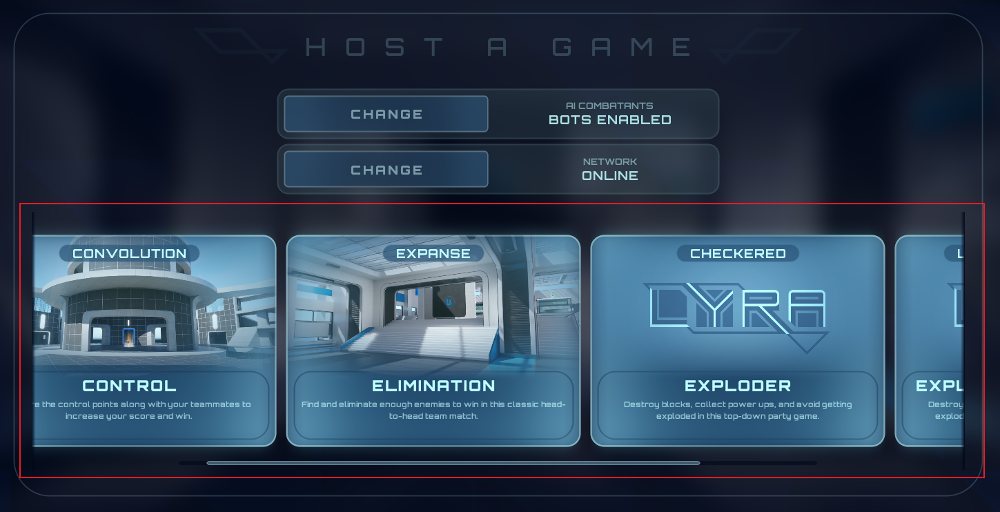

Lyra中一个游戏模式的具体内容称为Experience`(ULyraExperienceDefinition)`，从`L_LyraFrontEnd`中，可以选择一种游戏Experience开始游戏:



实现这一功能时，期望可以灵活扩展Experience的数量，方便制定外观。所以这里再定义了一种`ULyraUserFacingExperienceDefinition`资产，描述用于展示一种Experiences的UI和开始一个Session的设置:
- MapID
- ExperienceID 均用FPrimaryAssetId，在属性上加上`meta=(AllowedTypes="Map")`可以限定类型.
- ExtraArgs 会被写到OpenLevel的URL参数里，最终会出现在GameMode的OptionStirng中。
- 多人相关的配置，最大玩家数量
- UI相关的Description配置，加载界面

在ExperienceList初始化时，可以通过`FPrimaryAssetType`直接拿到`ULyraUserFacingExperienceDefinition`的所有AssetId，用蓝图调用时，可以通过下拉菜单选择当前项目中所有的`FPrimaryAssetType`:
```c++
void UKismetSystemLibrary::GetPrimaryAssetIdList(FPrimaryAssetType PrimaryAssetType, TArray<FPrimaryAssetId>& OutPrimaryAssetIdList)
{
	if (UAssetManager* Manager = UAssetManager::GetIfValid())
	{
		Manager->GetPrimaryAssetIdList(PrimaryAssetType, OutPrimaryAssetIdList);
	}
}
```
然后通过异步节点`AsyncLoadPrimaryAssetList`加载所有的`FPrimaryAssetId`，这里最终调用的是`UAssetManager::LoadPrimaryAssets()`，加载出来的Asset会永远存在内存中，直到你显式Unload。随后创建对应的UI，然后玩家选择模式，构建`UCommonSession_HostSessionRequest`，通过选择的`ULyraUserFacingExperienceDefinition`构建加载URL，再通过`UCommonSessionSubsystem`(GameInstanceSubsystem)开始游戏。

随后GameMode会解析出选择的`ULyraExperienceDefinition`，并初始化整个游戏系统。

这里定义的`ULyraUserFacingExperienceDefinition`把实际的Experience与它的选择完全隔离开。通过Map URL更是将Experience的初始化完全与局外的Experience选择完全分离。