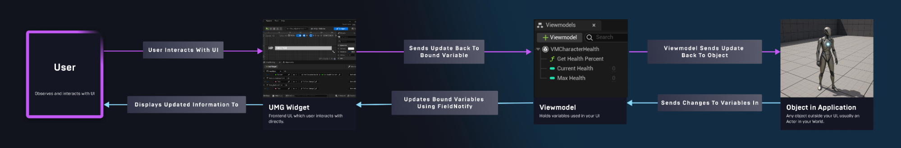

## Viewmodel
Viewmodel中的属性应该是Private的，必须有UPROPERTY宏和FieldNotify。

FieldNotify表明可以向Widget广播这个Property的改变，且会出现在ViewBinding界面。
Setter或Setter="FUNCTION_NAME"表明允许通过指定的函数设置这个属性。如果不指定函数名则默认为函数Set[VariableName].
Getter或Setter="FUNCTION_NAME"同理。

MVVM

Reference : 
- https://docs.unrealengine.com/5.1/zh-CN/umg-viewmodel/
- https://www.bilibili.com/video/BV1Dj411N735/