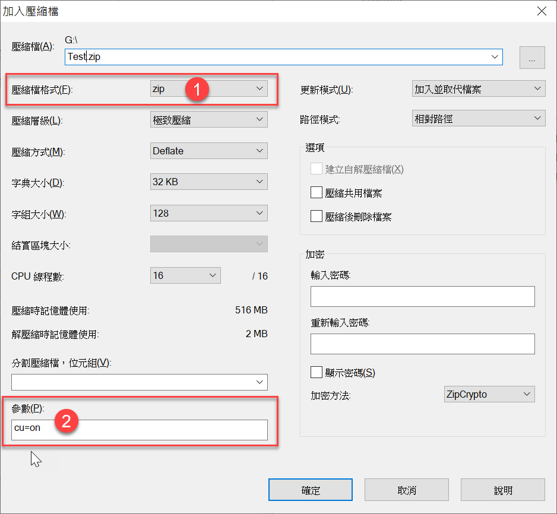

## 7zip 解压乱码
如果开启了: Time&language > Language&region > Administrative language settings > Change system locale > √Beta:Use Unicode UTF-8 for worldwide language support

解压非UTF-8操作系统压缩出来的压缩文件时就会乱码。

或者本身解压和压缩的两个操作系统的编码就是不一样的。不一样的语言。

可以用chcp在压缩的机器上看它是什么编码的，然后用命令行解压：
```
7z x -mcp=936 -o"./" -- 94F9C1014AEFFAB42F9D949220CF10E8.zip
```
936是 Supports Simplified Chinese GBK

## 压缩时指定编码
指定utf-8



reference：
* https://blog.miniasp.com/post/2020/09/14/7-Zip-with-Chinese-filenames-should-use-UTF-8

* https://superuser.com/questions/1668449/is-it-possible-to-extract-foreign-zip-files-with-7zip-without-adding-a-region-to
* https://en.wikipedia.org/wiki/Code_page