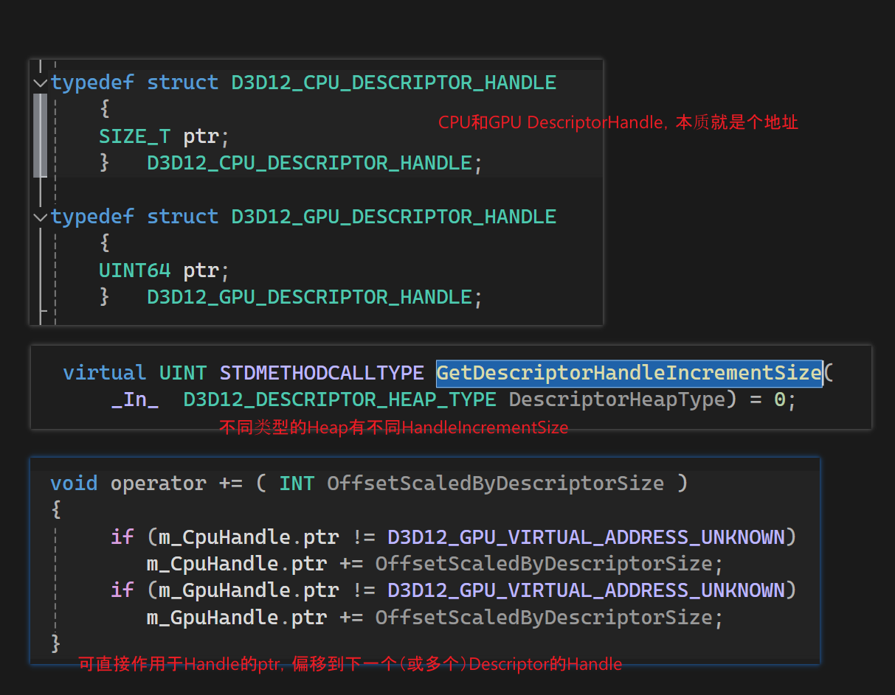

* vscode-markdown-paste-image，Markdown 粘贴图片，积极维护的[fork](https://github.com/telesoho/vscode-markdown-paste-image)

## markdown reference
- https://code.visualstudio.com/Docs/languages/markdown
  
Suggest：
- https://code.visualstudio.com/docs/editor/profiles#_doc-writer-profile-template

必装插件：
- https://marketplace.visualstudio.com/items?itemName=mushan.vscode-paste-image
- https://marketplace.visualstudio.com/items?itemName=yzhang.markdown-all-in-one
- https://marketplace.visualstudio.com/items?itemName=bierner.markdown-preview-github-styles
- https://marketplace.visualstudio.com/items?itemName=bierner.github-markdown-preview
- 
## example

:smirk: 

- [x] tasklists

强调

*This text will be italic*

_This text will be italic_

**This text will be bold** 

__This text will be bold__

* 图片设置大小，居中

* github要这个才能正常居中：

  

## D3D12

* https://developer.nvidia.com/dx12-dos-and-donts

## Game Rendering Engine Design 

- [RenderEngineForGames](https://enginearchitecture.realtimerendering.com/2021_course/)
- [All Resource you need](https://github.com/Gforcex/OpenGraphic)
